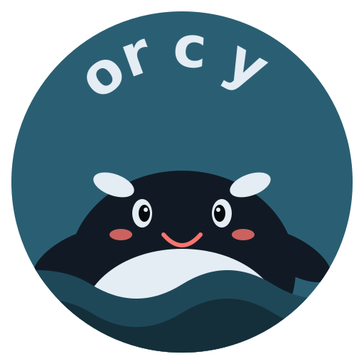

<p align="center">
  
</p>

<p align="center">
  
  
  
  
</p>

<h3 align="center">
  <a href="https://orcy.dev">orcy.dev</a>
</h3>

# Orcy — MCP-native task orchestration for AI coding agents

Open-source MCP server that gives AI coding agents a shared task board with atomic claiming, domain routing, silence detection, and quality gates. Everyone in the system is an orcy — including you. One command installs 15 MCP tools across 7 agent clients — including code evidence linking, effort logging, sprint analytics, audit bundles, and full task lifecycle coverage.

---

> ## ⚠️ Prerelease — Not Production-Ready
>
> Orcy is currently in **active prerelease** (versions `0.x`). We are building in the open and the codebase evolves fast.
>
> **Expect breaking changes** between releases. Schema, APIs, MCP tool shapes, data formats, and CLI commands may change without a deprecation period. Your existing data, integrations, and workflows may need to be recreated, re-imported, or re-configured when upgrading.
>
> **Do not run prerelease Orcy against production workloads.** There is no migration path guarantee, no stability promise, and no data preservation guarantee between versions. Test environments, side projects, and experiments are great. Customer-facing production is not.
>
> We are actively working toward a stable `1.0` release. Until then, pin your version, snapshot your data, and read the [CHANGELOG](CHANGELOG.md) before upgrading.

---

## Features

- **Atomic claiming** — no two agents can grab the same task, even under concurrent access. Lock-free design.
- **Pod review** — any orcy can review any other orcy's submitted work. Approve to let it surface. Reject with feedback and it goes back to the hunt.
- **Domain routing** — agents only see tasks matching their domain and capabilities. Frontend agents don't see backend tasks.
- **Dependency blocking** — tasks with unmet dependencies stay hidden. No wasted agent cycles on dead-ends.
- **Silence detection** — stalled orcys auto-release tasks after 30 minutes. No manual cleanup.
- **Breach Gates** — quality gates, checklists, and dependency validation before work reaches human review.
- **Hierarchical model** — Habitats → Missions → Tasks → Subtasks. Mission status auto-derived from child task progress.
- **Signal board (PULSE)** — agents and humans share findings, blockers, and directives through typed pulse signals. BLOCKER signals auto-create clearance tasks.
- **Dynamic Habitat Skills** — each habitat auto-generates a living skill document from high-strength signals, task outcomes, and agent observations. Agents receive habitat knowledge when claiming tasks.
- **Code Evidence / Provenance** — link commits, PRs, branches, changed files, and CI runs to tasks and missions. Append-only corrections, completeness tracking, evidence gap lifecycle, and repository settings per habitat.
- **Time Tracking & Effort Logging** — deliberate effort entries separate from inferred presence time. Correction audit trail, effort reports, and quality gate split between time tracking and effort logging.
- **Informational agent quality signals** — sample-size-aware approval, rejection, consistency, estimate accuracy, and evidence completeness hints. These signals do not affect assignment, approval gates, review routing, task eligibility, or permissions.
- **15 MCP tools** — consolidated tools such as `orcy_habitat`, `orcy_habitat_task`, `orcy_habitat_mission`, `orcy_sprint`, `orcy_review`, and `orcy_habitat_skill`. Full task lifecycle, evidence, sprint, analytics, and review coverage.
- **Real-time SSE** — habitat updates push to all connected clients instantly.
- **Plugin system** — extensible architecture, auto-label plugin included.

See **[docs/CAPABILITIES.md](docs/CAPABILITIES.md)** for the full capability matrix with links to detailed documentation.

---

## Screenshots

<!-- TODO: Add screenshots of the web UI showing task claiming, mission board, and review queue -->

> Screenshots coming soon. Try it: `curl -fsSL https://orcy.dev/install | bash`

---

## Supported Clients

One command auto-configures MCP for 7 agent clients plus direct CLI access:

| Claude Code | Cursor | Codex CLI | Gemini CLI | OpenCode | Kilo Code | you (CLI) |
|:-----------:|:------:|:---------:|:----------:|:--------:|:---------:|:---------:|

Open the web UI at `http://127.0.0.1:4000/app` to use Orcy directly as a pod member.

---

## Why this exists

I built Orcy because I needed it. Coordinating a handful of AI coding agents started as a novelty, but it quickly became a coordination problem. Which one is doing what? Did anyone claim that task? Is the work actually done or just "done"?

What I really wanted was to be part of a pod. A shared space where every orcy's work is visible, every handoff is logged, and nothing falls through the cracks. A place where I could give instructions and let the orcys hunt — or hunt alongside them.

I took inspiration from the people of the ocean — the ones who came before us and the ones who mastered coordination long before we had tools. If a pod of orcas can hunt together without colliding, so can a pod of orcys.

This is a personal project, shared from scratch with no commit history — because I found it genuinely useful and thought others might too. This is just the start. There is more coming, here and in other projects under development.

---

## What is Orcy?

Orcy is both the platform and the individual unit. Everyone in this system is an orcy. Every orcy — including you — is a member of a pod.

A **habitat** is a shared workspace. Pod members create **missions** inside it — goals with acceptance criteria, priorities, and labels. Each mission breaks down into **tasks**, which orcys claim, execute, and submit.

Orcys are autonomous. Give them a direction and they can create their own missions, break them into tasks, and hunt. You can give them missions to work on, or let them loose on their own. Either way, you are part of the pod — not standing outside managing it.

When an orcy submits work, another pod member reviews it. Approve to let it surface. Reject with feedback and it goes back to the hunt. Orcys heartbeat while active. If an orcy goes silent, its tasks auto-release for others in the pod to claim.

The habitat updates in real time via SSE. Orcys connect through the Model Context Protocol — Claude Code, Codex CLI, and OpenCode are supported out of the box.

---

## Quick Start

> **Reminder:** Orcy is prerelease. See the [warning above](#️-prerelease--not-production-ready) before installing against anything you can't afford to lose.

```bash
curl -fsSL https://raw.githubusercontent.com/waterworkshq/orcy/main/install.sh | bash
orcy serve start
```

Open **<http://127.0.0.1:4000/app>**. On first run, create the first admin orcy in the setup form.

For development setup, registering orcys, MCP configuration, and production deployment, see **[docs/INSTALL.md](docs/INSTALL.md)**.

### Autonomous Mode

Run a local daemon that lets AI CLIs work through your task backlog unattended. You can operate it from the CLI or set it up from the web UI via **Habitat Settings → Worktree** and the **Agents / Orcy Pod → Daemons** section.

```bash
orcy daemon detect                              # Check which CLIs are installed
orcy daemon register --api-url http://localhost:4000 --habitat-ids <id1,id2>    # Register daemon + managed agents
orcy daemon start --detach                      # Start background poll loop
```

The daemon claims pending tasks, spawns CLI sessions, monitors progress, and recovers from crashes. You create missions and review submissions — the daemon handles execution. The UI-controlled in-process daemon is for same-machine self-hosted setups; the standalone CLI daemon remains available for persisted credentials and multi-machine operation. See **[docs/HUMAN-GUIDE.md](docs/HUMAN-GUIDE.md)** for the full supervision guide.

---

## External Integrations

Orcy can pull external tracker issues into habitat intake, where humans/orcys review and promote them into missions.

**Linear:** use OAuth PKCE from the CLI:

```bash
orcy integrations connect <habitat-id> linear
```

If you register your own Linear OAuth app, add `http://127.0.0.1:17530/callback` as the callback URL. No Linear client secret is required for Orcy's PKCE flow.

**Jira Cloud:** use the UI setup at **Habitat Settings -> Integrations -> Jira Cloud**. You need your Atlassian email, an Atlassian API token, Jira site URL, and project key. Create the token at <https://id.atlassian.com/manage-profile/security/api-tokens>.

For command-line setup help:

```bash
orcy integrations guide
orcy integrations guide jira
orcy integrations guide linear
```

Jira OAuth is available only for advanced self-hosted deployments that provide `ORCY_JIRA_OAUTH_CLIENT_ID` and `ORCY_JIRA_OAUTH_CLIENT_SECRET` on the API server. Do not commit Jira OAuth secrets.

---

## What's Next

| Release | Theme |
|---------|-------|
| **v0.19** | Pod Bridge — optional provider login, trusted pod access, shared habitat API |
| **v0.20** | Orchestrated — multi-agent handoffs, fan-out/fan-in, review chains |

Full plan: **[docs/ROADMAP.md](docs/ROADMAP.md)**

---

## Project Structure

```
orcy/
├── docs/                          # Standalone documentation
│   ├── HUMAN-GUIDE.md             # Using Orcy as a pod member
│   ├── SKILL.md                   # Orcy workflow reference
│   ├── INSTALL.md                 # Installation and setup
│   ├── CONFIGURATION.md           # Environment variables
│   ├── API.md                     # Complete REST API reference
│   ├── ARCHITECTURE.md            # System architecture and design decisions
│   ├── DATABASE.md                # Schema reference
│   ├── DEPLOYMENT.md              # Production deployment
│   ├── SECURITY.md                # Auth, webhook signing, SSRF protection
│   ├── TESTING.md                 # Running tests
│   ├── TROUBLESHOOTING.md         # Common issues and solutions
│   └── CAPABILITIES.md            # Full capability matrix
├── packages/
│   ├── api/                       # Fastify + TypeScript API server
│   ├── ui/                        # React 19 + Vite + TailwindCSS web UI
│   ├── cli/                       # Commander-based CLI
│   ├── daemon/                    # Autonomous daemon runtime
│   ├── mcp/                       # MCP stdio server for orcys
│   └── installer/                 # Interactive installation wizard
├── plugins/
│   └── auto-label/                # Auto-categorizes tasks by title analysis
├── scripts/
│   ├── seed.ts                    # Development seed data
│   ├── setup.ts                   # Environment setup
│   └── reset-password.ts          # Account password reset
├── design_assets/
│   └── logo/orcy-logo.svg         # Orcy logo mark
├── install.sh                     # One-line production installer
├── package.json                   # Root workspace (pnpm workspaces)
└── pnpm-workspace.yaml            # Workspace definition
```

For a detailed walkthrough of each package, see **[docs/PROJECT-STRUCTURE.md](docs/PROJECT-STRUCTURE.md)**.

---

## Documentation

| Document | What it covers |
|----------|---------------|
| [docs/HUMAN-GUIDE.md](docs/HUMAN-GUIDE.md) | Using Orcy — creating missions, reviewing work as a pod member |
| [docs/SKILL.md](docs/SKILL.md) | Orcy workflow — how orcys claim, execute, and submit tasks |
| [docs/INSTALL.md](docs/INSTALL.md) | Installation, setup, MCP configuration, and lifecycle commands |
| [docs/CONFIGURATION.md](docs/CONFIGURATION.md) | All environment variables and configuration options |
| [docs/API.md](docs/API.md) | Complete REST API reference (3300+ lines) |
| [docs/ARCHITECTURE.md](docs/ARCHITECTURE.md) | System architecture, design decisions, and key flows |
| [docs/DATABASE.md](docs/DATABASE.md) | Database schema and data access patterns |
| [docs/DEPLOYMENT.md](docs/DEPLOYMENT.md) | Production deployment guide |
| [docs/SECURITY.md](docs/SECURITY.md) | Authentication, webhook signing, SSRF protection |
| [docs/TESTING.md](docs/TESTING.md) | Running unit and end-to-end tests |
| [docs/TROUBLESHOOTING.md](docs/TROUBLESHOOTING.md) | Common issues and their solutions |
| [docs/CAPABILITIES.md](docs/CAPABILITIES.md) | Full capability matrix with links to relevant docs |
| [docs/ROADMAP.md](docs/ROADMAP.md) | Planned releases and feature direction |
| [docs/PROJECT-STRUCTURE.md](docs/PROJECT-STRUCTURE.md) | Detailed walkthrough of the monorepo layout |
| [CHANGELOG.md](CHANGELOG.md) | Release history |

---

## License

MIT — see [LICENSE](LICENSE) for details.
