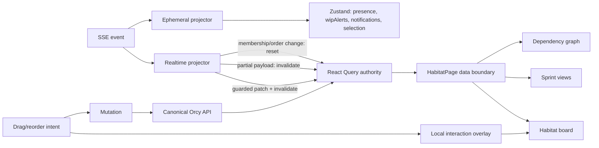

# Architecture Documentation

This document covers the system architecture, design decisions, key flows, and integration patterns.

> **Prerelease:** Orcy is in active `0.x` prerelease. Architecture, schema, and APIs may change between releases. Do not use prerelease Orcy for production workloads. See the [README](../README.md#️-prerelease--not-production-ready).

---

## System Overview

```
┌──────────────────────────────────────────────────────────┐
│  AI Agent (Claude Code / Codex / OpenCode / Cursor / Gemini) │
│  MCP stdio transport                                     │
│  ┌──────────────────────────────────────────────────┐   │
│  │  MCP Server (16 dispatch tools)                      │   │
│  │  Features: list │ create │ get_context │ delete  │   │
│  │  Tasks: claim │ submit │ update │ heartbeat     │   │
│  │  Rules: get │ update │ evaluate                │   │
│  │  Scheduled: list │ create │ run                 │   │
│  │  Skill: get │ refresh │ contribute             │   │
│  │  Code Evidence: link │ list │ gaps │ resolve    │   │
│  └────────────────────┬─────────────────────────────┘   │
│                       │ HTTP (X-Agent-API-Key)           │
└───────────────────────┼──────────────────────────────────┘
                          ▼
                    Kanban API

┌──────────────────────────────────────────────────────────┐
│  Habitat → Missions → Tasks → Subtasks                     │
│  Missions flow through columns, tasks have state machine   │
│  Background intervals: stale detection, health snapshots, │
│    prioritization evaluation (5min), scheduled tasks (1m), │
│    daemon nudges/digests, in-process daemon engine       │
└──────────────────────────────────────────────────────────┘
```

---

## Component Responsibilities

### API (`packages/api`)

| Layer | Directory | Responsibility |
|-------|-----------|---------------|
| Routes | `src/routes/` | HTTP parsing, validation, response formatting. Includes daemon machine routes (`/daemon/*`), human/UI daemon controls (`/daemons/*`), and habitat skill routes (`/habitats/:id/skill/*`) |
| Services | `src/services/` | Business logic, SSE broadcasting, webhook dispatch, AI features. Includes `featureService.ts`, `prioritizationService.ts`, `scheduledTaskService.ts`, `habitatSkillService.ts`, daemon nudges/digests, and `daemonEngine.ts` for the API in-process daemon runtime; `daemon-wiring.ts` provides lazy dynamic-import DI for the in-process daemon; `inProcessClaimStrategy.ts` implements the in-process claim path |
| Repositories | `src/repositories/` | Drizzle-backed data access (habitat, mission, task, column, agent, daemon, comment, template, webhook, event-mission, habitatSkill) |
| Models | `src/models/` | TypeScript types, Zod schemas. Includes `Mission`, `MissionWithProgress`, `MissionStatus` types |
| Middleware | `src/middleware/` | Authentication (API key + JWT), RBAC, team-based access |
| SSE | `src/sse/` | Event broadcaster (pub/sub) — broadcasts both task and mission events |
| DB | `src/db/` | Database initialization, Drizzle ORM schema (62+ tables including habitat_skills, habitat_skill_signals, code evidence tables) |
| Plugins | `src/plugins/` | Plugin system for extensibility |

### UI (`packages/ui`)

| Layer | Directory | Responsibility |
|-------|-----------|---------------|
| Pages | `src/pages/` | HabitatListPage, HabitatPage, MissionDetailPage |
| Components | `src/components/ui/` | Button, Badge, Card, Dialog, ErrorBoundary |
| Habitat | `src/components/habitat/` | Habitat, Column, TaskCard, TaskDetailPanel, DaemonSection, DaemonCard, DaemonSetupDialog, SkillPanel |
| Store | `src/store/` | Zustand state management — ephemeral slices only (theme, presence, wipAlerts, UI selection, recentSSEEvents); server data lives in React Query |
| API | `src/api/` | Typed REST client (per-domain modules; no server-shape aliasing) |
| Lib | `src/lib/` | React Query hooks (`useHabitatData`, `useTaskData`) + cache key factory (`queryKeys`) + guarded mutation helpers (`habitatMutations`) |
| Hooks | `src/hooks/` | `useSSE` (abort/generation-safe subscription lifecycle) + `useMissionDragMove` (single-flight, latest-target coalescing) |
| SSE | `src/sse/` | Event registry (membership-aware projection matrix) |
| Types | `src/types/` | TypeScript interfaces |

### MCP (`packages/mcp`)

| File | Responsibility |
|------|---------------|
| `src/index.ts` | MCP SDK server setup, tool registry |
| `src/tools/index.ts` | All tool exports + dispatch tool files (18 MCP tools total, including instructions tools) |
| `src/tools/habitat-dispatch.ts` | Habitat dispatch: list, find, summary, metrics, settings, health, analytics, prioritization rules |
| `src/tools/mission-dispatch.ts` | Mission dispatch: lifecycle, context, comments, code evidence, scoped audit bundle |
| `src/tools/task-dispatch.ts` | Task dispatch: lifecycle, CRUD, details, quality, subtasks, dependencies, effort, code evidence, scoped audit bundle |
| `src/tools/agent-dispatch.ts` | Agent dispatch: register, heartbeat, stats |
| `src/tools/sprint-dispatch.ts` | Sprint dispatch: lifecycle, mission membership, metrics, burndown, carry-over |
| `src/tools/review-dispatch.ts` | Review dispatch: review assignment rules and task reviewers |
| `src/tools/suggest-dispatch.ts` | Suggest dispatch: suggest-next-task |
| `src/tools/code-evidence.ts` | Code evidence handlers: link-code, list-code-evidence, correct-code-evidence-link, mark-not-applicable, clear-not-applicable, report-gap, resolve-gap, backfill (10 handler functions) |
| `src/tools/instructions.ts` | Hierarchical agent workflow instructions |
| `src/api.ts` | REST API client (OrcyApiClient) |

---

## State Ownership

The UI has two state stores with sharply separated responsibilities.
The boundary is enforced at the type level — there are no overlapping
slices, no dual-writes, and no SSE lane that writes server data into
Zustand. The full authority model and the rejected alternatives are
recorded in [ADR-0040](adr/0040-react-query-sole-server-state-authority.md).

| State | Authority | Notes |
|---|---|---|
| Habitat, Columns, active Missions with progress | React Query — `queryKeys.habitats.detail(habitatId)` | Complete main-board representation; the unpaginated active collection |
| Mission detail, tasks, progress, comments, dependencies | Domain-specific React Query keys | Independently invalidatable detail representations |
| Archived Missions | React Query infinite — `[...missions.all, "archived", habitatId]` | Mutable offset; reset-on-membership-change semantics |
| Habitat statistics | React Query — `queryKeys.habitats.stats(habitatId)` | Server-supplied `missionSummary` plus cycle/throughput/WIP |
| Sprint planning and dependency graph | Habitat detail Query | Reuse the complete active Missions already in detail |
| Presence, WIP alerts, notifications, theme, UI selection | Zustand ephemeral slices | Session and recipient-attention state only |
| Drag preview and column reorder | Local interaction overlay | Removed on success, failure, unmount, or Habitat switch |
| Recent SSE debug buffer | Zustand `recentSSEEvents` (bounded) | Debug surface, never read as domain truth |



### Zustand slices

The Zustand store (`packages/ui/src/store/habitatStore.ts`) composes
exactly five slices — none of them hold durable server data:

- **Theme** — `theme: 'light' | 'dark'` + `setTheme`/`toggleTheme`.
- **Habitat** — `wipAlerts: Record<columnId, { limit, timestamp }>` +
  `clearWipAlert`. WIP alerts are short-lived UI warnings, not domain state.
- **Presence** — `presence: PresenceEntry[]` + upsert/remove. Session-scoped.
- **UI** — `selectedMissionId`, `selectedMissionIds`, `selectedTaskIds`,
  bulk-select modes, `collapsedColumns`, `notifications`, `isLoading`/`error`.
- **SSE handler** — `recentSSEEvents: SSEEvent[]` (bounded) +
  `handleSSEEvent` (dispatches to the ephemeral projector only).

### Realtime projection rules

The SSE event registry (`packages/ui/src/sse/registry.ts`) classifies
each event by representation and applies a per-representation projection:

- **Guarded merge** for compatibility-shape payloads (e.g. an
  already-cached Mission with version-ordered return). Never inserts; never
  overwrites a newer version with an older response.
- **Invalidate** for partial, filter-sensitive, or version-sensitive
  payloads (e.g. `task.*` invalidates the owning Mission, Mission progress,
  and Habitat detail).
- **Generation-reset** for archived-pagination membership or order changes
  (archive/unarchive/delete); the archived infinite Query is reset from
  offset zero.
- **Ephemeral-only** for presence, WIP, notification, and debug surfaces.

The projector calls `queryClient.cancelQueries` for affected keys before
guarded patches and rechecks the active subscription generation after
every await, so an older HTTP response cannot land after the patch.

### Subscription lifecycle

`useSSE` (`packages/ui/src/hooks/useSSE.ts`) owns:

- A monotonically increasing `generation` that identifies the active
  connection. Habitat change, reconnect replacement, or unmount increments
  it (invalidating the old generation) and aborts the token request,
  cancels reconnect timers, closes the current stream.
- A per-token `AbortController` for the stream-token request.
- Generation rechecks after every `await`, before installing the
  `EventSource` (a stale-generation `EventSource` is closed immediately),
  and inside the message handler (a stale generation performs no
  projection effect).

`habitat.deleted` removes the deleted Habitat's caches unconditionally
and navigates home only when the active route still represents the deleted
subscription.

### Mutation concurrency

- **Mission drag** (`useMissionDragMove`) is single-flight per Mission,
  coalesces to the latest target column, and dispatches the queued move
  with the previous successful response's authoritative `mission.version`.
  The API requires `expectedVersion` and returns `409 VERSION_CONFLICT`
  on mismatch; the client surfaces the conflict distinctly (never as a
  generic network failure) and invalidates to reconcile.
- **Column reorder** (`POST /habitats/:habitatId/columns/reorder`) is
  one atomic OCC operation. The server compares
  `expectedOrder: string[]` to the current order inside one transaction
  and returns `409 VERSION_CONFLICT` (with the current order) on mismatch
  before any writes. On success the response carries `{ columns }` in
  canonical order; `column.updated` SSE events fire post-commit. The prior
  sequential persistence loop and any compensation requests are deleted.

### Archived offset-reset semantics

The archived-Mission infinite Query's `pageParam` is the server offset;
next page exists while raw accumulated count is less than `total`. Any
change that can affect archived membership or order starts a new
collection generation: cancel in-flight page work, discard accumulated
pages, reset from offset zero before Load More is re-enabled. Late
results from a superseded generation are ignored. Stable-snapshot
browsing is explicitly not promised by this contract; it would require a
separate cursor/snapshot API decision.

---

## Habitat Skill Architecture

Each habitat auto-generates a living skill document from high-strength pulse signals, task outcomes, and agent observations. The system clusters signals by topic, scores them for strength, and promotes high-confidence signals into the skill document.

### Signal Ingestion

Signals are ingested from three sources:

1. **Pulse signals** — findings, blockers, warnings, directives posted by agents and humans
2. **Task events** — completed, approved, rejected, failed task outcomes
3. **Task comments** — review feedback, discussion threads

Each signal is normalized into a `cluster_key` (e.g., "auth-jwt-signing") and merged with existing signals on `(habitat_id, cluster_key)`.

### Signal Scoring

Strength is a composite 0-1 score from four dimensions:

| Dimension | Weight | Input |
|-----------|--------|-------|
| Frequency | 30% | How often this cluster has been seen |
| Corroboration | 30% | Number of distinct agents confirming |
| Cross-mission | 20% | Number of distinct missions this signal spans |
| Outcome | 20% | Ratio of successful to failed associated tasks |

### Skill Categories

Signals are classified into one of four categories:

| Category | Criteria | Description |
|----------|----------|-------------|
| `domain_knowledge` | frequency ≥ 3 and corroboration ≥ 2 | Confirmed technical knowledge |
| `convention` | frequency ≥ 3 and corroboration ≥ 2 | Established team practices |
| `pattern` | frequency ≥ 3 and cross-mission ≥ 2 | Cross-cutting patterns |
| `anti_pattern` | failed tasks > successful tasks | Things that consistently fail |

### Promotion & Demotion

- Signals with strength ≥ 0.6 are promoted (`promotedToSkill = 1`) and included in the generated document
- Signals with strength < 0.2 are demoted and excluded
- The skill document is regenerated on refresh or after significant signal changes

### Hook Registry Pattern

Domain functions expose lifecycle hooks (`onHabitatCreated`, `onTaskCompleted`, etc.) that the skill service registers consumers for. Domain code remains unchanged — consumers write to their own tables only, preventing circular signal creation.

### MCP Integration

The `orcy_habitat_skill` dispatch tool exposes three actions:

| Action | Description |
|--------|-------------|
| `get` | Retrieve the current skill document for the habitat |
| `refresh` | Trigger async regeneration of the skill document |
| `contribute` | Submit a direct insight to the skill system |

Skill context is automatically injected into `getMissionContext()` responses, so agents receive habitat knowledge when claiming tasks.

### Component Layout

```
packages/api/
  src/db/schema/habitat-skill.ts              — Drizzle schema (2 tables)
  src/repositories/habitatSkill.ts             — CRUD + signal queries
  src/services/habitatSkillService.ts          — Ingestion, scoring, category classification, document generation
  src/routes/habitatSkill.ts                   — 5 API endpoints
packages/mcp/
  src/tools/habitat-skill.ts                   — 3 MCP handler functions
  src/tools/habitat-skill-dispatch.ts          — Dispatch tool + handler map
packages/cli/
  src/commands/skill.ts                        — 4 CLI commands (get, refresh, contribute, signals)
packages/ui/
  src/components/habitat/SkillPanel.tsx         — Collapsible panel with Document/Signals tabs
```

---

## Code Evidence Provenance

Promotes existing PR/MR, pipeline, worktree branch, and artifact foundations into an explicit, queryable code evidence layer. Instead of treating pull requests and CI runs as opaque attachments, the code evidence system decomposes them into structured, linkable entities that can be queried for completeness and gap analysis.

### Architecture

The code evidence layer uses a **hybrid model**: concrete evidence tables store normalized data from Git providers (branches, commits, changed files, reviews), while a central `code_evidence_links` table provides polymorphic metadata linking evidence to any Orcy entity (mission, task, or subtask).

```
┌─────────────────────┐       ┌─────────────────────┐
│ habitat_code_        │       │ code_evidence_       │
│ repositories         │       │ completeness         │
│ (1:1 per habitat)    │       │ (not-applicable      │
│                      │       │  overrides +         │
│ provider, repoSlug,  │       │  derived status)     │
│ verificationState    │       └─────────────────────┘
└──────────┬──────────┘
           │ (repositoryId)
           ▼
┌─────────────────────┐       ┌─────────────────────┐
│ code_branches        │──────<│ code_commits         │
│                      │       │                      │
│ name, headSha,       │       │ sha, message,        │
│ baseBranch,          │       │ authorName/Email,    │
│ createdFromTaskId    │       │ verificationState    │
└──────────┬──────────┘       └──────────┬──────────┘
           │                              │
           │ (branchId)                   │ (commitId)
           ▼                              ▼
┌─────────────────────┐       ┌─────────────────────┐
│ code_changed_files   │       │ code_reviews         │
│                      │       │                      │
│ path, previousPath,  │       │ reviewStatus,        │
│ changeType,          │       │ reviewerName         │
│ additions, deletions │       └─────────────────────┘
└─────────────────────┘

           ┌─────────────────────┐
           │ code_evidence_links │  ← Core link table
           │                     │    (polymorphic: mission/task/subtask → evidence)
           │ targetType,         │
           │ targetId,           │
           │ evidenceType,       │
           │ evidenceId,         │
           │ status, confidence, │
           │ linkSource          │
           └─────────────────────┘

           ┌─────────────────────┐
           │ code_evidence_gaps   │  ← Gap lifecycle
           │                     │
           │ reasonCode,         │
           │ status              │    (active/resolved)
           │ resolutionReason    │
           └─────────────────────┘
```

### Key Tables

| Table | Purpose |
|-------|---------|
| `habitat_code_repositories` | One row per habitat — canonical repository identity (provider, repoSlug, verificationState) |
| `code_branches` | Branch evidence (name, headSha, baseBranch, createdFromTaskId) |
| `code_commits` | Commit evidence (sha, message, authorName/Email, verificationState) |
| `code_changed_files` | Changed file snapshots per commit (path, previousPath, changeType, additions, deletions) |
| `code_reviews` | Review evidence (reviewStatus, reviewerName) |
| `code_evidence_links` | Core polymorphic link table — connects missions/tasks/subtasks to evidence entities |
| `code_evidence_completeness` | Not-applicable overrides + derived completeness status per target |
| `code_evidence_gaps` | Gap lifecycle tracking (reasonCode, status active/resolved, resolutionReason) |

### URL Parsing

Code evidence is extracted from provider URLs without API calls:

| Provider | URL Pattern | Evidence Extracted |
|----------|------------|-------------------|
| GitHub | `github.com/owner/repo/pull/123` | PR → branch, commit, changed files, review |
| GitHub | `github.com/owner/repo/commit/abc123` | Commit → changed files |
| GitHub | `github.com/owner/repo/actions/runs/456` | CI run → commit, branch |
| GitLab | `gitlab.com/owner/repo/-/merge_requests/123` | MR → branch, commit, changed files, review |
| GitLab | `gitlab.com/owner/repo/-/commit/abc123` | Commit → changed files |
| GitLab | `gitlab.com/owner/repo/-/pipelines/456` | Pipeline → commit, branch |

### Evidence Linking Sources

Every evidence link records its provenance via `linkSource`:

| Source | Description |
|--------|-------------|
| `webhook` | Automatically linked via GitHub/GitLab webhook handler |
| `branch_pattern` | Matched by worktree branch naming convention |
| `commit_trailer` | Detected from commit message metadata (e.g., `Task-Id:` trailer) |
| `agent_reported` | Submitted by an AI agent via MCP dispatch action |
| `human_manual` | Manually linked by a human through the UI or API |
| `migration` | Created during data migration from attachment-based provenance |
| `api` | Created via direct API call |
| `artifact_mirror` | Backfilled from existing `pull_requests` / `pipeline_events` tables |

### Completeness Derivation

Completeness status is derived per target (mission/task/subtask) by evaluating active evidence links against expected evidence types:

| Status | Condition |
|--------|-----------|
| `complete` | All expected evidence types have active links |
| `partial` | Some but not all expected evidence types have active links |
| `missing` | No active evidence links for any expected type |
| `not_applicable` | Explicit override via `code_evidence_completeness` table (with reasonCode) |
| `unknown` | Target has no defined evidence expectations |

### Append-Only Corrections

Evidence links use an append-only correction model rather than mutations:

| Correction | Effect |
|------------|--------|
| `superseded` | Link replaced by a newer, more accurate link |
| `incorrect` | Link was wrong (with reason and actor who corrected it) |
| `removed` | Link no longer relevant (with reason and actor) |

Original links are never deleted — corrections create new link records with `status` set to the correction type, preserving the full audit trail.

### Non-Blocking Webhook Integration

Evidence linking in webhook handlers (GitHub Issues, GitLab MR, CI/CD pipelines) is wrapped in `try/catch` blocks. A failure to create evidence records does not block the primary webhook operation (mission sync, pipeline status update). Evidence linking failures are logged but never cause webhook handler errors.

### Lazy Backfill

Existing PRs and pipeline events created before the code evidence layer receive evidence links via `backfillExistingCodeEvidence()`. This function:

1. Queries existing `pull_requests` and `pipeline_events` rows
2. Parses stored URLs to extract provider, repository, branch, and commit metadata
3. Creates evidence records (branches, commits, changed files, reviews) and links them to the corresponding tasks/missions
4. Runs idempotently — re-running does not create duplicate evidence

### Component Layout

```
packages/api/
  src/db/schema/code-evidence.ts            — Drizzle schema (8 tables)
  src/repositories/codeEvidence.ts           — CRUD + evidence queries + completeness derivation
  src/services/codeEvidenceService.ts        — URL parsing, linking, backfill, gap management
  src/routes/codeEvidence.ts                 — API endpoints for evidence operations
packages/mcp/
  src/tools/code-evidence.ts                 — 10 MCP handler functions
  src/tools/task-dispatch.ts                 — code evidence + scoped audit bundle actions
  src/tools/mission-dispatch.ts              — code evidence + scoped audit bundle actions
```

**Decision:** Use `better-sqlite3` for production storage; `sql.js` (WASM) only for test environments.

**Rationale:**

- Native SQLite bindings provide better production behavior than sql.js
- Zero external database dependency — file-based with WAL mode
- Easy to reset (delete `orcy.db`)
- Drizzle ORM provides cross-database support (SQLite/PostgreSQL via dialect)

**Trade-offs:**

- No concurrent write support under heavy load
- No replication or clustering
- SQLite-specific SQL (not portable to PostgreSQL without dialect changes)

### ADR-3: SSE over WebSocket

**Decision:** Use Server-Sent Events for real-time updates.

**Rationale:**

- Unidirectional (server → client) is all we need
- Native browser support via `EventSource`
- Simpler than WebSocket for this use case
- Works through most proxies with proper headers

**Trade-offs:**

- No bidirectional communication
- Some proxy configurations may buffer events

### ADR-4: Zustand over Redux

**Decision:** Use Zustand for UI state management.

**Rationale:**

- Minimal boilerplate
- Built-in selector optimization
- Easy SSE integration — `handleSSEEvent` updates store directly
- No middleware complexity

### ADR-5: Parameterized SQL over ORM — [OBSOLETE]

**Decision:** Use raw parameterized SQL queries instead of an ORM.

**Rationale:**

- Full control over query performance
- No ORM abstraction leaks
- Direct mapping to SQLite capabilities
- Easier to reason about for simple queries

**Trade-offs:**

- More verbose than ORM equivalents
- Schema changes require manual SQL updates

### ADR-6: Append-Only Event Log

**Decision:** Task events are immutable and append-only.

**Rationale:**

- Complete audit trail for debugging and compliance
- Event sourcing foundation for future features
- No data loss from updates

**Trade-offs:**

- Event table grows unboundedly
- No "delete event" capability (intentional)

### ADR-7: Drizzle ORM with better-sqlite3

**Decision:** Migrate from raw parameterized SQL to Drizzle ORM with better-sqlite3 as the primary database driver.

**Rationale:**

- Type-safe schema definition with automatic TypeScript type inference
- Cross-database support via dialect helpers (SQLite/PostgreSQL)
- Drizzle Kit for schema management
- Native SQLite bindings provide superior production behavior to sql.js
- Still allows raw SQL for complex queries when needed

**Trade-offs:**

- Additional abstraction layer
- Learning Drizzle API required
- PostgreSQL support requires driver switching via `setDriver('postgres')`

### ADR-8: React Query for Server State Caching

**Decision:** Use React Query (`@tanstack/react-query`) for server state caching. React Query is the sole client authority for durable server data; Zustand retains only ephemeral UI state.

**Rationale:**

- React Query eliminates redundant API requests via intelligent deduplication and caching
- Stale-while-revalidate pattern keeps UI responsive without over-fetching
- Built-in cache invalidation hooks integrate cleanly with SSE events
- `retry: false` on 429 errors prevents retry storms that amplify rate limiting
- A single authority eliminates the dual-write and dual-invalidate defects that historically split the UI across two caches

**Batched Endpoints Pattern:**

To avoid a cascade of parallel requests when opening a task detail panel, endpoints are consolidated. The `GET /tasks/:id/details` endpoint returns everything needed in one call:

```ts
{
  task, subtasks, pullRequests, pipelineEvents, events,
  comments, totalComments,
  attachments, watchers, isWatching,
  mission, siblingTasks,
  dependencies, blockedBy, blocking, habitatContext
}

Similarly, `GET /missions/:id/details` returns mission + tasks + events + progress in one call.

**State ownership:** the durable server state authority is React Query; Zustand holds only ephemeral slices (theme, presence, WIP alerts, UI selection, collapsed columns, notifications, the bounded `recentSSEEvents` debug buffer). The full authority boundary, membership-aware realtime projection, abort/generation-safe subscription lifecycle, cancel-before-patch HTTP ordering, versioned Mission moves, atomic OCC Column reorder, and mutable-offset archived resets are recorded in [ADR-0040](adr/0040-react-query-sole-server-state-authority.md), which supersedes the pre-v0.18.3 "two caching layers" trade-off that used to live in this section.

### ADR-9: Hierarchical Kanban — Missions → Tasks → Subtasks

**Decision:** Replace the flat Habitat → Tasks model with Habitat → Missions → Tasks → Subtasks. Missions become the habitat-level cards; tasks become mission-internal work units.

**Rationale:**

- Aligns with how teams think about work — missions as deliverables, tasks as implementation steps
- Mission status auto-derived from child tasks eliminates manual status management
- Cleaner separation of concerns: missions own habitat position/timeline, tasks own agent assignment
- Mission-level dependencies are more meaningful than task-level cross-habitat deps

**Trade-offs:**

- Breaking change — no backward compatibility with flat task model
- Required restructuring the codebase
- Additional API complexity (13 new mission endpoints)
- Agents must learn mission-centric workflow (`orcy_habitat_mission({action:"get-context"})` before claiming)

### ADR-10: Mission Status Derivation Engine

**Decision:** Mission status is always derived from child task states. No manual status field.

**Rationale:**

- Eliminates status drift between missions and their tasks
- Single source of truth — task states drive everything
- Automatic column advancement keeps the habitat visually accurate
- Humans retain veto power via manual column override (POST /missions/:id/move)
- Completed work can be archived (`isArchived` flag) while retaining 'done' status for metrics, rather than introducing an 'archived' status in the state machine.

**Trade-offs:**

- Recalculation on every task state change (minimal performance impact)
- Edge case: empty missions default to `not_started`
- Mission status changes are side effects, not directly triggered

---

## Hierarchical Model Architecture

### Entity Responsibility Matrix

| Concern | Mission | Task | Subtask |
|---------|---------|------|---------|
| Habitat column position | Yes | No | No |
| State machine | No (derived) | Yes | No |
| Agent assignment | No (deferred) | Yes | No |
| Result / artifacts | No | Yes | No |
| Comments | No (on tasks) | Yes | No |
| Events / audit trail | Yes (mission-level) | Yes (task-level) | No |
| Dependencies | Yes (cross-mission) | Yes (within-mission) | No |
| Priority | Yes | Yes | No |
| Labels | Yes | No | No |
| SLA / due date | Yes | No | No |
| Estimated time | No | Yes | No |
| Progress tracking | Derived from tasks | Boolean per state | Boolean |

### MCP Tool Architecture (Consolidated Dispatch Pattern)

The MCP server exposes **13 dispatch tools** with dozens of action-routed operations (plus `orcy_instructions` and `orcy_pulse_instructions` standalone tools). Each dispatch tool accepts an `action` parameter to route to specific operations:

| Dispatch Tool | Actions | Purpose |
|---------------|---------|---------|
| `orcy_habitat` | `list`, `find`, `summary`, `metrics`, `get-settings`, `update-settings`, `get-health`, `get-health-history`, `predictions`, `bottlenecks`, `agent-quality`, `get-rules`, `update-rules`, `evaluate-rules` | Habitat-level operations, health, analytics, and prioritization rules |
| `orcy_habitat_mission` | `list`, `create`, `delete`, `archive`, `unarchive`, `get-context`, comments, code evidence, `get-audit-bundle` | Mission lifecycle, context, code evidence, and scoped audit bundles |
| `orcy_habitat_task` | lifecycle, CRUD, detail, quality, subtasks, dependency, effort, code evidence, `get-audit-bundle` | Task lifecycle, evidence, effort, quality, and scoped audit tools |
| `orcy_habitat_agent` | `register`, `list`, `heartbeat`, `get-stats` | Agent management |
| `orcy_suggest` | `suggest-next-task` | AI-ranked task suggestions (fan-out `dependencyBonus` boosts tasks that unblock more downstream dependents; capped at 25 points, weighted 5 per dependent) |
| `orcy_habitat_message` | `send`, `get-messages` | Agent-to-agent messaging |
| `orcy_pulse` | `post`, `check` | Mission signal board — post findings, blockers, directives; check partner signals |
| `orcy_habitat_subscription` | `subscribe`, `unsubscribe` | Real-time notifications |
| `orcy_admin` | `list-webhooks`, `create-webhook`, `list-templates`, `batch-assign-tasks`, `export-audit-log`, `get-audit-summary`, `list-scheduled-tasks`, `create-scheduled-task`, `run-scheduled-task` | Admin operations + scheduled tasks |
| `orcy_worktree` | `get-worktree` | Git worktree info |
| `orcy_habitat_skill` | `get`, `refresh`, `contribute` | Dynamic habitat skills — get skill document, trigger regeneration, submit direct insights |
| `orcy_sprint` | `list`, `get`, `get_active`, `get_metrics`, `get_burndown`, `get_carry_over`, lifecycle and mission membership actions | Sprint planning, lifecycle, and analytics |
| `orcy_review` | `list_rules`, `create_rule`, `update_rule`, `delete_rule`, `list_reviewers`, `add_reviewer`, `remove_reviewer` | Review rules and task reviewer assignment |
| `orcy_instructions` | (tool) | Returns orcy skill guide |

### Pulse Signal Architecture

Pulse adds a structured signal layer on top of the existing task state machine. Signals flow as follows:

```

Agent / Human
  │
  ├─► orcy_pulse({action: "post", missionId, signalType, subject})
  │     │
  │     ├─► POST /api/missions/:id/pulse
  │     │     ├─► INSERT INTO pulses (missionId, habitatId, fromType, signalType, ...)
  │     │     ├─► IF signalType = 'blocker' → taskService.createTask("Clear Blocker: ...")
  │     │     └─► SSE broadcast: pulse.signal_posted
  │     │
  │     └─► Other agents discover via:
  │           ├─► mission_get_context() — pulse digest (counts + highlights)
  │           └─► orcy_pulse({action: "check", missionId}) — full signal list
  │
  └─► System auto-generates signals on task lifecycle events:
        ├─► claim → CONTEXT: "{agent} claimed '{title}'"
        ├─► submit → OFFER: "Results for '{title}' available"
        ├─► complete → CONTEXT: "{agent} completed '{title}'"
        ├─► fail → WARNING: "Task '{title}' failed: {reason}"
        ├─► release → CONTEXT: "Task '{title}' released"
        └─► blocker clearance done → CONTEXT: "Blocker cleared: {subject}"

```

**Key tables:** `pulses` (signal storage with deep-linking to missions, tasks, and other pulses) and `pulse_cursors` (per-reader per-mission last-checked timestamp). See [DATABASE.md](DATABASE.md) for the full schema.

---

## State Machines

### Task State Machine

Tasks use the following state machine. Two paths lead to `done`: the **gated path** (via `POST /tasks/:id/complete`) which validates quality gates and dependencies, and the **pod member override path** (via `POST /tasks/:id/approve`) which skips gates.

                    ┌──────────────────────────────────────────────┐
                    │                                              │
                    ▼                                              │
 ┌─────────┐  claim  ┌─────────┐  start  ┌────────────┐          │
 │ PENDING │────────>│ CLAIMED │────────>│ IN_PROGRESS │          │
 └────┬────┘         └────┬────┘         └──────┬─────┘          │
      │                   │                     │                 │
      │                   │  release            │ submit          │
      │                   └────────┐            │                 │
      │                            │            ▼                 │
      │                            │    ┌──────────┐              │
      │                            │    │ SUBMITTED│              │
      │                            │    └────┬─────┘              │
      │                            │         │                    │
      │                            │    ┌────┴──────┐             │
      │                            │    │           │             │
      │                            │  approve   complete          │
      │                            │ (no gates)  (gates ✅)      │
      │                            │    │           │             │
      │                            │    ▼           ▼             │
      │                            │  ┌──────────┐                │
      │                            │  │ APPROVED │──────┐         │
      │                            │  └────┬─────┘      │         │
      │                            │       │            │         │
      │                            │  complete    complete        │
      │                            │  (gates ✅)  (gates ✅)     │
      │                            │       │            │         │
      │                            │       ▼            ▼         │
      │                            │  ┌────────────────────┐      │
      │                            │  │       DONE         │      │
      │                            │  │    (terminal)      │      │
      │                            │  └────────────────────┘      │
      │                            │                              │
      │                            │         reject               │
      │                            │            │                 │
      │                            │            ▼                 │
      │                            │    ┌──────────┐              │
      │                            │    │ REJECTED │──start──> IN_PROGRESS
      │                            │    └──────────┘              │
      │                            │                              │
      │                   release  │            fail              │
      │<──────────────────────────┘            │                  │
      │                                        ▼                  │
      │                                  ┌────────┐               │
      │<───── retry ─────────────────────│ FAILED │               │
      │                                  └────────┘               │
      │                                                           │
      ▼                                                           │
 (re-claimable)                                                   │
                                                                  │
 Note: complete = POST /tasks/:id/complete (quality gates ✅)     │
       approve = POST /tasks/:id/approve (quality gates ❌)       │
 ────────────────────────────────────────────────────────────────┘

### Valid Transitions

| From | To | Trigger | Actor | Quality Gates |
|------|----|---------|-------|---------------|
| `pending` | `claimed` | `POST /tasks/:id/claim` | Agent | n/a |
| `claimed` | `in_progress` | `POST /tasks/:id/start` | Agent | n/a |
| `claimed` | `pending` | `POST /tasks/:id/release` | Agent/System | n/a |
| `in_progress` | `submitted` | `POST /tasks/:id/submit` | Agent | n/a |
| `in_progress` | `pending` | `POST /tasks/:id/release` | Agent | n/a |
| `in_progress` | `failed` | `POST /tasks/:id/fail` | Agent | n/a |
| `submitted` | `done` | `POST /tasks/:id/complete` | Agent | ✅ enforced |
| `submitted` | `approved` | `POST /tasks/:id/approve` | Human/System | ❌ skipped |
| `submitted` | `rejected` | `POST /tasks/:id/reject` | Human/System | n/a |
| `approved` | `done` | `POST /tasks/:id/complete` | Agent | ✅ re-checks |
| `rejected` | `in_progress` | `POST /tasks/:id/start` | Agent | n/a |
| `failed` | `pending` | Retry/System | System | n/a |
| `done` | — | Terminal state | — | — |

---

### Mission Status Derivation

Mission status is **auto-derived** from child task states. There is no manual status management.

```

Mission Status Derivation Rules:
─────────────────────────────────
not_started  ← all tasks are pending
in_progress  ← any task is claimed/in_progress/submitted/approved/rejected
review       ← all tasks are submitted/approved/done (none active)
done         ← all tasks are done/approved (at least one done)
failed       ← any task failed and none actively being worked on

```

### Column Auto-Advancement

After deriving mission status, the mission's column position is automatically updated:

```

Status → Column Mapping:
─────────────────────────
not_started  → first column (Backlog)
in_progress  → second column (In Progress)
review       → second-to-last non-terminal column (Review)
done         → terminal column (Done)
failed       → stays in current column (no auto-advance)

```

### Trigger Points

The derivation engine runs after every task state change:

| Task Service Method | Triggers Mission Status Derivation |
|---------------------|-------------------------------------|
| `claimTask()` | Yes |
| `startTask()` | Yes |
| `submitTask()` | Yes |
| `approveTask()` | Yes |
| `rejectTask()` | Yes |
| `completeTask()` | Yes |
| `failTask()` | Yes |
| `releaseTask()` | Yes |
| `createTask()` | Yes (may not change status) |
| `deleteTask()` | Yes (may change status) |

---

## Dependency Resolution

### Mission-Level Dependencies

Missions declare dependencies on other missions. Tasks inherit dependency filtering from their parent mission.

1. When creating a mission, specify `dependsOn: ["mission-uuid-1", "mission-uuid-2"]`
2. The `getAvailableTasksForAgent()` function checks mission-level dependencies via `mission_dependencies`
3. Tasks within a mission with unmet dependencies are not shown to agents
4. When a mission reaches `done` status, dependent missions become available

#### Release Gates (v0.25.0)

Release gates layer alongside mission dependencies as an additional blocking condition in `getAvailableTasksForAgent()`. A mission carries an optional gate declared via two nullable columns — `releaseGateType` (`patch`/`minor`/`major`) and `releaseGateVersion` (a free-text version pin like `v0.25` or `v0.25.0`):

1. A gated mission's tasks are blocked from claiming until a matching release ships.
2. Either-match semantics: a gate is satisfied when the shipped release type matches-or-cascades (`patch ⊂ minor ⊂ major`) **or** the version pin matches (exact or prefix). A mission with both fields set is satisfied by either.
3. Satisfaction is **derived at read-time** from the `releases` table — no stored gate state. `getAvailableTasksForAgent()` evaluates the gate fresh on every poll.
4. When a release ships, `detectAndActivate` resolves release-gates on matched missions **before** the legacy finding-promotion loop. Resolved gates unblock claiming; linked findings promote (`triaged → in_progress`) as before. The notification guard is widened to fire when only gates resolved (no findings promoted).

Gates supersede v0.24.0's finding-level `targetReleaseType` activation model — gating now lives at the mission level (greenfield, no migration of finding state). The finding-level `findReleaseMatched` path is retained but deprecated. See [ADR-0033](../docs/adr/) for the triage agent's expanded roadmap-editor role.

### Task-Level Dependencies (Within Mission)

Tasks can also have within-mission dependencies on sibling tasks:

1. `task_dependencies` table tracks within-mission task dependencies
2. `getAvailableTasksForAgent()` checks both mission-level and task-level dependencies
3. Within-mission dependencies are enforced at the application level

### Dependency Rules

- Mission-level dependencies only (no cross-mission task dependencies per ADR-005)
- Within-mission task dependencies allowed
- Circular dependencies are not detected at creation time — validate client-side
- Self-dependency prevented at database level via CHECK constraint

---

## Stale Task Detection

A background interval (60 seconds) checks for stale agents and releases their tasks:

1. Find all agents whose `lastHeartbeat` was > 30 minutes ago and whose status is not `offline`
2. Mark each stale agent as `offline` (clear their `currentTaskId`)
3. If the agent had a current task → release it back to `pending` (with reason `stale_timeout`)
4. Broadcast SSE events for the agent status change (to `'global'` channel) and task release (to habitat channel)

Configuration is in `packages/api/src/index.ts`:

- Stale threshold: 30 minutes (hardcoded in `releaseStaleTasks(30)`)
- Check interval: 60 seconds (`setInterval(..., 60_000)`)

---

## Prioritization Service

Dynamic prioritization rules engine that auto-recalculates task priority based on configurable conditions. Follows the `anomalyService` pattern: per-type evaluator functions + aggregator + SSE broadcast.

### Architecture

```

prioritizationService.ts
├── evaluateCondition(task, rule, context) — recursive, handles all 10 condition types + And/Or
├── evaluateRules(habitatId) — aggregates all rule evaluations for a habitat
├── applyPrioritization(habitatId) — orchestrator: fetch tasks, evaluate, apply actions, broadcast SSE
└── applyAllBoards() — batch iterator for background interval

```

### Condition Types

| Type | Evaluates |
|------|-----------|
| `overdue` | Task's mission past `dueAt` |
| `sla_approaching` | Mission `slaDeadlineAt` within threshold |
| `due_soon` | Mission `dueAt` within threshold |
| `pending_duration` | Task pending longer than threshold |
| `dependency_count` | Task blocked by N tasks |
| `rejection_count` | Task rejected N times |
| `feature_status` | Parent mission has specific status |
| `agent_idle` | No agent activity for N minutes |
| `label_match` | Mission has matching labels |
| `priority_is` | Task has specific priority |
| `and` / `or` | Compound conditions |

### Rule Actions

| Action | Effect |
|--------|--------|
| `set_priority` | Set task priority to specific level |
| `bump_priority` | Increase priority by N levels |
| `add_label` | Add label to mission |
| `set_score_bonus` | Boost sorting score |

### Background Interval

Prioritization rules evaluate every 5 minutes via `scheduler.ts`:

- Interval: 300,000ms (5 minutes)
- Only evaluates boards with `prioritizationSettings.enabled: true`
- Skips tasks in terminal states (`done`, `failed`)
- Broadcasts `task.priority_changed` SSE event when priority changes

### SSE Events

| Event | Trigger | Payload |
|-------|---------|---------|
| `task.priority_changed` | Rule engine adjusts priority | `{ taskId, ruleName, score }` |

---

## Scheduled Task Service

Recurring scheduled creation of missions and tasks from templates. Follows the `retryService` pattern with background polling.

### Architecture

```

scheduledTaskService.ts
├── processDueScheduledTasks() — polls for due tasks and executes them
├── executeScheduledTask(scheduledTask) — creates mission + tasks from template
├── calculateNextRun(scheduledTask) — computes nextRunAt using cron-parser
└── CRUD operations — create, update, delete, enable, disable

```

### Background Interval

Scheduled tasks are polled every 60 seconds via `scheduler.ts`:

- Interval: 60,000ms (1 minute)
- Polls `scheduled_tasks` where `nextRunAt <= now` AND `enabled = true`
- Each execution: creates mission from template → creates child tasks → updates `lastRunAt`/`nextRunAt`/`runCount`
- Catches up on missed executions after restart (polls all due, not just current tick)
- Wired to also process audit export schedules in the same polling loop

### SSE Events

| Event | Trigger | Payload |
|-------|---------|---------|
| `scheduled_task.executed` | Scheduled task creates mission | `{ scheduleId, missionId, missionTitle }` |
| `scheduled_task.failed` | Execution fails | `{ scheduleId, error }` |
| `scheduled_task.created` | New schedule configured | `{ scheduleId, name }` |

## External Integrations (v0.12)

### Intake Architecture

External issue trackers (GitHub Issues, eventually Jira/Linear) act as **intake surfaces**, not mirrored task boards. Orcy remains the execution system — external issues flow through an authority gradient:

```

external issue → intake candidate → refined mission → Orcy tasks

```

This is pull-first and downstream: `external issue → Orcy mission`. No default writeback to external trackers.

### Provider Posture by Default

| Provider | Default authority | Rationale |
|----------|-------------------|-----------|
| GitHub Issues | Direct mission import (toggle-controlled) | Usually close to technical execution work |
| Jira | Intake candidate | Highly variable ticket quality and stakeholder language |
| Linear | Intake candidate | Product/roadmap context, not always execution-ready |

GitHub can be configured for direct import (`autoImport: true`) during connection setup. Jira and Linear default to intake candidates that a human/orcy reviews before promoting to missions. The `external_intake_candidates` table holds reviewable source evidence — titles, descriptions, priority, labels, assignees, and raw provider payloads — without automatically creating missions.

### Source Evidence vs. Orcy Execution Authority

An external issue link (`external_issue_links`) is durable provenance, not canonical execution state. The Orcy mission owns its own lifecycle: status, priority, labels, task decomposition. External issue edits update linked missions (title, body, labels) but never overwrite Orcy-only state. The guarded close rule protects active work: an upstream issue closure only marks a mission `done` if all its tasks are terminal; otherwise it adds an `external-closed` label and sync warning.

### Sync Service

Located at `packages/api/src/services/integrations/syncService.ts`. Core responsibilities:

- **`syncConnection(id, trigger, adapter)`** — Full sync of all open issues from a provider. Creates a `integration_sync_run` record, iterates external issues, and delegates per-issue logic to `syncExternalIssue`. Updates connection last-sync state on completion.
- **`syncExternalIssue(connectionId, issue, trigger)`** — Per-issue import logic. Implements link-first idempotency: checks `external_issue_links` by connection/external-id before creating a mission. Creates new missions in the habitat's `Todo` column (or next available non-terminal column as fallback). Applies label provenance and guarded close behavior.

The sync service is provider-neutral — it accepts an `IssueProviderAdapter` interface. GitHub, Jira, and Linear adapters implement this interface. Tests use a fake adapter that returns synthetic issues.

### Adapter Interface

```typescript
interface IssueProviderAdapter {
  provider: string;
  listIssues(params: { owner: string; repo: string; state: string; }) → ExternalIssue[];
  getIssue(params: { owner: string; repo: string; issueNumber: number; }) → ExternalIssue | null;
}
```

The GitHub adapter (`githubAdapter.ts`) implements this with REST API calls, pagination handling, and pull request filtering.

### Webhook Flow

```
GitHub Issue Event → POST /webhooks/github/issues → webhookService.handleGitHubIssueWebhook()
  → Verify HMAC signature (constant-time)
  → Match repository owner/name to enabled connection(s)
  → Route event to syncExternalIssue (opened/reopened/edited) or guarded close (closed)
```

Supported events: `opened`, `reopened`, `edited`, `labeled`, `unlabeled`, `closed`. Unlinked issues with auto-import enabled are imported; without auto-import, unlinked events are no-ops. Pull requests in the issue payload are filtered out.

### Component Layout

```
packages/api/
  src/services/integrations/
    types.ts              — Adapter interface + result types
    syncService.ts        — Core sync logic (provider-neutral)
    githubAdapter.ts      — GitHub REST adapter + webhook creation
    githubOAuth.ts        — Device flow start/poll + viewer lookup
    webhookService.ts     — Webhook handler (HMAC verify → route)
    columnResolver.ts     — Find Todo/fallback column for imports
  src/repositories/
    integrationConnection.ts   — Connection CRUD + toView() mask
    externalIssueLink.ts       — Issue link CRUD
    integrationSyncRun.ts      — Sync run tracking
  src/routes/
    integrations.ts           — 9 API endpoints (CRUD, sync, OAuth, links)
    githubIssueWebhooks.ts    — Webhook route (raw body → verify → handle)
  src/db/schema/integration.ts — Drizzle schema for 4 tables
```

---

## Notification System V2 (v0.18)

Notification V2 replaces the legacy email-only `notification_preferences` with a durable attention system:

| Component | Responsibility |
|-----------|---------------|
| `notificationCommandService.ts` | Command seam — enqueues notifications through subscription resolution |
| `notificationSubscriptionResolver.ts` | Resolves habitat defaults + recipient overrides (required bypass, mute, cadence) |
| `notificationDeliveryService.ts` | Dispatches deliveries to channel adapters (in-app, webhook, Slack, Discord) |
| `notificationDigestService.ts` | Groups non-immediate deliveries into digest.ready events |
| `notificationClearanceService.ts` | Clears acknowledged/failed deliveries past retention windows |
| `notification-channels/` | Per-channel delivery adapters with attempt recording + redaction |

### Data Model

6 tables: `notification_events`, `notification_deliveries`, `notification_delivery_attempts`, `notification_subscriptions`, `notification_digest_items`, `notification_retention_policies`

### Subscription Resolution

1. Load habitat defaults matching event type
2. Apply recipient overrides
3. Required defaults bypass mute
4. Non-required mute suppresses future delivery
5. Cadence determines immediate vs. digest queueing

---

## Workflow Automation Engine (v0.18)

Server-side rules that react to events with bounded actions:

| Component | Responsibility |
|-----------|---------------|
| `automationContextBuilder.ts` | Loads task/mission/agent/sprint/habitat context from repositories |
| `automationEvaluator.ts` | Evaluates 12 condition types with AND/OR/NOT nesting (depth ≤ 5) |
| `automationExecutor.ts` | Executes 9 action types with per-action results + composite status |
| `automationSimulationService.ts` | Preview — condition tree, action previews, no side effects |
| `automationEventService.ts` | Ingests server events → finds matching rules → applies guards |
| `automationScanService.ts` | Scheduled scans (mission_blocked, sprint_ending, agent_silent, evidence_gap_open) |
| `automationTemplateRenderer.ts` | `{{task.title}}` token substitution with ~30 allowed tokens |

### Safety Guards

| Guard | Skip Reason |
|-------|-------------|
| Cooldown | `cooldown` |
| Hourly cap | `rate_limited` |
| Self-loop prevention | `loop_guard` |
| Disabled rule | `disabled` |

### Execution Flow

```
server event or scan → matching enabled rules → guards → start run →
  evaluator → executor (notify/create_signal/create_task/etc.) →
  finish run with per-action results → audit projection
```

Notification V2 is the only notification path — Automation never calls legacy preferences, email service, or channel adapters directly.

---

## Audit Trail V2 (v0.17)

Audit Trail V2 provides a canonical, provenance-aware audit projection over all lifecycle, effort, code-evidence, pipeline, integration, webhook, health-snapshot, and operational (automation, notification, plugin) sources. It uses virtual projection-on-read rather than a materialized audit table — every source row is transformed into the canonical `AuditEvent` shape at query time.

### Architecture

```
Source tables (~21)                    Projection (query time)
┌──────────────────────┐              ┌─────────────────────────┐
│ taskEvents           │──┐           │                         │
│ missionEvents        │  │           │  auditQueryService      │
│ effortEntries        │  │           │  auditProjection/       │
│ codeEvidenceLinks    │  ├──► collector ──►  AuditEvent         │
│ codeCommits          │  │   catalog    (canonical)            │
│ pullRequests         │  │              ├── id: prefix:PK       │
│ pipelineEvents       │  │              ├── completeness       │
│ integrationSyncRuns  │  │              ├── provenance         │
│ webhookDeliveries    │──┘              └── summary            │
│ habitatHealthSnapshots│                │       └─────────────┘
│ automationRuleRuns  │──┐                │
│ notificationEvents  │  ├──► operational ├──► auditExportService (CSV/JSON/JSONL)
│ notificationDeliveries│ │  collectors   └──► auditBundleService (task/mission bundles)
│ pluginRuns          │──┘
└──────────────────────┘
```

### Collector Catalog (v0.29)

Nine collectors register exactly one source family each (enforced by `assertCatalogCoverage`). Fatal collectors propagate errors; warning collectors swallow errors into a `collector_unavailable` warning + caveat so a single broken source cannot blind the query:

| Key | Entity types | Failure policy |
|---|---|---|
| `lifecycle` | `task`, `mission` | fatal |
| `effort` | `effort_entry`, `time_record` | fatal |
| `code_evidence` | `code_evidence_link`, `code_evidence_gap`, `commit`, `changed_file`, `pull_request`, `code_review`, `pipeline_event` | fatal |
| `integration_sync` | `integration_sync_run` | warning |
| `webhook_delivery` | `webhook_delivery` | warning |
| `health_snapshot` | `health_snapshot` | warning |
| `automation_run` | `automation_run` | warning |
| `notification` | `notification_event`, `notification_delivery` | warning |
| `plugin_run` | `plugin_run` | warning |

Automation Run, Notification Event/Delivery, and Plugin Run events each carry typed provenance namespaces (`automation`, `notification`, `plugin`) and resolved `linkedEntities` to tasks/missions where applicable. Bundle queries scope by `referencedEntities` BEFORE pagination so that operational events linking to a task/mission survive even when the habitat contains far more lifecycle events than the default page size.

### Projection-on-Read

The ~21 source tables are read on-demand, each projected via a dedicated `project*Row` function into the canonical `AuditEvent` shape. No materialized `audit_events` table exists. This trades read cost for write simplicity — every domain keeps a single source of truth, and audit never drifts from the systems it observes.

### Provenance Flow

Fastify hooks seed an `AsyncLocalStorage` context with source/request/route/MCP metadata. The `withAuditProvenanceMetadata` helper stamps this into `metadata.audit` on every event write. On read, `normalizeAuditActorAndSource` unpacks it into the structured `AuditEvent.provenance` field, so the query layer reconstructs *who* acted, *through which* surface (REST route, MCP tool, webhook, internal interval), and from *what* origin — without callers threading provenance explicitly.

### Source-Prefix ID Scheme

Every projected `AuditEvent.id` is `"prefix:<source-PK>"` (e.g. `task_event:<uuid>`, `commit:<sha>`). The prefix makes IDs deterministic, acts as a tagged-union discriminator and stable sort key, and lets archival reverse-lookup and delete the correct source row without a join table.

### Key Files

| File | Role |
|------|------|
| `packages/api/src/services/auditQueryService.ts` | Public audit query seam — delegates to `collectAuditProjection`, applies pagination and truncation warnings |
| `packages/api/src/services/auditProjection/collectAuditProjection.ts` | Internal pipeline — collector dispatch, filtering, actor enrichment, sorting (no pagination) |
| `packages/api/src/services/auditProjection/catalog.ts` | Static 9-collector registry with `selectCollectors` and `assertCatalogCoverage` |
| `packages/api/src/services/auditProjection/helpers.ts` | Shared helpers — `normalizeFilters`, `matchesFilters`, `sortEvents`, `sanitizeMetadata`, `resolveEntityReferences` |
| `packages/api/src/services/auditExportService.ts` | CSV/JSON/JSONL streaming exports with filters, presets, and metadata sanitization |
| `packages/api/src/services/auditBundleService.ts` | Scoped evidence bundles for individual tasks or missions (pre-pagination `referencedEntities` scope) |
| `packages/api/src/services/auditProvenanceContext.ts` | AsyncLocalStorage-based provenance injection via Fastify hooks |
| `packages/api/src/services/auditArchivalService.ts` | Retention-driven archival (task/mission events only, default 90 days) |
| `packages/api/src/services/automationAuditProjection.ts` | Operational projectors — automation run, notification event/delivery, plugin run (typed provenance, metadata allowlists) |
| `packages/shared/src/types/audit.ts` | AuditEvent, AuditCompleteness, AuditProvenance (with automation/notification/plugin namespaces), AuditWarning, AUDIT_SOURCES, AUDIT_ENTITY_TYPES const arrays |

### Design Decisions

- **Projection-on-read, no audit store** — all source tables projected at query time for a single source of truth per domain
- **Collector catalog (v0.29)** — 9 cohesive projection-family collectors with entity-type-based selection, fatal/warning failure policies, and `assertCatalogCoverage` completeness enforcement
- **Operational metadata allowlists** — automation, notification, and plugin projectors expose only safe identifiers; raw payloads, error text, and fingerprints are excluded
- **Deterministic prefixed IDs** — `prefix:<source-PK>` enables tagging, stable sorting, and reversible archival
- **Completeness as first-class** — per-event status (complete/legacy_partial/source_unavailable) + caveats + query-level warnings
- **Metadata sanitization** — raw provider payloads, diffs, and patches are scrubbed before projection (security boundary)

### Deferred

- **Hash-chain / tamper-evidence** — the `AuditIntegrity` type is declared but never populated; schema reserved for future work
- **Physical `audit_events` table** — not implemented; projection-on-read is the current model

---

## Daemon Runtime Seam (v0.19.1)

The daemon runtime (session management, task claiming, heartbeats) is decoupled from both the standalone CLI daemon and the API's in-process daemon through six interfaces in `@orcy/shared`. Both consumers program against the interfaces; concrete implementations are constructed by factory functions and injected at runtime.

### Architecture

```
@orcy/shared (contracts)
  ├── types/daemon.ts — 6 interfaces + DTOs
  ├── daemon-poll.ts — runPollTick (the claim loop)
  └── workdir-error.ts — sentinelerror class
        │
        ▼
packages/daemon (concrete impls + factory)
  ├── factory.ts — createSessionManager, createCliDetector, etc.
  ├── session/manager.ts — SessionManager implements ISessionManager
  ├── httpClaimStrategy.ts — HTTP claim path
  └── httpHeartbeatStrategy.ts — HTTP heartbeat path
        │
        ▼
packages/api (consumer via DI)
  ├── daemon-wiring.ts — dynamic import("@orcy/daemon"), per-daemonId caching
  ├── services/daemonEngine.ts — tick() → runPollTick, start() → getSessionManager
  └── services/inProcessClaimStrategy.ts — direct-service claim path
```

### Flow

The standalone daemon (`packages/daemon`) constructs its own `HttpClaimStrategy` and `HttpHeartbeatStrategy` and drives the loop through `PollLoop.tick()`, which delegates to the shared `runPollTick` in `@orcy/shared`. The HTTP strategies call the API's REST endpoints, so each claim and heartbeat traverses the network boundary exactly as an external agent would.

The API's in-process daemon (`daemonEngine.tick()`) reuses the same `runPollTick` algorithm but injects an `InProcessClaimStrategy` that calls services directly instead of over HTTP. This eliminates the self-call round-trip while preserving identical claim semantics, ordering, and error handling.

The dependency injection itself lives in `daemon-wiring.ts`, which lazy-imports `@orcy/daemon` via dynamic `import()` and caches the constructed `ISessionManager` per `daemonId`. `initDaemonWiring()` runs at API startup to populate the wiring once, keeping `@orcy/api` free of any static dependency on `@orcy/daemon`.

### Key Files

| File | Role |
|------|------|
| `shared/src/types/daemon.ts` | Six seam interfaces (ISessionManager, IClaimStrategy, etc.) + DTOs |
| `shared/src/daemon-poll.ts` | runPollTick — the single claim-loop algorithm shared by both consumers |
| `daemon/src/factory.ts` | Factory functions — the only attachment point for concrete implementations |
| `api/src/daemon-wiring.ts` | DI module with dynamic import; caches ISessionManager per daemonId |
| `api/src/services/inProcessClaimStrategy.ts` | In-process claim path using direct service calls instead of HTTP |

### Design Decisions

- **Interface-seam pattern** — both consumers program against shared interfaces, never concrete classes
- **Tick consolidation** — `runPollTick` replaces two 40+ line duplicated `tick()` implementations
- **Dynamic import** — API loads `@orcy/daemon` lazily via `initDaemonWiring()` to avoid static coupling
- **Strategy injection** — `IClaimStrategy` has two implementations (HTTP vs in-process) chosen by deployment mode

## Workflow Engine (v0.20)

The workflow engine adds mission-scoped orchestration DAGs with typed gates, join specs, conditional predicates, failure recovery, and agent experience self-reporting. It layers on top of the existing claim path as derived constraints — no new task status, no changes to `IClaimStrategy`, `runPollTick`, or `getSuggestionsForAgent`.

### Two-Channel Event Bus (ADR-0005)

The workflow service needs to react to all task lifecycle actions, not just lifecycle-completing ones. The existing `onTaskEvent` hook only fires for 4 actions (`completed|approved|rejected|failed`). Rather than widening `onTaskEvent` (which would force an audit of every existing consumer), v0.20 adds a parallel `onTransition` channel.

```
emitTransition(taskId, action, context)
  ├── [existing] notifyTaskEvent()     → fires for 4 lifecycle-completing actions only
  │                                      Audience: habitatSkillService (skill generation)
  └── [new in v0.20] notifyTransition() → fires for ALL actions unconditionally
                                         Audience: workflowService (gate evaluation, recovery)
```

**Two channels, two audiences:**

- `onTaskEvent` — lifecycle-completing actions only (4). Preserves v0.17.1 design intent.
- `onTransition` — all transitions. New audience: `workflowService` and future consumers that need mid-lifecycle events.

### Derived-Constraint Pattern (ADR-0001)

Workflow-gated tasks stay in `pending` status. "Not yet claimable" is a derived property checked at claim time, mirroring the existing `areAllDependenciesMet()` guard.

```
claimTask(taskId, agentId)
  ├── status check (pending? assigned?)
  ├── areAllDependenciesMet(taskId)          ← existing guard
  ├── areAllWorkflowGatesSatisfied(taskId)   ← new in v0.20
  │     └── EXISTS subquery on task_workflow_gates
  │         WHERE downstream_task_id = taskId AND satisfied = 0
  │         then evaluate join spec (all_of / any_of / n_of)
  └── claim write
```

Zero changes to `IClaimStrategy`, `HttpClaimStrategy`, `InProcessClaimStrategy`, `runPollTick`. New claim failure reason: `workflow_gates_unmet`. Recovery-spawned gates (`recoveryDepth > 0`) are excluded from the claim-blocking check.

### Workflow Service Architecture

```
Event Sources              workflowService                    State
─────────────              ────────────────                    ─────
onTransition ──────────┐   handleTransition()
                       │   ├── action → gateType mapping
                       │   │   (completed → on_complete,
                       │   │    approved → on_approve,
                       │   │    failed/rejected/released → on_fail)
                       │   ├── find affected gates
                       │   ├── evaluate matchConfig + condition
                       │   ├── UPDATE satisfied = true (idempotent)
                       │   ├── if on_fail: buildFailureContext()
                       │   ├── if on_fail: spawnRecoveryForGate()
                       │   │   ├── resolve effective handler
                       │   │   ├── check depth cap (max 2)
                       │   │   ├── substitute {{variables}}
                       │   │   ├── createTask (recovery)
                       │   │   ├── create new on_fail gate (depth+1)
                       │   │   └── emit workflow.recovery_started
                       │   └── if approved/completed: handleRedemptionIfNeeded()
                       │       ├── find failure_contexts WHERE recoveryTaskId = taskId
                       │       ├── satisfy original's downstream on_complete/on_approve gates
                       │       ├── resolveFailureContext("redeemed")
                       │       └── emit workflow.recovery_succeeded
                       │
onPulseCreated ────────┘   handlePulseCreated()
                           ├── find on_signal gates matching pulse
                           ├── evaluate SignalMatch config
                           │   (signalType, experience?, subjectContains?, matchScope)
                           ├── evaluate condition predicate
                           └── UPDATE satisfied = true
```

**Initialization:** `initWorkflowService()` called from `api/src/index.ts` alongside `initSkillHooks()`. Registers `onTransition` and `onPulseCreated` subscribers.

**Error isolation:** Per-gate try/catch inside `WorkflowGateEvaluator` (one failing gate doesn't block others — errors returned as `GateEvaluationDecision` with `status: "error"`). Top-level try/catch in each handler (subscriber errors don't propagate to the emitter). Predicate evaluation errors (`ConditionDepthExceededError`, `InvalidConditionError`) are caught and logged.

**Internal module structure (v0.26.0):** Gate lookup queries and idempotent satisfaction updates live in `WorkflowGateStore`. Pure trigger matching (signal/automation/lifecycle) lives in `WorkflowGateEvaluator`. `workflowService.ts` delegates to both but owns audit emission, recovery spawning, and redemption orchestration. The evaluator returns satisfaction decisions; it does not touch the DB or emit side effects.

### Recovery Subsystem

```
Task fails (failed/rejected/released)
  │
  ▼
onTransition fires
  │
  ▼
workflowService.handleTransition()
  ├── on_fail gates satisfied (idempotent)
  ├── failureContextService.buildFailureContext()
  │   ├── read task.artifacts
  │   ├── query task_events (last 20)
  │   ├── query pulses WHERE signalType='experience' (last 50)
  │   ├── summarize experience categories
  │   └── query retry history (last 10)
  ├── persist FailureContext row
  └── spawnRecoveryForGate() per newly-satisfied on_fail gate
      ├── idempotency: skip if gate.recoveryTaskId already set
      ├── resolve effective handler (per-task override > workflow default)
      ├── depth check: recoveryDepth >= 2 → emit workflow.recovery_unrecoverable, STOP
      ├── substitute {{failedTaskTitle}}, {{failureReason}}, {{failedAgentName}}
      ├── createTask() with recovery template
      ├── create new on_fail gate (upstream=recoveryTask, depth+1)
      ├── link gate.recoveryTaskId + failureContext.recoveryTaskId
      └── emit workflow.recovery_started notification

Recovery task approved/completed
  │
  ▼
workflowService.handleRedemptionIfNeeded()
  ├── find failure_contexts WHERE recoveryTaskId = taskId AND resolvedAt IS NULL
  ├── satisfy original failed task's downstream on_complete/on_approve gates
  ├── resolveFailureContext("redeemed")
  └── emit workflow.recovery_succeeded notification
```

**Gate orientation (implementation note):** The new on_fail gate created during recovery spawning uses `upstream=recoveryTask, downstream=originalDownstream` — NOT the literal `failedTask → recoveryTask` from the original design text. This prevents a double-spawn race on repeated failure events. Redemption works via `failureContexts.recoveryTaskId` direct reference, not gate-edge walking.

**Two recovery attempts maximum.** Depth 0 = original gate, depth 1 = recovery-task gate, depth 2 = recovery-of-recovery. Deeper failure is unrecoverable.

### Key Files

| File | Role |
|------|------|
| `api/src/services/workflowService.ts` | Orchestration brain — gate evaluation, recovery spawning, redemption |
| `api/src/services/workflow/workflowGateStore.ts` | Internal: active-gate DB lookup + idempotent satisfaction + manual unblock persistence |
| `api/src/services/workflow/workflowGateEvaluator.ts` | Internal: pure trigger matching for lifecycle/Pulse Signal/Automation Run gates |
| `api/src/services/failureContextService.ts` | Builds and reads FailureBundle |
| `api/src/services/experienceMetricsService.ts` | Per-agent experience signal metrics |
| `api/src/services/workflowMetricsService.ts` | Workflow metrics for admin dashboard |
| `api/src/repositories/workflow.ts` | CRUD + `areAllWorkflowGatesSatisfied` claim-time check |
| `api/src/repositories/failureContext.ts` | Typed CRUD over `failure_contexts` |
| `api/src/repositories/experienceMetrics.ts` | Per-agent signal aggregation queries |
| `api/src/routes/workflow.ts` | Admin workflow CRUD routes + manual gate unblock |
| `api/src/routes/metrics.ts` | Admin metrics routes |
| `api/src/db/schema/workflow.ts` | 3 tables: workflows, taskWorkflowGates, failureContexts |
| `shared/src/types/workflow.ts` | 13 shared types (GateType, JoinMode, SignalMatch, etc.) |
| `shared/src/types/signal.ts` | Consolidated `SIGNAL_TYPES` const (10 values including `experience`) |
| `api/src/services/tasks/transition-emitter.ts` | `onTransition`/`notifyTransition` channel (ADR-0005) |
| `mcp/src/tools/workflow.ts` | `orcy_get_failure_context` + `orcy_get_workflow_context` MCP tools |

### Design Decisions

- **Layered constraints, not mode switches** — workflows add gate rows + one claim guard; no task status, lifecycle, or assignment changes
- **Recovery is just tasking** — recovery tasks are normal tasks in the existing table, claimed via the existing pipeline (ADR-0003)
- **Experience signals reuse pulse** — one new enum value + metadata convention; no new tables or services (ADR-0004)
- **Two-channel event bus** — `onTransition` for all actions, `onTaskEvent` for lifecycle-completing only (ADR-0005)
- **`on_automation` active since v0.20.1** — automation executor wired into production; 6 gate types available
- **`excludeFailedAgent` dropped** — no implementation path without violating ADR-0001's "no new task columns" principle
- **`sidetracked → anti_patterns`** — `SkillCategory` includes `anti_patterns` (shipped v0.20.1); the `sidetracked` experience category maps to it. Earlier drafts mapped it to `pitfall` as a stopgap; that is no longer the case.

## Habitat Wiki (v0.21)

The Habitat Wiki adds an authored, versioned, searchable knowledge layer above the habitat's existing primitives (pulses, signals, insights, skills, evidence). Human and agent orcys author markdown pages that synthesize primitives into long-form curated prose. The wiki does not auto-generate — every page is authored (ADR-0006).

### Services (4)

| Service | Responsibility |
|---|---|
| `wikiService` | Page CRUD, versioning, links, search, coverage marker management. Touches wiki tables only. |
| `wikiAugmentationService` | Cross-domain primitive composition for authoring context. Delta-on-edit (changes since last version) and chunk mode (time-windowed). Optional reactive keyword suggest. No RAG or embeddings. |
| `wikiSchedulerService` | Habitat-wide cadence (cron + agent-triggered), coverage watermark, bootstrap/refresh triggers. Wraps v0.9 `scheduledTaskService`. Scheduler spawns authoring TASKS; never writes content (ADR-0008). |
| `wikiSignalSurfaceService` | Reader-facing signal tab queries. Experience Signals (aggregated-only, privacy-protected from `habitat_skill_signals`) and Engineering Findings (individual + attributed, from `pulses WHERE signalType='finding'`). |

### Key Design Decisions

- **Authored-only** — every page written by an orcy; auto-write deferred to Learning Loop (seed 12) (ADR-0006)
- **Polymorphic citations** — single `wiki_page_links` table with `(target_type, target_id)`; dangling links detected at read time (ADR-0007)
- **Coverage watermark** — two-mode deletion (plain = cadence re-authors, stayGone = marker holds watermark); `no_update_needed` is a first-class coverage primitive (ADR-0009)
- **Scheduler spawns tasks, never writes** — both cron-driven and agent-triggered paths produce task rows, not page content (ADR-0008)
- **FTS5 external-content** — virtual table + triggers, first FTS5 use in codebase; LIKE fallback for sql.js test runner
- **Pure democracy permissions** — any orcy can read, author, publish, delete; deletion healable via cadence (ADR-0009 consequences)
- **Layered finding-metadata opt-in** — free-form findings always accepted; structured fields trigger Zod validation (ADR-0010)
- **Privacy boundary** — experience signals aggregated-only in wiki UI/MCP; system-internal consumers (v0.23 triage) access individual signals via service layer

### Data Model

4 base tables (`wiki_pages`, `wiki_page_versions`, `wiki_page_links`, `wiki_coverage_markers`) + 1 FTS5 virtual table (`wiki_pages_fts`) + `habitats.wiki_settings` JSON column. See [DATABASE.md](DATABASE.md) for column details.

### MCP Surface

`orcy_wiki` dispatch tool with 13 actions (search, get_page, list_pages, get_authoring_context, create_page, save_version, restore_version, update_metadata, add_link, remove_link, mark_no_update_needed, trigger_refresh, get_signal_surface) + `orcy_wiki_instructions` skill guide tool. 22 REST routes under `/habitats/:hid/wiki/...`. 4 SSE event types (`wiki_page_created`/`_updated`/`_deleted`/`_coverage_changed`).

## Plugin Runtime (v0.22)

The plugin platform extracts Orcy's matured in-tree extension seams into a safe, local-drop-in plugin surface. Plugins load in-process (same Node event loop as the API server) and interact with Orcy core exclusively through a vetted capability whitelist.

### Manifest / Module Split (ADR-0011)

A plugin is declared as a **discriminated `PluginManifest`** (declarative record in `@orcy/shared`: `{ id, version, description, contributions }`) paired with a **`PluginModule`** runtime object (`@orcy/api/src/plugins/types.ts`: handler maps). The split keeps the manifest serializable for audit rows and lets the loader fail-loud on declared contributions that have no matching handler. The `KanbanPlugin` shape is deleted and replaced (no backward-compat layer — prerelease).

### Contribution Kinds

Five contribution kinds on the manifest, each carrying its own `scope`:

| Kind | Scope | Purpose |
|------|-------|---------|
| `signalDetector` | habitat | Detects patterns in pulses/comments/task events and emits `signalType:"detected"` signals |
| `notificationChannel` | system | Delivers notifications via a custom channel (e.g. Microsoft Teams) |
| `lifecycleInterceptor` | habitat | Pre-veto or post-emit hooks on task transitions |
| `customMcpTool` | system | Declares a custom MCP tool (v0.22.0: validated-only — dispatch not wired, ADR-0018) |
| `customHttpRoute` | system | Registers custom HTTP routes via Fastify plugin |

A Mixed Plugin ships system + habitat contributions in one bundle — each contribution enables independently (system at boot env, habitat via enrollment REST).

### Capability Whitelist (ADR-0012)

`PluginContext` (constructed per handler invocation, scoped to pluginId + contributionId + habitatId + runId) exposes exactly 5 vetted capabilities:

| Capability | Methods | Bounds |
|------------|---------|--------|
| `pulseReader` | `listByHabitatSince`, `listByHabitatBetween`, `getPulse` | Habitat-pinned, mutation-free |
| `pulseWriter` | `createDetectedSignal(input)` | Server injects `metadata.detected:true`, `metadata.detector:<pluginId>`, `metadata.detectorRunId:<runId>`. Rejects `signalType:"experience"`. No update/delete. |
| `commentReader` | `listByHabitatSince` | No mutation |
| `taskReader` | `getTask`, `listTasksByHabitat` | Auth fields (`apiKeyHash`, etc.) stripped |
| `habitatReader` | `getHabitat` | Auth fields stripped |

Universal context fields (not capability-gated): `logger` (tagged with pluginId + runId) and `audit` (write-only — `auditSource:"plugin"`, cannot READ audit history). Contribution-kind-specific fields: `notificationPayload` for channels, `transition` for interceptors. The TS type of an undeclared capability is `undefined` — undeclared calls don't typecheck. See [SECURITY.md](SECURITY.md#plugin-trust-model) for the trust model.

### Detected Signal Category (ADR-0013)

The 11th member of `SIGNAL_TYPES` (`@orcy/shared/types/signal.ts`). Detector output lands in its own category — categorically distinct by provenance from agent self-report (`experience`) and intentional findings (`finding`). Server-injected metadata (`detected:true`, `detector:<pluginId>`, `detectorRunId:<runId>`) is constructed by the `PulseWriter.createDetectedSignal` capability, not by plugin input — agents cannot forge detected signals. The wiki signal surface gains a "Detected Signals" sub-bucket; v0.23 triage can weight detected clusters separately from self-reported ones.

### Lifecycle Interceptors (ADR-0014)

`lifecycleInterceptor` contributions declare `phase: "pre" | "post"`:

- **pre** — runs before the transition DB transaction opens. Returns `{ allow: true } | { allow: false, reason }`. First `allow:false` short-circuits remaining pre-hooks; transition service returns `403 { error: "Transition blocked by lifecycle interceptor", blockedBy: [...] }`. Pre-phase contributions cannot require `pulseWriter` — gates decide, they don't emit.
- **post** — runs after commit fire-and-forget (caller detaches). Returns `{ signals?: DetectedSignalInput[] }`; the runtime materializes the full signal array as ONE atomic database batch — validation or mid-batch write failure rolls back the entire batch (zero committed signals) and finishes the run `failed`; SSE and hooks publish only after commit (ADR-0039 Q11). Post-hooks can require `pulseWriter`. Post-interceptors are not quarantine-accounted (defensive gate only).

Priority is ascending; lower-priority pre-hooks veto short-circuit. Per ADR-0039 (Q1), the pre path is **bounded fail-closed**: an explicit `{ allow: false, reason }` is an ordinary veto that short-circuits remaining pre-hooks and returns 403; a handler throw, invalid return, or synchronous Promise return is a **failure veto** that writes a Plugin Run row, increments the contribution's quarantine counter, and returns 403. Once a pre-interceptor contribution reaches its quarantine threshold via accumulated faults, it is skipped (not failure-vetoed) so Task work can continue. Hard authorization and permission enforcement stays in Orcy core because quarantine bypasses the interceptor policy.

### Detector Execution (ADR-0015)

Trigger-based fire-and-forget-after-commit — same execution seam as post-interceptors. When a source event (`pulseCreated`, `taskEvent`, `commentCreated`, `taskSubmitted`) commits, the loader dispatches to enrolled detector handlers in a background `Promise`. Source event commits independently of detector outcome — detected signals are hints, not ground truth. Per-run atomic batching: signals from one detector invocation are written all-or-nothing in one `db.transaction`.

**Rate limiting & concurrency (ADR-0039 Q12, Q14):** the error-rate `isRateLimited` gate is removed; runtime faults feed the per-contribution quarantine counter and threshold only. `rate_limited` Plugin Run status is written solely when a Detector cannot acquire habitat concurrency capacity (`ORCY_DETECTOR_MAX_CONCURRENT`, default 8) — that outcome is temporary and recovery-eligible. The concurrency slot is released when the **underlying handler Promise settles**, not when the watchdog fires; a never-settling handler intentionally holds its slot until process restart. The watchdog (`withTimeout`) is a deadline race, not cancellation — no claim is made that the handler or late side effects were cancelled. Detector manifest `rateLimitDefaults` are not activated in this release. Catch-up scan recovers events missed during outage with status-aware dedup (only `running`/`succeeded`/`failed` count as durably accounted) and per-target dispatch with durable-start watermark acknowledgement.

### Plugin Storage (ADR-0016)

Three tables:

| Table | Purpose |
|-------|---------|
| `plugin_enrollments` | Per-contribution habitat enrollment. `UNIQUE (habitat_id, plugin_id, contribution_id)` — Mixed Plugin contributions enroll independently. |
| `plugin_runs` | Per-invocation telemetry: `pluginId`, `contributionId`, `triggerType`, `status` (`running`/`succeeded`/`failed`/`rate_limited`/`skipped`), `signals_emitted`, `error`, `started_at`, `finished_at`. `rate_limited` = Detector concurrency capacity denied (recovery-eligible); `skipped` = quarantine blocked this attempt (recovery-eligible). Only `running`/`succeeded`/`failed` satisfy catch-up dedup (ADR-0039). |
| `plugin_quarantines` | Persistent per-contribution quarantine state (added v0.22.3); keyed by the canonical kind-safe contribution key (ADR-0039 Q9). Re-populated into memory at boot by `loadQuarantinesFromDb()`. Admin-clearable via `DELETE /habitats/:id/plugins/:pluginKey/quarantine`. A one-time prerelease quarantine reset deletes legacy `pluginId:contributionId` rows whose format cannot map to the canonical key. |

Quarantine state persists across API restart via the `plugin_quarantines` table (added v0.22.3), re-populated into memory at boot by `loadQuarantinesFromDb()`; the per-contribution error *counter* is in-memory and resets on restart (the persisted quarantine row survives). Quarantine applies to one contribution via its canonical kind-safe key (ADR-0039 Q9) — `(pluginId, kind, contributionId[, phase, event])` — not the whole plugin. The counter accrues runtime faults (throw, watchdog timeout, invalid return, validator rejection) over a fixed 60-second window; threshold breach auto-quarantines. Only Signal Detectors, Automation Actions, and pre Lifecycle Interceptors increment the counter; Notification Channels and post Lifecycle Interceptors carry a defensive quarantine gate only and cannot reach the auto-threshold (ADR-0039 Q2). Admin can clear a quarantine via `DELETE /habitats/:id/plugins/:pluginKey/quarantine`. `ORCY_DETECTOR_ALLOWLIST` (comma-separated plugin ids, unset = fail-closed, `*` = open) gates which detectors can be habitat-enrolled.

### Notification Channel Registry (ADR-0017)

`notificationDeliveryService` consults a `channelRegistry` (built at boot from loaded plugins' `notificationChannel` contributions) BEFORE the existing 4-case switch. Registry hit → plugin handler invoked with `ctx.notificationPayload`. Registry miss → existing `in_app`/`webhook`/`slack`/`discord` cases run unchanged. v0.22.0 ships one new real channel (Microsoft Teams via `plugins/teams-channel/`); the four in-tree channels (in-app, webhook, Slack, Discord) migrated to thin channel plugins in v0.22.6 (`channel-in-app`/`-webhook`/`-slack`/`-discord`), with the hardcoded `dispatchChannel` switch retained as a backward-compat fallback (ADR-0019).

### Custom MCP Tool (ADR-0018)

`customMcpTool` is a first-class manifest kind in v0.22.0. The loader validates the contribution; the tool is surfaced via `getCustomMcpTools()` (scanning loaded plugin modules — no dedicated registry for this Tier-C kind). **The MCP server does NOT consume `getCustomMcpTools()` in v0.22.0** — the `orcy_*` count stays at 20. The cross-process wiring (REST endpoint for tool definitions + dispatcher route + MCP-server boot polling) is a v0.22.1 deliverable.

### Audit Source "plugin"

Every plugin invocation emits an `AuditEvent` via the write-only `ctx.audit` capability — `auditSource: "plugin"`, `source: "plugin:<pluginId>"`, `runId` joined to the `plugin_runs` row. Existing audit endpoints (`/api/audit/habitats/:id/events`) automatically include plugin rows in cross-source audit history. Per-plugin debug queries go through `GET /api/habitats/:habitatId/plugins/runs`.

### Environment Variables

| Variable | Default | Description |
|----------|---------|-------------|
| `PLUGINS_DIR` | `plugins/` | Plugin files directory |
| `PLUGINS_ENABLED` | — | Comma-separated plugin names to load (unset = all discovered) |
| `ORCY_DETECTOR_ALLOWLIST` | — | Detector enrollment gate (unset = fail-closed, `*` = open) |
| `ORCY_PLUGIN_QUARANTINE_THRESHOLD` | `10` | Per-contribution runtime-fault count (60s window) for auto-quarantine |
| `ORCY_DETECTOR_MAX_CONCURRENT` | `8` | Per-habitat concurrent detector handler invocations (capacity denial writes `rate_limited`) |

### Reference Plugins (15 shipped)

| Plugin | Contribution kind | Scope |
|--------|-------------------|-------|
| `plugins/auto-label/` | `lifecycleInterceptor` (post/taskCreated) | habitat |
| `plugins/detector-regex-frustration/` | `signalDetector` (detects: pulseCreated) | habitat |
| `plugins/channel-in-app/` | `notificationChannel` | system |
| `plugins/channel-webhook/` | `notificationChannel` | system |
| `plugins/channel-slack/` | `notificationChannel` | system |
| `plugins/channel-discord/` | `notificationChannel` | system |
| `plugins/teams-channel/` | `notificationChannel` | system |
| `plugins/formatter-standard/` | `webhookFormatter` | system |
| `plugins/formatter-slack/` | `webhookFormatter` | system |
| `plugins/formatter-discord/` | `webhookFormatter` | system |
| `plugins/condition-rejection-spike/` | `automationCondition` | system |
| `plugins/action-create-followup/` | `automationAction` | system |
| `plugins/integration-github/` | `integrationProvider` | system |
| `plugins/integration-jira/` | `integrationProvider` | system |
| `plugins/integration-linear/` | `integrationProvider` | system |

### Key Files

| File | Role |
|------|------|
| `shared/src/types/plugin.ts` | `PluginManifest`, `Contribution`, capability types, enrollment/run types |
| `shared/src/types/signal.ts` | `SIGNAL_TYPES` (11 values including `"detected"`) |
| `api/src/plugins/types.ts` | `PluginModule`, `ChannelHandler`, `DetectorHandler`, `InterceptorHandler`, `TransitionRef` |
| `api/src/plugins/context.ts` | `PluginContext` construction with capability whitelist |
| `api/src/plugins/pluginManager.ts` | Loader, channel registry, detector dispatcher, quarantine (DB-persisted state + in-memory cache). Owns composition/registry responsibilities; delegates invocation policy to the runtime. |
| `api/src/plugins/invocationRuntime.ts` | Plugin Invocation Runtime (ADR-0039) — `checkPreVeto` + `invokeManaged` entry points; owns startRun, quarantine gate, watchdog, validation, fault classification, finishRun. |
| `api/src/plugins/contributionAdapters.ts` | Contribution adapter catalog — per-kind label/orphan/collision/register behavior (v0.28 locality extraction) |
| `api/src/services/pluginEnrollmentService.ts` | REST-layer enrollment CRUD + allowlist gate |
| `api/src/repositories/pluginEnrollment.ts` | Enrollment CRUD + loader cache |
| `api/src/repositories/pluginRun.ts` | Per-run telemetry |
| `api/src/db/schema/plugin.ts` | 3 drizzle tables (enrollments, runs, quarantines) |
| `api/src/routes/plugins.ts` | Enrollment + run-listing REST routes |

## Triage System (v0.23)

The v0.23 "Triage" release automates the detection and response to systemic agent pain points. When implicit signals (experience, finding, detected) cluster around a pattern, the system investigates, creates corrective work, and learns from resolutions.

**ADRs:** 0024 (scan detection), 0025 (cross-provenance clustering), 0026 (triage mission structure), 0027 (finding_triage table)

### Cluster Detection Scan

A periodic scan (`signal_pattern_clustered`) queries time-windowed pulses (default 7 days), filters to clusterable signal types (experience, structured findings, detected — excluding triage-generated output), groups by normalized subject (`normalize(subject)` → clusterKey), and fires automation rules per-cluster with a typed `ClusterPayload`. Clusters below threshold (default 3 signals) are skipped. Active-triage suppression prevents duplicate triage missions for the same clusterKey.

**Key files:**

| File | Role |
|------|------|
| `api/src/services/triageScanService.ts` | Cluster detection algorithm + per-cluster rule firing |
| `api/src/services/agentQualityScanService.ts` | Agent quality degradation scan |
| `api/src/services/automationScanService.ts:19–29` | `runAllScans` habitat loop (extended with 2 new scan calls) |
| `api/src/services/automationExecutor.ts:663` | `executeAndRecordRuleRun` (gains optional `payload` param for per-cluster context) |

### Finding Triage Lifecycle

Engineering findings enter a 5-state lifecycle (`open → triaged → in_progress → resolved | wontfix`) tracked in `finding_triage`. The lifecycle outlives the triage mission — a `defer_to_patch` finding stays `triaged` until its target release ships. Dedup by `(clusterKey, findingKind)` links duplicate findings as corroborating evidence. Bidirectional pulse linkage: `finding_triage.pulse_id` → pulse, pulse metadata `findingTriageId` → record (write-once pointer).

**Key files:**

| File | Role |
|------|------|
| `api/src/repositories/findingTriage.ts` | CRUD + dedup + state-machine-enforced transitions |
| `api/src/services/findingTriageService.ts` | Lifecycle orchestration + bidirectional linkage |
| `api/src/services/triageService.ts` | Triage mission creation, resolution recording, source-tagged analysis pulses |
| `api/src/repositories/triageResolutions.ts` | Resolution CRUD + proactive clusterKey lookup |
| `api/src/repositories/triageClusterMissions.ts` | Active-triage suppression junction |

### Loop Prevention

Two-layer defense: (1) triage-output analysis pulses carry `metadata.triageGenerated: true` and are excluded from cluster detection; (2) the scan checks `triage_cluster_missions` for an open record matching the clusterKey before creating a new triage mission.

### MCP Tool

`orcy_triage` dispatch tool with actions `investigate` (read cluster context), `top_issues` (ranked cluster summaries), `resolution_lookup` (historical resolutions), and `insert_deferred_mission` (create a gated mission positioned in the roadmap DAG from a deferred finding). Tool count 20 → 21. The triage investigation context (`triageInvestigate`) now includes a `roadmap` section from `GET /habitats/:id/roadmap`.

### Roadmap Editor Role (v0.25.0)

The triage agent's role expands beyond investigation into roadmap authoring (ADR-0033). When a finding is deferred to a release, the agent can use `orcy_triage` → `insert_deferred_mission` to create a gated mission positioned correctly within the habitat's dependency DAG, rather than leaving a loose deferred finding. This closes the loop between triage investigation and the roadmap: deferred work becomes a positioned, release-gated mission that auto-activates when its target release ships.

## Release-Aware Automation (v0.24.0)

The v0.24.0 "Cadence" release makes release shipping a first-class automation trigger. When a release is detected (GitHub `release` webhook, `workflow_run` release-workflow completion, CLI, or REST), the system classifies it by semver type (patch/minor/major) and auto-promotes every deferred finding whose target matches — unconditionally, with no human gate.

**ADRs:** 0029 (targeting — cascading-type + version-pin matchers), 0030 (classification + the `releases` table), 0031 (unconditional promotion + two-layer kill switch)

### Provider-Agnostic Trigger Seam

All detectors converge on a single REST endpoint, `POST /triage/release-trigger`, which feeds the detect+activate seam. No provider-specific logic lives in the seam — GitHub release/webhook detectors, CI/CD pipeline completion, the CLI, and external callers all post the same `{ habitatId, version, releaseType?, detectedBy?, releaseNotes? }` body. The seam records the release, classifies its type, and runs activation.

### Classification

Release type is resolved one of two ways: (1) **caller override** — the caller supplies `releaseType`; or (2) **server-side semver-diff** — the pure semver engine (`@orcy/shared/semver.ts`, no DB/side effects) diffs the incoming version against the most recent prior `releases` row for the habitat. The **first** release on a habitat has no prior baseline and requires an explicit `releaseType`. Versions are normalised to strict `MAJOR.MINOR.PATCH` at ingestion; pre-release tags and build metadata are out of scope for v0.24.0.

**Key files:**

| File | Role |
|------|------|
| `shared/src/semver.ts` | Pure semver engine: `parseVersion`, `classifyReleaseType`, `matchesReleaseType`, `matchesReleaseVersion` |
| `shared/src/types/release.ts` | `RELEASE_TYPES`, `DETECTOR_SOURCES`, `ReleaseShippedPayload` |
| `api/src/services/releaseTriggerService.ts` | Detect + classify + record + activate seam (`detectAndActivate`) |

### Activation Loop

Matched deferred findings are promoted unconditionally (ADR-0031) via the existing triage `promote()` + `createMission` path — the same code the manual `POST /triage/findings/:id/promote` route uses. A finding matches when its `target_release_type` is satisfied by the shipped type under the cascading matcher (`patch ⊂ minor ⊂ major`) **or** its `target_release` version-pin matches (exact `v0.24.0` or prefix `v0.24`). Each promoted finding transitions `triaged → in_progress` and gets a corrective mission sourced from its pulse; per-finding isolation means a mid-batch failure is counted as errored and the loop continues. After the loop: a batched notification, a retrospective habitat-scoped pulse, and a `release.shipped` automation event fire.

### Two-Layer Kill Switch

The promotion loop is gated by two AND'd switches, both defaulting to on: the global `ORCY_RELEASE_AUTO_PROMOTE` env var and the per-habitat `releaseSettings.autoPromote` JSON column. The switch gates **only** the promotion loop — detection, recording, the retrospective pulse, and the `release.shipped` event fire regardless (PRD AC-ACTIVATE-8). This lets a deployment disable auto-promotion globally while still recording release history and emitting events for downstream consumers. See [CONFIGURATION.md](CONFIGURATION.md).

**Key files:**

| File | Role |
|------|------|
| `api/src/services/releaseSettingsService.ts` | `resolveReleaseSettings` (defaults merge) + `isAutoPromoteEnabled` (two-layer gate) |
| `api/src/db/schema/release.ts` | `releases` table (idempotency + classification baseline) |
| `api/src/repositories/findingTriage.ts` | `findReleaseMatched` (cascading-type + version-pin query) + `promote` |
| `api/src/routes/triage.ts` | `POST /triage/release-trigger` + `targetReleaseType` on `PATCH /triage/findings/:id` |
| `cli/src/commands/triage.ts` | `orcy triage release-trigger` CLI (sets `detectedBy: "cli"`) |
