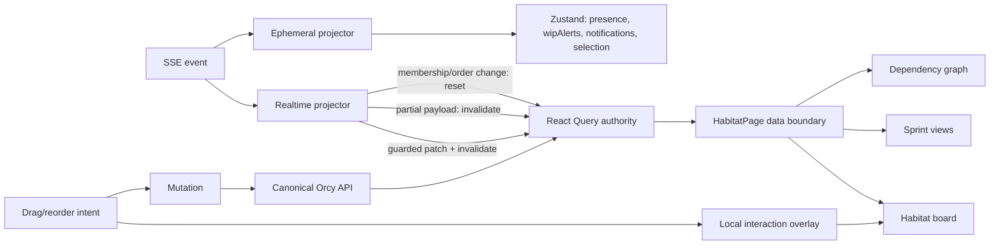
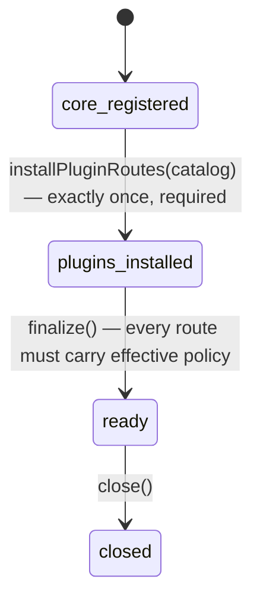

# Architecture Documentation

This document covers the system architecture, design decisions, key flows, and integration patterns.

> **Prerelease:** Orcy is in active `0.x` prerelease. Architecture, schema, and APIs may change between releases. Do not use prerelease Orcy for production workloads. See the [README](../README.md#️-prerelease--not-production-ready).

---

## System Overview

```
┌──────────────────────────────────────────────────────────┐
│  AI Agent (Claude Code / Codex / OpenCode / Cursor / Gemini) │
│  MCP stdio transport                                     │
│  ┌──────────────────────────────────────────────────┐   │
│  │  MCP Server (22 tools — see the dispatch table      │   │
│  │  in SKILL.md; counts drift, ALL_TOOLS is truth)     │   │
│  │  Features: list │ create │ get_context │ delete  │   │
│  │  Tasks: claim │ submit │ update │ heartbeat     │   │
│  │  Rules: get │ update │ evaluate                │   │
│  │  Scheduled: list │ create │ run                 │   │
│  │  Skill: get │ refresh │ contribute             │   │
│  │  Code Evidence: link │ list │ gaps │ resolve    │   │
│  └────────────────────┬─────────────────────────────┘   │
│                       │ HTTP (X-Agent-API-Key)           │
└───────────────────────┼──────────────────────────────────┘
                          ▼
                    Kanban API

┌──────────────────────────────────────────────────────────┐
│  Habitat → Missions → Tasks → Subtasks                     │
│  Missions flow through columns, tasks have state machine   │
│  Background intervals: stale detection, health snapshots, │
│    prioritization evaluation (5min), scheduled tasks (1m), │
│    daemon nudges/digests, in-process daemon engine       │
└──────────────────────────────────────────────────────────┘
```

---

## Component Responsibilities

### API (`packages/api`)

| Layer | Directory | Responsibility |
|-------|-----------|---------------|
| HTTP assembly | `src/httpApp.ts` | The single owner of the production HTTP surface (ADR-0049): Fastify construction, root hooks, policy installation, raw-body eligibility, both API prefix groups, realtime, Remote Participant, optional UI, and staged plugin route installation. The executable receives only a narrow runtime handle |
| Routes | `src/routes/` | HTTP parsing, validation, response formatting. Includes daemon machine routes (`/daemon/*`), human/UI daemon controls (`/daemons/*`), and habitat skill routes (`/habitats/:id/skill/*`) |
| Services | `src/services/` | Business logic, SSE broadcasting, webhook dispatch, AI features. Includes `missionService.ts`, `prioritizationService.ts`, `scheduledTaskService.ts`, `habitatSkillService.ts`, daemon nudges/digests, and `daemonEngine.ts` for the API in-process daemon runtime; `daemon-wiring.ts` provides lazy dynamic-import DI for the in-process daemon; `inProcessClaimStrategy.ts` implements the in-process claim path |
| Repositories | `src/repositories/` | Drizzle-backed data access (habitat, mission, task, column, agent, daemon, comment, template, webhook, event-mission, habitatSkill) |
| Models | `src/models/` | TypeScript types, Zod schemas. Includes `Mission`, `MissionWithProgress`, `MissionStatus` types |
| Middleware | `src/middleware/` | Authentication (API key + JWT), RBAC, team-based access |
| SSE | `src/sse/` | Event broadcaster (pub/sub) — broadcasts both task and mission events |
| DB | `src/db/` | Database initialization, Drizzle ORM schema (62+ tables including habitat_skills, habitat_skill_signals, code evidence tables) |
| Plugins | `src/plugins/` | Plugin system for extensibility |

### UI (`packages/ui`)

| Layer | Directory | Responsibility |
|-------|-----------|---------------|
| Pages | `src/pages/` | HabitatListPage, HabitatPage, MissionDetailPage |
| Components | `src/components/ui/` | Button, Badge, Card, Dialog, ErrorBoundary |
| Habitat | `src/components/habitat/` | Habitat, Column, TaskCard, TaskDetailPanel, DaemonSection, DaemonCard, DaemonSetupDialog, SkillPanel |
| Store | `src/store/` | Zustand state management — ephemeral slices only (theme, presence, wipAlerts, UI selection, recentSSEEvents); server data lives in React Query |
| API | `src/api/` | Typed REST client (per-domain modules; no server-shape aliasing) |
| Lib | `src/lib/` | React Query hooks (`useHabitatData`, `useTaskData`) + cache key factory (`queryKeys`) + guarded mutation helpers (`habitatMutations`) |
| Hooks | `src/hooks/` | `useSSE` (abort/generation-safe subscription lifecycle) + `useMissionDragMove` (single-flight, latest-target coalescing) |
| SSE | `src/sse/` | Event registry (membership-aware projection matrix) |
| Types | `src/types/` | TypeScript interfaces |

### MCP (`packages/mcp`)

| File | Responsibility |
|------|---------------|
| `src/index.ts` | MCP SDK server setup, tool registry |
| `src/tools/index.ts` | All tool exports + dispatch tool files — the `ALL_TOOLS` registry (22 tools at present; the registry, not this table, is the count authority) |
| `src/tools/habitat-dispatch.ts` | Habitat dispatch: list, find, summary, metrics, settings, health, analytics, prioritization rules |
| `src/tools/mission-dispatch.ts` | Mission dispatch: lifecycle, context, comments, code evidence, scoped audit bundle |
| `src/tools/task-dispatch.ts` | Task dispatch: lifecycle, CRUD, details, quality, subtasks, dependencies, effort, code evidence, scoped audit bundle |
| `src/tools/agent-dispatch.ts` | Agent dispatch: register, heartbeat, stats |
| `src/tools/sprint-dispatch.ts` | Sprint dispatch: lifecycle, mission membership, metrics, burndown, carry-over |
| `src/tools/review-dispatch.ts` | Review dispatch: review assignment rules and task reviewers |
| `src/tools/suggest-dispatch.ts` | Suggest dispatch: suggest-next-task |
| `src/tools/code-evidence.ts` | Code evidence handlers: link-code, list-code-evidence, correct-code-evidence-link, mark-not-applicable, clear-not-applicable, report-gap, resolve-gap, backfill (10 handler functions) |
| `src/tools/instructions.ts` | Hierarchical agent workflow instructions |
| `src/api.ts` | REST API client (OrcyApiClient) |

---

## State Ownership

The UI has two state stores with sharply separated responsibilities.
The boundary is enforced at the type level — there are no overlapping
slices, no dual-writes, and no SSE lane that writes server data into
Zustand. The full authority model and the rejected alternatives are
recorded in [ADR-0040](adr/0040-react-query-sole-server-state-authority.md).

| State | Authority | Notes |
|---|---|---|
| Habitat, Columns, active Missions with progress | React Query — `queryKeys.habitats.detail(habitatId)` | Complete main-board representation; the unpaginated active collection |
| Mission detail, tasks, progress, comments, dependencies | Domain-specific React Query keys | Independently invalidatable detail representations |
| Archived Missions | React Query infinite — `[...missions.all, "archived", habitatId]` | Mutable offset; reset-on-membership-change semantics |
| Habitat statistics | React Query — `queryKeys.habitats.stats(habitatId)` | Server-supplied `missionSummary` plus cycle/throughput/WIP |
| Sprint planning and dependency graph | Habitat detail Query | Reuse the complete active Missions already in detail |
| Presence, WIP alerts, notifications, theme, UI selection | Zustand ephemeral slices | Session and recipient-attention state only |
| Drag preview and column reorder | Local interaction overlay | Removed on success, failure, unmount, or Habitat switch |
| Recent SSE debug buffer | Zustand `recentSSEEvents` (bounded) | Debug surface, never read as domain truth |


```mermaid
flowchart LR
  API[Canonical Orcy API] --> RQ[React Query authority]
  SSE[SSE event] --> RP[Realtime projector]
  RP -->|guarded patch + invalidate| RQ
  RP -->|partial payload: invalidate| RQ
  RP -->|membership/order change: reset| RQ
  RQ --> PAGE[HabitatPage data boundary]
  PAGE --> BOARD[Habitat board]
  PAGE --> SPRINT[Sprint views]
  PAGE --> GRAPH[Dependency graph]

  SSE --> EP[Ephemeral projector]
  EP --> Z[Zustand: presence, wipAlerts, notifications, selection]

  INTENT[Drag/reorder intent] --> OVERLAY[Local interaction overlay]
  OVERLAY --> BOARD
  INTENT --> MUT[Mutation]
  MUT --> API
```

### Zustand slices

The Zustand store (`packages/ui/src/store/habitatStore.ts`) composes
exactly five slices — none of them hold durable server data:

- **Theme** — `theme: 'light' | 'dark'` + `setTheme`/`toggleTheme`.
- **Habitat** — `wipAlerts: Record<columnId, { limit, timestamp }>` +
  `clearWipAlert`. WIP alerts are short-lived UI warnings, not domain state.
- **Presence** — `presence: PresenceEntry[]` + upsert/remove. Session-scoped.
- **UI** — `selectedMissionId`, `selectedMissionIds`, `selectedTaskIds`,
  bulk-select modes, `collapsedColumns`, `notifications`, `isLoading`/`error`.
- **SSE handler** — `recentSSEEvents: SSEEvent[]` (bounded) +
  `handleSSEEvent` (dispatches to the ephemeral projector only).

### Realtime projection rules

The SSE event registry (`packages/ui/src/sse/registry.ts`) classifies
each event by representation and applies a per-representation projection:

- **Guarded merge** for compatibility-shape payloads (e.g. an
  already-cached Mission with version-ordered return). Never inserts; never
  overwrites a newer version with an older response.
- **Invalidate** for partial, filter-sensitive, or version-sensitive
  payloads (e.g. `task.*` invalidates the owning Mission, Mission progress,
  and Habitat detail).
- **Generation-reset** for archived-pagination membership or order changes
  (archive/unarchive/delete); the archived infinite Query is reset from
  offset zero.
- **Ephemeral-only** for presence, WIP, notification, and debug surfaces.

The projector calls `queryClient.cancelQueries` for affected keys before
guarded patches and rechecks the active subscription generation after
every await, so an older HTTP response cannot land after the patch.

### Subscription lifecycle

`useSSE` (`packages/ui/src/hooks/useSSE.ts`) owns:

- A monotonically increasing `generation` that identifies the active
  connection. Habitat change, reconnect replacement, or unmount increments
  it (invalidating the old generation) and aborts the token request,
  cancels reconnect timers, closes the current stream.
- A per-token `AbortController` for the stream-token request.
- Generation rechecks after every `await`, before installing the
  `EventSource` (a stale-generation `EventSource` is closed immediately),
  and inside the message handler (a stale generation performs no
  projection effect).

`habitat.deleted` removes the deleted Habitat's caches unconditionally
and navigates home only when the active route still represents the deleted
subscription.

### Mutation concurrency

- **Mission drag** (`useMissionDragMove`) is single-flight per Mission,
  coalesces to the latest target column, and dispatches the queued move
  with the previous successful response's authoritative `mission.version`.
  The API requires `expectedVersion` and returns `409 VERSION_CONFLICT`
  on mismatch; the client surfaces the conflict distinctly (never as a
  generic network failure) and invalidates to reconcile.
- **Column reorder** (`POST /habitats/:habitatId/columns/reorder`) is
  one atomic OCC operation. The server compares
  `expectedOrder: string[]` to the current order inside one transaction
  and returns `409 VERSION_CONFLICT` (with the current order) on mismatch
  before any writes. On success the response carries `{ columns }` in
  canonical order; `column.updated` SSE events fire post-commit. The prior
  sequential persistence loop and any compensation requests are deleted.

### Archived offset-reset semantics

The archived-Mission infinite Query's `pageParam` is the server offset;
next page exists while raw accumulated count is less than `total`. Any
change that can affect archived membership or order starts a new
collection generation: cancel in-flight page work, discard accumulated
pages, reset from offset zero before Load More is re-enabled. Late
results from a superseded generation are ignored. Stable-snapshot
browsing is explicitly not promised by this contract; it would require a
separate cursor/snapshot API decision.

---

## The Knowledge System

Orcy's knowledge features are a ladder, not one feature — each rung raises the abstraction and tightens the governance:

1. **Pulse / Insights** — raw, typed signals (findings, blockers, directives, experience, detected) and promoted insights; the capture layer.
2. **Habitat Skill auto-distillation** — the habitat skill service clusters and scores signals into a machine-readable skill document, injected into agent task context (below).
3. **Authored Wiki** — humans and agents synthesize the primitives into long-form curated prose; authored-only, versioned, searchable ([Habitat Wiki](#habitat-wiki-v021)).
4. **Recurrence-aware Triage** — clustered signals trigger bounded investigation; resolutions are recorded keyed by clusterKey so recurring patterns surface their history ([Triage System](#triage-system-v023)).
5. **Human-governed Learning Loop** — a dormant-by-default, citation-carrying proposal loop over an allowlist of history; accepted findings feed at most one Wiki draft, never auto-published ([Learning Loop](#learning-loop-v038)).

The ladder is descriptive, not a pipeline: no rung feeds the next automatically, and no habitat is required to climb it — capture works without promotion, the Learning Loop is dormant by default and enrolled per Habitat, and the wiki stays empty until someone authors it. Authorship is not human-only — agents author wiki pages and claim the scheduler's authoring tasks. These mechanisms have distinct outputs, not a shared pipeline: the wiki scheduler creates authoring tasks but never writes content; the Learning Loop proposes drafts rather than publishing; triage may create investigation and corrective work (missions and tasks).

## Habitat Skill Architecture

Each habitat auto-generates a living skill document from high-strength pulse signals, task outcomes, and agent observations. The system clusters signals by topic, scores them for strength, and promotes high-confidence signals into the skill document.

### Signal Ingestion

Signals are ingested from three sources:

1. **Pulse signals** — findings, blockers, warnings, directives posted by agents and humans
2. **Task events** — completed, approved, rejected, failed task outcomes
3. **Task comments** — review feedback, discussion threads

Each signal is normalized into a `cluster_key` (e.g., "auth-jwt-signing") and merged with existing signals on `(habitat_id, cluster_key)`.

### Signal Scoring

Strength is a composite 0-1 score from four dimensions (`calculateStrength`, `habitatSkillService.ts`):

| Dimension | Weight | Input |
|-----------|--------|-------|
| Frequency | 35% | Saturates at 5 observations (`min(frequency / 5, 1)`) |
| Recency | 25% | Linear decay over a 30-day window (`1 − daysSinceLastSeen / 30`) |
| Corroboration | 25% | Distinct confirming agents, saturating at 3 (`min(corroboratingAgents / 3, 1)`) |
| Outcome | 15% | Success ratio of associated tasks (defaults to 0.5 with no outcomes) |

The cross-mission count is **not** a strength input — it feeds category reclassification only (below). Within one `scoreAllSignals` pass, reclassification reads each signal's stored `crossMissionCount` from before the pass; the cross-mission recompute (`recalculateCrossMissionCounts`) runs after the loop, so a freshly broadened cluster influences the *next* pass.

### Skill Categories

Signals carry one of seven categories (`SKILL_CATEGORIES`, `@orcy/shared/types/skill.ts`):

| Category | Description |
|----------|-------------|
| `convention` | Established team practices (pulse `finding`/`directive` signals) |
| `pattern` | Cross-cutting patterns (experience `smooth`; also the reclassification target below) |
| `pitfall` | Things that consistently fail (pulse `warning`/`blocker`; experience `stuck`/`confused`/`backtrack`) |
| `domain_knowledge` | Confirmed technical knowledge (pulse `context`; experience `surprised`/`ambiguous`) |
| `agent_insight` | Direct contributions and unclassified signal types (the default bucket) |
| `anti_patterns` | Counterproductive behavior (experience `sidetracked`) |
| `detected_patterns` | Plugin-detector output — provenance-distinct from agent self-reports (ADR-0013) |

Initial category comes from signal provenance; `scoreAllSignals` then reclassifies on every scoring pass (`reclassifyCategory`):

- `convention` → `domain_knowledge` when frequency ≥ 3 and corroborating agents ≥ 2 — this check runs **first and returns**, so a `convention` signal meeting both thresholds becomes `domain_knowledge`, never `pattern`, in that pass.
- Otherwise, any category except `detected_patterns` becomes `pattern` when frequency ≥ 3 and stored `crossMissionCount` ≥ 2 (including `convention` when the first condition was not met).
- `detected_patterns` is never promoted — plugin-attributed matches must stay categorically distinct from agent-observed knowledge so triage can weight them separately.

### Promotion & Demotion

- Signals with strength ≥ 0.6 are promoted (`promotedToSkill = 1`) and included in the generated document
- Signals with strength < 0.2 are demoted and excluded
- The skill document is regenerated on refresh or after significant signal changes

### Hook Registry Pattern

Domain functions expose lifecycle hooks (`onHabitatCreated`, `onTaskCompleted`, etc.) that the skill service registers consumers for. Domain code remains unchanged — consumers write to their own tables only, preventing circular signal creation.

### MCP Integration

The `orcy_habitat_skill` dispatch tool exposes three actions:

| Action | Description |
|--------|-------------|
| `get` | Retrieve the current skill document for the habitat |
| `refresh` | Trigger async regeneration of the skill document |
| `contribute` | Submit a direct insight to the skill system |

Skill context is automatically injected into `getMissionContext()` responses, so agents receive habitat knowledge when claiming tasks.

### Component Layout

```
packages/api/
  src/db/schema/habitat-skill.ts              — Drizzle schema (2 tables)
  src/repositories/habitatSkill.ts             — CRUD + signal queries
  src/services/habitatSkillService.ts          — Ingestion, scoring, category classification, document generation
  src/routes/habitatSkill.ts                   — 5 API endpoints
packages/mcp/
  src/tools/habitat-skill.ts                   — 3 MCP handler functions
  src/tools/habitat-skill-dispatch.ts          — Dispatch tool + handler map
packages/cli/
  src/commands/skill.ts                        — 4 CLI commands (get, refresh, contribute, signals)
packages/ui/
  src/components/habitat/SkillPanel.tsx         — Collapsible panel with Document/Signals tabs
```

---

## Code Evidence Provenance

Promotes existing PR/MR, pipeline, worktree branch, and artifact foundations into an explicit, queryable code evidence layer. Instead of treating pull requests and CI runs as opaque attachments, the code evidence system decomposes them into structured, linkable entities that can be queried for completeness and gap analysis.

### Architecture

The code evidence layer uses a **hybrid model**: concrete evidence tables store normalized data from Git providers (branches, commits, changed files, reviews), while a central `code_evidence_links` table provides polymorphic metadata linking evidence to any Orcy entity (mission, task, or subtask).

```
┌─────────────────────┐       ┌─────────────────────┐
│ habitat_code_        │       │ code_evidence_       │
│ repositories         │       │ completeness         │
│ (1:1 per habitat)    │       │ (not-applicable      │
│                      │       │  overrides +         │
│ provider, repoSlug,  │       │  derived status)     │
│ verificationState    │       └─────────────────────┘
└──────────┬──────────┘
           │ (repositoryId)
           ▼
┌─────────────────────┐       ┌─────────────────────┐
│ code_branches        │──────<│ code_commits         │
│                      │       │                      │
│ name, headSha,       │       │ sha, message,        │
│ baseBranch,          │       │ authorName/Email,    │
│ createdFromTaskId    │       │ verificationState    │
└──────────┬──────────┘       └──────────┬──────────┘
           │                              │
           │ (branchId)                   │ (commitId)
           ▼                              ▼
┌─────────────────────┐       ┌─────────────────────┐
│ code_changed_files   │       │ code_reviews         │
│                      │       │                      │
│ path, previousPath,  │       │ reviewStatus,        │
│ changeType,          │       │ reviewerName         │
│ additions, deletions │       └─────────────────────┘
└─────────────────────┘

           ┌─────────────────────┐
           │ code_evidence_links │  ← Core link table
           │                     │    (polymorphic: mission/task/subtask → evidence)
           │ targetType,         │
           │ targetId,           │
           │ evidenceType,       │
           │ evidenceId,         │
           │ status, confidence, │
           │ linkSource          │
           └─────────────────────┘

           ┌─────────────────────┐
           │ code_evidence_gaps   │  ← Gap lifecycle
           │                     │
           │ reasonCode,         │
           │ status              │    (active/resolved)
           │ resolutionReason    │
           └─────────────────────┘
```

### Key Tables

| Table | Purpose |
|-------|---------|
| `habitat_code_repositories` | One row per habitat — canonical repository identity (provider, repoSlug, verificationState) |
| `code_branches` | Branch evidence (name, headSha, baseBranch, createdFromTaskId) |
| `code_commits` | Commit evidence (sha, message, authorName/Email, verificationState) |
| `code_changed_files` | Changed file snapshots per commit (path, previousPath, changeType, additions, deletions) |
| `code_reviews` | Review evidence (reviewStatus, reviewerName) |
| `code_evidence_links` | Core polymorphic link table — connects missions/tasks/subtasks to evidence entities |
| `code_evidence_completeness` | Not-applicable overrides + derived completeness status per target |
| `code_evidence_gaps` | Gap lifecycle tracking (reasonCode, status active/resolved, resolutionReason) |

### URL Parsing

Code evidence is extracted from provider URLs without API calls:

| Provider | URL Pattern | Evidence Extracted |
|----------|------------|-------------------|
| GitHub | `github.com/owner/repo/pull/123` | PR → branch, commit, changed files, review |
| GitHub | `github.com/owner/repo/commit/abc123` | Commit → changed files |
| GitHub | `github.com/owner/repo/actions/runs/456` | CI run → commit, branch |
| GitLab | `gitlab.com/owner/repo/-/merge_requests/123` | MR → branch, commit, changed files, review |
| GitLab | `gitlab.com/owner/repo/-/commit/abc123` | Commit → changed files |
| GitLab | `gitlab.com/owner/repo/-/pipelines/456` | Pipeline → commit, branch |

### Evidence Linking Sources

Every evidence link records its provenance via `linkSource`:

| Source | Description |
|--------|-------------|
| `webhook` | Automatically linked via GitHub/GitLab webhook handler |
| `branch_pattern` | Matched by worktree branch naming convention |
| `commit_trailer` | Detected from commit message metadata (e.g., `Task-Id:` trailer) |
| `agent_reported` | Submitted by an AI agent via MCP dispatch action |
| `human_manual` | Manually linked by a human through the UI or API |
| `migration` | Created during data migration from attachment-based provenance |
| `api` | Created via direct API call |
| `artifact_mirror` | Backfilled from existing `pull_requests` / `pipeline_events` tables |

### Completeness Derivation

Completeness status is derived per target (mission/task/subtask) by evaluating active evidence links against expected evidence types:

| Status | Condition |
|--------|-----------|
| `complete` | All expected evidence types have active links |
| `partial` | Some but not all expected evidence types have active links |
| `missing` | No active evidence links for any expected type |
| `not_applicable` | Explicit override via `code_evidence_completeness` table (with reasonCode) |
| `unknown` | Target has no defined evidence expectations |

### Corrections (Same-Envelope Mutation)

A correction marks an evidence link with a correction status instead of inserting a second link record:

| Correction | Effect |
|------------|--------|
| `superseded` | Link replaced by a newer, more accurate link (`replacement_link_id` may point at it) |
| `incorrect` | Link was wrong (with reason and actor who corrected it) |
| `removed` | Link no longer relevant (with reason and actor) |

The correction updates the *same* link row: its `status`, the latest `correctedByType`/`correctedById`/`correctedAt`, `correctionReason` and an optional `replacement_link_id` pointer. The link's target identity, evidence identity, original linked actor/time/source, verification, confidence and metadata are all retained, and no provider evidence is deleted. The audit trail is the separate route-level `code_evidence_corrected` task/mission event written after the mutation — not an additional link row, and not an immutable ledger: repeating a correction overwrites the previous correction envelope (and clears `replacement_link_id` when the caller omits it) and writes another route event. "History" for a target is a query over current nonactive rows, so it reflects the latest envelope per link rather than every correction ever made.

The `replacement_link_id` pointer is a reference, not a content grant or a source-ownership transfer. It is a nullable self-FK with `ON DELETE SET NULL` and carries no target/active/generation constraint, so it may reference any existing link — another Task, another Mission or Habitat, a nonactive link, itself, or a link participating in a cycle. Correction never fetches, discloses or authorizes the replacement object; only the scalar id is stored and returned. The FK is what supplies reference existence: a `replacementLinkId` that does not exist fails the statement (`500`, rolled back) rather than being silently dropped.

### Non-Blocking Webhook Integration

Evidence linking in webhook handlers (GitHub Issues, GitLab MR, CI/CD pipelines) is wrapped in `try/catch` blocks. A failure to create evidence records does not block the primary webhook operation (mission sync, pipeline status update). Evidence linking failures are logged but never cause webhook handler errors.

### Lazy Backfill

Existing PRs and pipeline events created before the code evidence layer receive evidence links via `backfillExistingCodeEvidence()`. This function:

1. Queries existing `pull_requests` and `pipeline_events` rows
2. Parses stored URLs to extract provider, repository, branch, and commit metadata
3. Creates evidence records (branches, commits, changed files, reviews) and links them to the corresponding tasks/missions
4. Runs idempotently — re-running does not create duplicate evidence

### Component Layout

```
packages/api/
  src/db/schema/code-evidence.ts            — Drizzle schema (8 tables)
  src/repositories/codeEvidence.ts           — CRUD + evidence queries + completeness derivation
  src/services/codeEvidenceService.ts        — URL parsing, linking, backfill, gap management
  src/routes/codeEvidence.ts                 — API endpoints for evidence operations
packages/mcp/
  src/tools/code-evidence.ts                 — 10 MCP handler functions
  src/tools/task-dispatch.ts                 — code evidence + scoped audit bundle actions
  src/tools/mission-dispatch.ts              — code evidence + scoped audit bundle actions
```

**Decision:** Use `better-sqlite3` for production storage; `sql.js` (WASM) only for test environments.

**Rationale:**

- Native SQLite bindings provide better production behavior than sql.js
- Zero external database dependency — file-based with WAL mode
- Easy to reset (delete `orcy.db`)
- Drizzle ORM provides cross-database support (SQLite/PostgreSQL via dialect)

**Trade-offs:**

- No concurrent write support under heavy load
- No replication or clustering
- SQLite-specific SQL (not portable to PostgreSQL without dialect changes)

### ADR-3: SSE over WebSocket

**Decision:** Use Server-Sent Events for real-time updates.

**Rationale:**

- Unidirectional (server → client) is all we need
- Native browser support via `EventSource`
- Simpler than WebSocket for this use case
- Works through most proxies with proper headers

**Trade-offs:**

- No bidirectional communication
- Some proxy configurations may buffer events

### ADR-4: Zustand over Redux

**Decision:** Use Zustand for UI state management.

**Rationale:**

- Minimal boilerplate
- Built-in selector optimization
- Easy SSE integration — `handleSSEEvent` updates store directly
- No middleware complexity

### ADR-5: Parameterized SQL over ORM — [OBSOLETE]

**Decision:** Use raw parameterized SQL queries instead of an ORM.

**Rationale:**

- Full control over query performance
- No ORM abstraction leaks
- Direct mapping to SQLite capabilities
- Easier to reason about for simple queries

**Trade-offs:**

- More verbose than ORM equivalents
- Schema changes require manual SQL updates

### ADR-6: Append-Only Event Log

**Decision:** Task events are immutable and append-only.

**Rationale:**

- Complete audit trail for debugging and compliance
- Event sourcing foundation for future features
- No data loss from updates

**Trade-offs:**

- Event table grows unboundedly
- No "delete event" capability (intentional)

### ADR-7: Drizzle ORM with better-sqlite3

**Decision:** Migrate from raw parameterized SQL to Drizzle ORM with better-sqlite3 as the primary database driver.

**Rationale:**

- Type-safe schema definition with automatic TypeScript type inference
- Cross-database support via dialect helpers (SQLite/PostgreSQL)
- Drizzle Kit for schema management
- Native SQLite bindings provide superior production behavior to sql.js
- Still allows raw SQL for complex queries when needed

**Trade-offs:**

- Additional abstraction layer
- Learning Drizzle API required
- PostgreSQL support requires driver switching via `setDriver('postgres')`

### ADR-8: React Query for Server State Caching

**Decision:** Use React Query (`@tanstack/react-query`) for server state caching. React Query is the sole client authority for durable server data; Zustand retains only ephemeral UI state.

**Rationale:**

- React Query eliminates redundant API requests via intelligent deduplication and caching
- Stale-while-revalidate pattern keeps UI responsive without over-fetching
- Built-in cache invalidation hooks integrate cleanly with SSE events
- `retry: false` on 429 errors prevents retry storms that amplify rate limiting
- A single authority eliminates the dual-write and dual-invalidate defects that historically split the UI across two caches

**Batched Endpoints Pattern:**

To avoid a cascade of parallel requests when opening a task detail panel, endpoints are consolidated. The `GET /tasks/:id/details` endpoint returns everything needed in one call:

```ts
{
  task, subtasks, pullRequests, pipelineEvents, events,
  comments, totalComments,
  attachments, watchers, isWatching,
  mission, siblingTasks,
  dependencies, blockedBy, blocking, habitatContext
}

Similarly, `GET /missions/:id/details` returns mission + tasks + events + progress in one call.

**State ownership:** the durable server state authority is React Query; Zustand holds only ephemeral slices (theme, presence, WIP alerts, UI selection, collapsed columns, notifications, the bounded `recentSSEEvents` debug buffer). The full authority boundary, membership-aware realtime projection, abort/generation-safe subscription lifecycle, cancel-before-patch HTTP ordering, versioned Mission moves, atomic OCC Column reorder, and mutable-offset archived resets are recorded in [ADR-0040](adr/0040-react-query-sole-server-state-authority.md), which supersedes the pre-v0.18.3 "two caching layers" trade-off that used to live in this section.

### ADR-9: Hierarchical Kanban — Missions → Tasks → Subtasks

**Decision:** Replace the flat Habitat → Tasks model with Habitat → Missions → Tasks → Subtasks. Missions become the habitat-level cards; tasks become mission-internal work units.

**Rationale:**

- Aligns with how teams think about work — missions as deliverables, tasks as implementation steps
- Mission status auto-derived from child tasks eliminates manual status management
- Cleaner separation of concerns: missions own habitat position/timeline, tasks own agent assignment
- Mission-level dependencies are more meaningful than task-level cross-habitat deps

**Trade-offs:**

- Breaking change — no backward compatibility with flat task model
- Required restructuring the codebase
- Additional API complexity (13 new mission endpoints)
- Agents must learn mission-centric workflow (`orcy_habitat_mission({action:"get-context"})` before claiming)

### ADR-10: Mission Status Derivation Engine

**Decision:** Mission status is always derived from child task states. No manual status field.

**Rationale:**

- Eliminates status drift between missions and their tasks
- Single source of truth — task states drive everything
- Automatic column advancement keeps the habitat visually accurate
- Humans retain veto power via manual column override (POST /missions/:id/move)
- Completed work can be archived (`isArchived` flag) while retaining 'done' status for metrics, rather than introducing an 'archived' status in the state machine.

**Trade-offs:**

- Recalculation on every task state change (minimal performance impact)
- Edge case: empty missions default to `not_started`
- Mission status changes are side effects, not directly triggered

---

## Hierarchical Model Architecture

### Entity Responsibility Matrix

| Concern | Mission | Task | Subtask |
|---------|---------|------|---------|
| Habitat column position | Yes | No | No |
| State machine | No (derived) | Yes | No |
| Agent assignment | No (deferred) | Yes | No |
| Result / artifacts | No | Yes | No |
| Comments | No (on tasks) | Yes | No |
| Events / audit trail | Yes (mission-level) | Yes (task-level) | No |
| Dependencies | Yes (cross-mission) | Yes (within-mission) | No |
| Priority | Yes | Yes | No |
| Labels | Yes | No | No |
| SLA / due date | Yes | No | No |
| Estimated time | No | Yes | No |
| Progress tracking | Derived from tasks | Boolean per state | Boolean |

### MCP Tool Architecture (Consolidated Dispatch Pattern)

The MCP server exposes every tool in the `ALL_TOOLS` registry (`packages/mcp/src/tools/index.ts`) with dozens of action-routed operations. Each dispatch tool accepts an `action` parameter to route to specific operations. Tool and action counts drift release-to-release — the registry and the full dispatch table in [SKILL.md](SKILL.md) are the authority, not this illustrative subset:

| Dispatch Tool | Actions | Purpose |
|---------------|---------|---------|
| `orcy_habitat` | `list`, `find`, `summary`, `metrics`, `get-settings`, `get-health`, `get-health-history`, `predictions`, `bottlenecks`, `agent-quality`, `get-rules`, `update-rules`, `evaluate-rules` | Habitat-level operations, health, analytics, and prioritization rules |
| `orcy_habitat_mission` | `list`, `create`, `delete`, `archive`, `unarchive`, `get-context`, `get-comments`, `add-comment`, `link-code`, `list-code-evidence`, `get-audit-bundle` | Mission lifecycle, context, code evidence, and scoped audit bundles |
| `orcy_habitat_task` |  `claim`, `submit`, `complete`, `release`, `retry`, `get-context`, `get-comments`, `add-comment`, `get-quality-checklist`, `validate-quality-gates`, `list-subtasks`, `create-subtask`, `log-effort`, `link-code`, `get-audit-bundle`  | Task lifecycle, evidence, effort, quality, and scoped audit tools |
| `orcy_habitat_agent` | `register`, `list`, `heartbeat`, `get-stats` | Agent management |
| `orcy_suggest` | `suggest-next-task` | AI-ranked task suggestions (fan-out `dependencyBonus` boosts tasks that unblock more downstream dependents; capped at 25 points, weighted 5 per dependent) |
| `orcy_habitat_message` | `send`, `get-messages` | Agent-to-agent messaging |
| `orcy_pulse` | `post`, `check` | Mission signal board — post findings, blockers, directives; check partner signals |
| `orcy_habitat_subscription` | `subscribe`, `unsubscribe` | Real-time notifications |
| `orcy_worktree` | `get-worktree` | Git worktree info |
| `orcy_habitat_skill` | `get`, `refresh`, `contribute` | Dynamic habitat skills — get skill document, trigger regeneration, submit direct insights |
| `orcy_sprint` | `list`, `get`, `get_active`, `get_metrics`, `get_burndown`, `get_carry_over`, `create`, `update`, `delete`, `start`, `complete`, `cancel`, `add_mission`, `remove_mission` | Sprint planning, lifecycle, and analytics |
| `orcy_review` | `list_rules`, `create_rule`, `update_rule`, `delete_rule`, `list_reviewers`, `add_reviewer`, `remove_reviewer` | Review rules and task reviewer assignment |
| `orcy_instructions` | (tool) | Returns orcy skill guide |

### Pulse Signal Architecture

Pulse adds a structured signal layer on top of the existing task state machine. Signals flow as follows:

```

Agent / Human
  │
  ├─► orcy_pulse({action: "post", missionId, signalType, subject})
  │     │
  │     ├─► POST /api/missions/:id/pulse
  │     │     ├─► INSERT INTO pulses (missionId, habitatId, fromType, signalType, ...)
  │     │     ├─► IF signalType = 'blocker' → taskService.createTask("Clear Blocker: ...")
  │     │     └─► SSE broadcast: pulse.signal_posted
  │     │
  │     └─► Other agents discover via:
  │           ├─► mission_get_context() — pulse digest (counts + highlights)
  │           └─► orcy_pulse({action: "check", missionId}) — full signal list
  │
  └─► System auto-generates signals on task lifecycle events:
        ├─► claim → CONTEXT: "{agent} claimed '{title}'"
        ├─► submit → OFFER: "Results for '{title}' available"
        ├─► complete → CONTEXT: "{agent} completed '{title}'"
        ├─► fail → WARNING: "Task '{title}' failed: {reason}"
        ├─► release → CONTEXT: "Task '{title}' released"
        └─► blocker clearance done → CONTEXT: "Blocker cleared: {subject}"

```

**Key tables:** `pulses` (signal storage with deep-linking to missions, tasks, and other pulses) and `pulse_cursors` (per-reader per-mission last-checked timestamp). See [DATABASE.md](DATABASE.md) for the full schema.

---

## Durable Review Safety (migration 0082)

The review requirement is durable state: a per-task requirement row
(CHECK-enforced state matrix), one immutable claim snapshot per
successful-claim generation, append-only typed decisions, and append-only
human override evidence. The claim kernel captures policy inside the claim
transaction; every ownership-ending writer (release, fail, remote release,
agent deletion, retry, import reset) invalidates claimant/proof and expires
overrides with immediate baseline restore in the same transaction; finality
runs under one immediate reservation ending in a committed
`approved_generation` proof. Legacy tasks are classified sticky-unknown at
migration and resolve only through the independent human recovery command
(viewer-ceiling persisted-role authorization). See SECURITY.md 'Durable
Review Safety' and DATABASE.md migration `0082`.

## State Machines

### Task State Machine

Tasks use the following state machine. Completion reaches `done` only through the **gated path** (`POST /tasks/:id/complete`), which validates quality gates and dependencies — including after an approval. From `submitted`, two review decisions exist: approval (`POST /tasks/:id/approve`) moves the task to `approved` — or leaves it `submitted` while required reviews remain — and skips quality gates at its own transition only; rejection (`POST /tasks/:id/reject`) returns the task for rework. Decisions are made by a human or by an agent holding a pending assigned reviewer row (agent self-review is denied server-side); a separately opted-in system merge-approval webhook can also approve.

                    ┌──────────────────────────────────────────────┐
                    │                                              │
                    ▼                                              │
 ┌─────────┐  claim  ┌─────────┐  start  ┌────────────┐          │
 │ PENDING │────────>│ CLAIMED │────────>│ IN_PROGRESS │          │
 └────┬────┘         └────┬────┘         └──────┬─────┘          │
      │                   │                     │                 │
      │                   │  release            │ submit          │
      │                   └────────┐            │                 │
      │                            │            ▼                 │
      │                            │    ┌──────────┐              │
      │                            │    │ SUBMITTED│              │
      │                            │    └────┬─────┘              │
      │                            │         │                    │
      │                            │    ┌────┴──────┐             │
      │                            │    │           │             │
      │                            │  approve   complete          │
      │                            │ (no gates)  (gates ✅)      │
      │                            │    │           │             │
      │                            │    ▼           ▼             │
      │                            │  ┌──────────┐                │
      │                            │  │ APPROVED │──────┐         │
      │                            │  └────┬─────┘      │         │
      │                            │       │            │         │
      │                            │  complete    complete        │
      │                            │  (gates ✅)  (gates ✅)     │
      │                            │       │            │         │
      │                            │       ▼            ▼         │
      │                            │  ┌────────────────────┐      │
      │                            │  │       DONE         │      │
      │                            │  │    (terminal)      │      │
      │                            │  └────────────────────┘      │
      │                            │                              │
      │                            │         reject               │
      │                            │            │                 │
      │                            │            ▼                 │
      │                            │    ┌──────────┐              │
      │                            │    │ REJECTED │──start──> IN_PROGRESS
      │                            │    └──────────┘              │
      │                            │                              │
      │                   release  │            fail              │
      │<──────────────────────────┘            │                  │
      │                                        ▼                  │
      │                                  ┌────────┐               │
      │<───── retry ─────────────────────│ FAILED │               │
      │                                  └────────┘               │
      │                                                           │
      ▼                                                           │
 (re-claimable)                                                   │
                                                                  │
 Note: complete = POST /tasks/:id/complete (quality gates ✅)     │
       approve = POST /tasks/:id/approve (quality gates ❌)       │
 ────────────────────────────────────────────────────────────────┘

### Valid Transitions

| From | To | Trigger | Actor | Quality Gates |
|------|----|---------|-------|---------------|
| `pending` | `claimed` | `POST /tasks/:id/claim` | Agent | n/a |
| `claimed` | `in_progress` | `POST /tasks/:id/start` | Agent | n/a |
| `claimed` | `pending` | `POST /tasks/:id/release` | Agent/System | n/a |
| `in_progress` | `submitted` | `POST /tasks/:id/submit` | Agent | n/a |
| `in_progress` | `pending` | `POST /tasks/:id/release` | Agent | n/a |
| `in_progress` | `failed` | `POST /tasks/:id/fail` | Agent | n/a |
| `submitted` | `done` | `POST /tasks/:id/complete` | Agent | ✅ enforced |
| `submitted` | `approved` | `POST /tasks/:id/approve` | Human / admitted agent-typed reviewer | ❌ skipped (this transition only; later `complete` re-checks) |
| `submitted` | `rejected` | `POST /tasks/:id/reject` | Human / admitted agent-typed reviewer | n/a |
| `approved` | `done` | `POST /tasks/:id/complete` | Agent | ✅ re-checks |
| `rejected` | `in_progress` | `POST /tasks/:id/start` | Agent | n/a |
| `failed` | `pending` | Retry/System | System | n/a |
| `done` | — | Terminal state | — | — |

---

### Execution Token (Claim-Epoch Identity)

Every successful claim mints a fresh `tasks.execution_token` uuid **inside the claim authority's transaction** (`claimWithAuthority` → `commitPlainClaim` / `commitDelegatedClaim`) — the token IS the claim epoch's identity, one per ownership period. The daemon session created in the same transaction (the `onClaimCommitted` hook → `createDaemonSessionWithClient`) carries the SAME token, so task and session join atomically: a session-insert failure rolls back the claim with it, leaving task/agent/session coherent with no leaked success effects.

Why not timestamps: `claimedAt`/`startedAt` can be equal across predecessor/successor pairs under clock granularity, and rework re-entry would reuse a preserved `claimedAt`. A freshly generated opaque uuid distinguishes claim epochs without relying on timestamp ordering.

| Writer | Token action |
|---|---|
| Claim (plain / delegated / remote / batch / auto-assign — all route through the claim authority) | **mint** (fresh uuid) |
| `claimed → in_progress` start; submit; delegation offer | **preserve** |
| Reject transition | **preserve** (the rejected-continuation token — the owner's proof for the rework start) |
| `rejected → in_progress` rework start (local owner only) | **mint** Y (response-pinned; same act-tx rebinds the exact-X session or terminalizes one classified stale by policy) |
| `releaseTask` (route, stale sweep, agent-delete current-task) | **clear** |
| Automation `release_assignment` (canonical release act-tx, both live and frozen delivery paths) | **clear** (evaluated/pinned-epoch fenced) |
| Daemon session-recovery drive (`claimed` + failed/lost session → never-started; completed-no-submit; session-released — all via the release act-tx) | **clear** (session-epoch fenced) |
| Plugin `taskWriter.releaseTask` (observation-fenced release act-tx, previously-read-or-claimed) | **clear** (observed-epoch fenced) |
| Agent deletion (atomic composition — release bundles per `claimed`/`in_progress` holding via `releaseTaskWithEffectsWithClient`; terminal/legacy unassign) | **clear** (bundles) / **normalize-to-NULL** (terminal unassign) |
| `releaseTaskByRemoteParticipant` / `releaseTaskForRemote` inline tx write | **clear** |
| Habitat import reset | **clear** |
| `failTask`; retry `executeRetry` / `escalateToHuman` payloads; terminal `done`/`approved` writes | **clear** |

The `onClaimCommitted` hook is api-internal, synchronous, and runs after `verifyAndReturn` proves the claim landed, still inside `client.transaction`, before commit. This composed claim runs the existing pre-interceptors before the repository transaction and performs post-claim effects only after its successful commit; the session-insertion hook is synchronous and api-internal, and it adds no new plugin or network work inside the transaction (the pre-interceptor veto keeps its existing position outside and before the repo call, ADR-0038 §3).

The token is read-only bookkeeping: it serializes as an optional additive field on Task payloads (REST/SSE — an epoch identity, not a credential), is not settable through any task PATCH schema (zod `.strict()` excludes it), and is written by authoritative claim/mint/clear paths only. Same-session reject continuity is bound: reject preserves the token as the rejected-continuation token; the still-assigned owner's rework start (`rejected → in_progress`, local path only, remote mirror claimed-gated) mints the rework epoch Y in the same atomic write, rebinds the exact-X continuation daemon session onto Y in the same act-tx, and terminalizes instead (monotonic `lost`, keeping X) when the session's owner is classified stale by the existing policy (embedded `!running` ∧ heartbeat ≥ 10 min; standalone: heartbeat-only staleness) — the terminalized X death then no-ops against the rework epoch by epoch-mismatch construction. An active exact-X session continues whenever it is not classified stale by the existing policy (embedded engine running, or a fresh/unparseable heartbeat); a fresh heartbeat is not proof the owner process is alive — a dead-but-fresh-beat owner still rebinds (intentional current-session continuation), and its later death under Y is the current worker's legitimate recovery signal. Legacy NULL-token rows (pre-migration claims, and rows rejected before this change, which cleared the token) admit the rework start (stored-NULL guard branch) with no session inference (no NULL==NULL rebind). Execution identity is recorded and copied onto daemon sessions; automatic recovery driven by that identity is implemented below.

**Epoch mutation guard (required claim-pinned token on agent lifecycle mutations).** The four agent-callable task mutations — `startTask`, `submitTask`, `failTask`, `releaseTask` — require the claim-pinned execution token on the agent wire, immediately and unconditionally (no staged flag; breaking wire compat by decision). Policy, evaluated INSIDE each authoritative write/transaction (never a pre-check beside it): a stored-NULL token row is the sole legacy boundary and always allows past the epoch guard — actor, status, and authority checks still apply (a client-presented token never turns a legacy row into a rejection); a non-NULL stored row demands `executionToken` body equality — missing, typed-null, or mismatched all reject with `409 { code: "EPOCH_MISMATCH" }` naming `task.executionToken` as the source. Typed-null ≡ omitted. The guard rides the service/authority predicates: the progression authority tx (`start`), the submit/release IMMEDIATE transactions, and the fail act-tx (where the client's expected epoch is checked via the same disjunction while the stamped `failed` event and causal snapshot keep the ACTUAL winning row's token — never the client's value). The system bypass is STRUCTURAL: only the agent HTTP routes thread the body token into the guarded predicate; server-actor sites (stale sweep, automation executor, plugin runtime, retry processor, remote seam, internal recovery services) pass no token and never route through the guarded predicate — no wire-controllable flag exists. The MCP surface threads the token through the client interface, the task-lifecycle tools, and the `board_update_task`/`update`-action status branches; `claim` gains no token input (it mints). Claim surfaces propagate the token from the stored claim composition (shared `ClaimResult`, `ClaimNextDaemonTaskResult`, embedded strategy, standalone daemon) and the daemon embeds it in the adapter prompt at spawn — immutable for the process lifetime, never written to `.mcp.json` or any workdir file.

### Daemon Worker Recovery

Terminal/crash/session-loss recovery for daemon sessions runs server-side, keyed on the session's claim-epoch token (never recency or latest-row heuristics).

**Drive (`driveDaemonSessionOutcome`).** Both transports converge on the same seam immediately after a terminal session status write commits: the embedded `InProcessSessionUpdater.updateSession` and the daemon-auth `PATCH /daemon/sessions/:id` handler (the drive is synchronous better-sqlite3 work, so an awaited PATCH/shutdown covers the durable task transition and the receipt enqueue on a successful drive — it does NOT cover the effects' completion, which drains on the consumers' own cadence; a drive failure inside the act-tx rolls the whole bundle back and writes nothing task-side; a caught failure after the act-tx commits (post-commit postlude) leaves the committed task state and receipts in place — later delivery backstops handling. Either way the fixed code `daemon_recovery_db_write_failed` is logged and the sweep retries the driveable remainder). Explicit branch by the task's current status — `in_progress` + `failed`/`lost` session → the fail act-tx (full 5-consumer effect bundle); `claimed` + `failed`/`lost` → the release act-tx with reason `daemon_session_failed_never_started`; `completed`-unsubmitted or `released` session on a claimed/in_progress task → the release act-tx (`daemon_session_completed_no_submit` / `daemon_session_released`). No null-fallthrough: a refused fail is never re-routed to release. The intended epoch is the SESSION's token conveyed through the pre-image — a task re-claimed under a new epoch refuses with zero task/effect-bundle writes — only metered-action budget bookkeeping may be recorded (E1's death never touches E2's task state). Pre-migration NULL-token sessions are a task-side no-op; the 30-minute agent-stale fallback then applies only where its own conditions hold (the assigned agent heartbeat-stale with this task as its `currentTaskId`) — an orphaned task or one whose agent heartbeats otherwise may outlive that fallback.

**Release act-tx (`releaseTaskWithEffects`).** Its own `BEGIN IMMEDIATE` (never routed through the plain repo release): epoch revalidation, CAS release write with `tasks.last_release_event_id` (migration 0080; an independent provenance stream from the failure pointer), in-tx `released` event, and receipts for exactly `{workflow_gates, failure_context}`. The gates consumer fences the release's gate/spawn mutation on the unclaimed window (`pending ∧ token-NULL ∧ pointer = :eventId`) — a successor claim, retry reset, or terminal write acks `superseded` — while historical failure-context capture survives epoch supersession whenever the frozen-gate satisfied-stamp condition held at delivery — capture stays conditional on that stamp and bounded by the consumer's finite retry budget, not an unconditional guarantee. Graceful operator stop releases in-flight sessions for ALL adapters through this chain with no retry-budget burn.

**Ghost sweep.** A 60 s interval + boot pass (post-`initDb`) terminalizes `starting`/`running` sessions whose owner shows no heartbeat or contact — absence, never proof of death — freeing `maxConcurrent`/per-agent capacity independent of task state, never inferring task ownership. No-contact rule: the sweep never acts while the embedded engine is running; otherwise the DAEMON heartbeat decides, ≥ exactly 10 minutes stale (a NOMINAL detection figure that holds while the API is healthy, the heartbeat is eligible, and the embedded engine is not running — polling delay, sweep backlog, DB errors, or a revival can extend it; it is not a hard deadline) (numeric `Date.parse`; NULL → stale, unparseable/future-dated → skip reap + fixed-code log). The terminalization transaction re-reads the heartbeat fresh in-tx — a daemon that heartbeats between sweep observation and the write is spared (revival race closed). The embedded engine's `start()` performs the one verified-restart action: a local straggler cleanup of that daemon's still-active session rows before serving its first claim. Session status writes are monotonic (first terminal write wins; no resurrection).

**Shutdown.** Embedded API shutdown is bounded, not loss-free: `onClose` stops the sweep, then awaits engine session shutdown under a 5 s cap; sessions not settled by the deadline keep their rows and remain eligible for later boot-pass or sweep recovery under the same guards — no particular pass is guaranteed to pick them up. Graceful operator stop releases in-flight sessions immediately through the release chain; a deadline-expired shutdown guarantees no such completion — recovery, not in-flight continuation, owns the remainder.

**Attribution.** Every recovery write is the auth-derived `system` actor (`daemon-recovery`) — classification is never reason-text-derived, so an agent posting `/fail` with a `daemon_session_*` reason stays agent-attributed. The skill-ingestion receipt consumer drops the agent binding for system-origin failures (the task-bound blocker signal remains); retry spend caps stay blame-indifferent, with the classified cause stamped on `retry_scheduled`/`escalated` follow-up metadata only.

### Mission Status Derivation

Mission status is **auto-derived** from child task states. There is no manual status management.

```

Mission Status Derivation Rules:
─────────────────────────────────
not_started  ← all tasks are pending
in_progress  ← any task is claimed/in_progress/submitted/approved/rejected
review       ← all tasks are submitted/approved/done (none active)
done         ← all tasks are done/approved (at least one done)
failed       ← any task failed and none actively being worked on

```

### Column Auto-Advancement

After deriving mission status, the mission's column position is automatically updated:

```

Status → Column Mapping:
─────────────────────────
not_started  → first column (Backlog)
in_progress  → second column (In Progress)
review       → second-to-last non-terminal column (Review)
done         → terminal column (Done)
failed       → stays in current column (no auto-advance)

```

### Trigger Points

The derivation engine runs after every task state change:

| Task Service Method | Triggers Mission Status Derivation |
|---------------------|-------------------------------------|
| `claimTask()` | Yes |
| `startTask()` | Yes |
| `submitTask()` | Yes |
| `approveTask()` | Yes |
| `rejectTask()` | Yes |
| `completeTask()` | Yes |
| `failTask()` | Yes |
| `releaseTask()` | Yes |
| `createTask()` | Yes (may not change status) |
| `deleteTask()` | Yes (may change status) |

---

## Dependency Resolution

### Mission-Level Dependencies

Missions declare dependencies on other missions. Tasks inherit dependency filtering from their parent mission.

1. When creating a mission, specify `dependsOn: ["mission-uuid-1", "mission-uuid-2"]`
2. The `getAvailableTasksForAgent()` function checks mission-level dependencies via `mission_dependencies`
3. Tasks within a mission with unmet dependencies are not shown to agents
4. When a mission reaches `done` status, dependent missions become available

#### Release Gates (v0.25.0)

Release gates layer alongside mission dependencies as an additional blocking condition in `getAvailableTasksForAgent()`. A mission carries an optional gate declared via two nullable columns — `releaseGateType` (`patch`/`minor`/`major`) and `releaseGateVersion` (a free-text version pin like `v0.25` or `v0.25.0`):

1. A gated mission's tasks are blocked from claiming until a matching release ships.
2. Either-match semantics: a gate is satisfied when the shipped release type matches-or-cascades (`patch ⊂ minor ⊂ major`) **or** the version pin matches (exact or prefix). A mission with both fields set is satisfied by either.
3. Satisfaction is **derived at read-time** from the `releases` table — no stored gate state. `getAvailableTasksForAgent()` evaluates the gate fresh on every poll.
4. When a release ships, gate satisfaction is derived at read-time from the `releases` table and satisfies the release-gate predicate; other claim guards still apply. Linked findings activate (`triaged → in_progress`) through the frozen Release epoch described in [Release-Aware Automation](#release-aware-automation-v0240). The release notification fires only when findings activate; deadline misses raise their own `release.deadline_missed` warning.

Gates supersede v0.24.0's finding-level `targetReleaseType` activation model — gating now lives at the mission level (greenfield, no migration of finding state). The legacy finding-level `findReleaseMatched` activation loop was removed in v0.25.1; ADR-0048 later narrowed the triage agent's role to routing (superseding ADR-0033's roadmap-editor expansion).

### Task-Level Dependencies (Within Mission)

Tasks can also have within-mission dependencies on sibling tasks:

1. `task_dependencies` table tracks within-mission task dependencies
2. `getAvailableTasksForAgent()` checks both mission-level and task-level dependencies
3. Within-mission dependencies are enforced at the application level

### Dependency Rules

- Mission-level dependencies only (no cross-mission task dependencies per ADR-005)
- Within-mission task dependencies allowed
- Circular dependencies are not detected at creation time — validate client-side
- Self-dependency prevented at database level via CHECK constraint

---

## Stale Task Detection

A background interval (60 seconds, `packages/api/src/services/scheduler.ts`) checks for stale agents and releases their current task through the canonical release seam (`releaseTaskWithEffects`, the same act-tx the daemon recovery drive uses — a `released` task event, `{workflow_gates, failure_context}` effect receipts for ADR-0005 `on_fail` heartbeat-lost machinery, and the non-required SSE/pulse postlude). Per candidate, guards run cheap-to-authoritative:

1. **Candidacy** — `lastHeartbeat` older than 30 minutes (strict compare at second precision; unparseable or future-dated timestamps are skipped, never treated stale) **and** (not already `offline` **or** a retained `currentTaskId`). An already-offline agent with a retained pointer — e.g. a budget-refused candidate — stays a candidate so a later ceiling raise can retry; an offline taskless agent is never rescanned.
2. **Offline marking** — a sweep-only CAS (`status='offline'` WHERE the heartbeat is still stale) that **keeps** `currentTaskId`. A revived agent is never flipped offline by a stale observation; the `agent.status_changed` SSE fires only on the first flip. The general `setAgentOffline` (which clears the pointer) is unchanged for every other caller.
3. **Release** — cheap stale/pointer/task checks (terminal, foreign-owner, or pending-unowned pointers are cleanup-only: the pointer is cleared under a same-observed-value + still-stale CAS, never a release, never a foreign-task mutation, never a new assignment), then the metered-transition budget preflight, then the act-tx whose in-tx guard is the final authority: task owner equality, `agents.currentTaskId === taskId`, and a fresh in-tx heartbeat-staleness recheck (numeric; malformed fails fresh). Any refusal — epoch ABA, pointer moved, revival, budget — performs no release-bundle writes from the refused attempt; a budget-refused candidate retains its own pointer, concurrent state changes are preserved as-is, and later passes reconsider eligible candidates. Reason is `stale_timeout`; the sweep actor is the system actor `stale-sweep`.
4. **Cleanup + postlude** — after a committed release the sweep emits the non-required mask and requests an eager deliverer pass, then clears the agent's pointer under an atomic `BEGIN IMMEDIATE` cleanup (same write authority as the claim path): agent id ∧ observed `currentTaskId` ∧ still-stale heartbeat ∧ NOT (task claimed/in_progress owned by this agent). A task re-claimed by the agent in the commit→cleanup gap therefore RETAINS its pointer — the next tick's full guard path decides the release — while every residue shape (missing, terminal, foreign, pending-unowned) still clears; a revived/rebound pointer is never clobbered, and receipts are durable with the boot deliverer as backstop even if cleanup throws.

**Budget-refused releases** retain the candidate (pointer + candidacy) so raising the habitat's `lifecycleSettings.taskTransitionCeiling` permits a later eligible attempt (heartbeat state may have changed; no completion guarantee) — for this shape (task still `claimed` by the heartbeat-stale agent) the ceiling raise is the operative remedy, because the release route is agent-key gated (`authPolicy: "agent"`; the service refuses owner mismatch) and reject/approve require `submitted`. The general human-actor budget exemption (ADR-0051) still holds wherever humans can act. A SYSTEM budget refusal may still persist an escalation event with SSE and a human notification naming the remedy — zero release-bundle writes does not mean zero observable records. Remaining event-less mutation paths: plugin-context task operations no longer bypass the emission-owning layer — `taskWriter.assignTask`, `releaseTask`, and `updatePriority` now commit their claim/release/priority events atomically through the canonical authorities (release is observation-fenced; see the plugin section). The habitat import execution-state reset (`mode:"replacement"` + `tasks:reset`) is no longer record-less: inside the same publication transaction as the reset, every affected task — terminal states included — receives exactly one `updated` event row via `createEventWithClient`, with `fromStatus`/`toStatus` carrying the true pre-reset → `pending` transition on the event model, and bounded server-owned metadata `{importDisposition:"tasks:reset", importAttemptId, mode, preStatus}` taken from the winning in-tx preimage (`preStatus` is read on the publication tx's client under the `BEGIN IMMEDIATE` RESERVED lock, never from the preflight snapshot). Attribution is truthful and two-rooted: the event actor is the human whose request ACTUALLY executed the publication, while `metadata.importAttemptId` links the import-attempt record whose reservation initiator is retained (lease/outcome fields are mutable) — on the ordinary path these are the same person, but the public expired-lease recovery path lets a different authenticated human re-drive a reserved manifest (same manifest id + digest, expired lease), in which case the markers record the recovering executor and the attempt row keeps its initiator; neither principal is rewritten into the other's record, and the initiator is not duplicated into the marker metadata (the event actor plus the linked attempt are the two provenance roots). The marker is an audit row only: no emitter postlude, no SSE/watchers/mission-recalculation hooks, no receipts, no `on_fail`/recovery effects, and no meter (`updated` is unmetered and human actors are exempt regardless). Any abort after the reset write — late guard, participant throw, or a marker INSERT failure — rolls the markers back with the whole aggregate; `preserve`/`replace` dispositions emit zero reset markers (replace history dying with the deleted rows remains its documented asymmetry). Existing surfaces expose the marker truthfully: the per-task event trail (`GET /tasks/:id/events`) and the audit projection read the same rows; there is no new read surface, table, or outbox. The automation executor's release is no longer in that set: `release_assignment` releases through the canonical release act-tx with the system actor `automation-executor` (metered via the transition budget, ADR-0051), fenced on the EVALUATED task epoch — the live path composes its own `BEGIN IMMEDIATE` mutation in which the budget guard and an evaluated-assignee-vs-current-row check run authoritatively in-tx (a cross-writer race that spends the meter or moves the holder between the cheap preflight and the mutation refuses with zero writes), using the evaluation snapshot as the act-tx pre-image (a same-agent release+re-claim between evaluation and action mints a new token and refuses), and the frozen delivery path first pins the evaluated intent `{taskId, assignedAgentId, executionToken}` into the action checkpoint's `idempotency_key` and then commits the release bundle and the proved checkpoint receipt — citing the stamped `released` event id — in ONE outer `BEGIN IMMEDIATE` under the lease fence: a crash before commit leaves nothing fired, a proof that affects zero rows rolls back the whole bundle, any same-delivery re-attempt uses the existing pin (never a fresh token); unproved expired-lease releases require operator attention rather than automatic resumption, a malformed or foreign pin fails closed, and an in-tx guard rechecks ownership against the PINNED assignee. Epoch limits, explicit: an expired-lease attempt whose release was never proved is NOT treated as a proven release — the stranded checkpoint is resolved with the delivery machinery's fixed unknown-outcome disposition (surfaced for operator attention; no automatic safe-resume claim is made or implemented); NULL→NULL epoch ABA is admitted (pre-migration both-NULL rows are unfenceable by token — the in-tx pinned-assignee guard is the residual fence); NULL→minted is refused (a pin with `executionToken: null` never matches a later minted token — the release refuses rather than releasing blind). Post-commit non-required effects (SSE/pulse mask + eager deliverer nudge) are best-effort and never falsify the committed outcome. Agent deletion is no longer in that set: the atomic teardown composes every release bundle (`releaseTaskWithEffectsWithClient`), unassign audit, and delegation cancellation inside one outer `BEGIN IMMEDIATE` — eligibility (assigned `submitted`/`rejected` blocks with typed `409 deletion_blocked_review_in_flight`) is checked before the budget preflight (self-delete refusals map to typed `409 deletion_blocked_budget`; admin-human releases are unmetered), each bundle's event and receipts carry the real operator (admin human `request.user.id`, or the agent's own id on the self route), terminal/legacy assigned rows keep status and history while the reference is cleared under an `updated` audit event (`updated` is unmetered), inbound delegation offers are cancelled with the same canonical `updated` action, and a PRE-delete assertion verifies zero remaining `assignedAgentId`/`delegatedToAgentId` references under the writer lock before the agent row dies (the raw daemon-era straggler reset is gone). Every refusal or mid-composition failure rolls the whole transaction back — agent, tasks, and reviews byte-identical. Known retained limitation: agent-reviewer plaintext rows (`task_reviewers.reviewer_id`, no FK) are never auto-removed on deletion — pending rows never decide reviews and auto-removal would silently weaken review gates; the manual `removeTaskReviewer` remedy stands.

Pre-existing limitation, unchanged: the `currentTaskId` single pointer is the release scope — a stale agent's non-current claimed tasks are untouched (the daemon-session recovery keyed on execution tokens covers a different crash shape). The claim path does not set this pointer; the claim-first-then-cleanup ordering preserves an E2 pointer across the sweep, while clear-first-then-later-claim requires the agent's heartbeat binding to re-establish candidacy. The task-release race is closed per-pass by the in-tx guards, not globally race-free; a task released while its agent is now-stale can become eligible again under a fresh epoch, consistently with these rules.

Configuration:

- Stale threshold: 30 minutes (hardcoded in `releaseStaleTasks(30)`)
- Check interval: 60 seconds (`setInterval(..., 60_000)`)

---

## Prioritization Service

Dynamic prioritization rules engine that auto-recalculates task priority based on configurable conditions. Follows the `anomalyService` pattern: per-type evaluator functions + aggregator + SSE broadcast.

### Architecture

```

prioritizationService.ts
├── evaluateCondition(task, rule, context) — recursive, handles all 10 condition types + And/Or
├── evaluateRules(habitatId) — aggregates all rule evaluations for a habitat
├── applyPrioritization(habitatId) — orchestrator: fetch tasks, evaluate, apply actions, broadcast SSE
└── applyAllBoards() — batch iterator for background interval

```

### Condition Types

| Type | Evaluates |
|------|-----------|
| `overdue` | Task's mission past `dueAt` |
| `sla_approaching` | Mission `slaDeadlineAt` within threshold |
| `due_soon` | Mission `dueAt` within threshold |
| `pending_duration` | Task pending longer than threshold |
| `dependency_count` | Task blocked by N tasks |
| `rejection_count` | Task rejected N times |
| `feature_status` | Parent mission has specific status |
| `agent_idle` | No agent activity for N minutes |
| `label_match` | Mission has matching labels |
| `priority_is` | Task has specific priority |
| `and` / `or` | Compound conditions |

### Rule Actions

| Action | Effect |
|--------|--------|
| `set_priority` | Set task priority to specific level |
| `bump_priority` | Increase priority by N levels |
| `add_label` | Add label to mission |
| `set_score_bonus` | Boost sorting score |

### Background Interval

Prioritization rules evaluate every 5 minutes via `scheduler.ts`:

- Interval: 300,000ms (5 minutes)
- Only evaluates boards with `prioritizationSettings.enabled: true`
- Skips tasks in terminal states (`done`, `failed`)
- Broadcasts `task.priority_changed` SSE event when priority changes

### SSE Events

| Event | Trigger | Payload |
|-------|---------|---------|
| `task.priority_changed` | Rule engine adjusts priority | `{ taskId, ruleName, score }` |

---

## Scheduled Task Service

Recurring scheduled creation of missions and tasks from templates. Follows the `retryService` pattern with background polling.

### Architecture

```

scheduledTaskService.ts
├── processDueScheduledTasks() — polls for due tasks and executes them
├── executeScheduledTask(scheduledTask) — creates mission + tasks from template
├── calculateNextRun(scheduledTask) — computes nextRunAt using cron-parser
└── CRUD operations — create, update, delete, enable, disable

```

### Background Interval

Scheduled tasks are polled every 60 seconds via `scheduler.ts`:

- Interval: 60,000ms (1 minute)
- Polls `scheduled_tasks` where `nextRunAt <= now` AND `enabled = true`
- Each execution: creates mission from template → creates child tasks → updates `lastRunAt`/`nextRunAt`/`runCount`
- Catches up on due occurrences after restart (polls all due, not just the current tick); occurrences whose window passed entirely during downtime are not backfilled — see Scheduled Occurrence Reservation and Repair below
- Wired to also process audit export schedules in the same polling loop

### SSE Events

| Event | Trigger | Payload |
|-------|---------|---------|
| `scheduled_task.executed` | Scheduled task creates mission | `{ scheduleId, missionId, missionTitle }` |
| `scheduled_task.failed` | Execution fails | `{ scheduleId, error }` |
| `scheduled_task.created` | New schedule configured | `{ scheduleId, name }` |

## External Integrations (v0.12)

### Intake Architecture

External issue trackers (GitHub Issues, eventually Jira/Linear) act as **intake surfaces**, not mirrored task boards. Orcy remains the execution system — external issues flow through an authority gradient:

```

external issue → intake candidate → refined mission → Orcy tasks

```

This is pull-first and downstream: `external issue → Orcy mission`. No default writeback to external trackers.

### Provider Posture by Default

| Provider | Default authority | Rationale |
|----------|-------------------|-----------|
| GitHub Issues | Direct mission import (toggle-controlled) | Usually close to technical execution work |
| Jira | Intake candidate | Highly variable ticket quality and stakeholder language |
| Linear | Intake candidate | Product/roadmap context, not always execution-ready |

GitHub can be configured for direct import (`autoImport: true`) during connection setup. Jira and Linear default to intake candidates that a human/orcy reviews before promoting to missions. The `external_intake_candidates` table holds reviewable source evidence — titles, descriptions, priority, labels, assignees, and raw provider payloads — without automatically creating missions.

### Source Evidence vs. Orcy Execution Authority

An external issue link (`external_issue_links`) is durable provenance, not canonical execution state. The Orcy mission owns its own lifecycle: status, priority, labels, task decomposition. External issue edits update linked missions (title, body, labels) but never overwrite Orcy-only state. The guarded close rule protects active work: an upstream issue closure only marks a mission `done` if all its tasks are terminal; otherwise it adds an `external-closed` label and sync warning.

### Sync Service

Located at `packages/api/src/services/integrations/syncService.ts`. Core responsibilities:

- **`syncConnection(id, trigger, adapter)`** — Full sync of all open issues from a provider. Creates a `integration_sync_run` record, iterates external issues, and delegates per-issue logic to `syncExternalIssue`. Updates connection last-sync state on completion.
- **`syncExternalIssue(connectionId, issue, trigger)`** — Per-issue import logic. Implements link-first idempotency: checks `external_issue_links` by connection/external-id before creating a mission. Creates new missions in the habitat's `Todo` column (or next available non-terminal column as fallback). Applies label provenance and guarded close behavior.

The sync service is provider-neutral — it accepts an `IssueProviderAdapter` interface. GitHub, Jira, and Linear adapters implement this interface. Tests use a fake adapter that returns synthetic issues.

### Adapter Interface

```typescript
interface IssueProviderAdapter {
  provider: string;
  listIssues(params: { owner: string; repo: string; state: string; }) → ExternalIssue[];
  getIssue(params: { owner: string; repo: string; issueNumber: number; }) → ExternalIssue | null;
}
```

The GitHub adapter (`githubAdapter.ts`) implements this with REST API calls, pagination handling, and pull request filtering.

### Webhook Flow

```
GitHub Issue Event → POST /webhooks/github/issues
  → verified-ingress guard resolves HMAC over exact raw bytes
  → resolution stashed on request.verifiedIngress.issues
  → route calls dispatchGitHubIssueWebhook() exactly once
  → syncExternalIssue (opened/reopened/edited) or guarded close (closed), per matched connection
```

Supported events: `opened`, `reopened`, `edited`, `labeled`, `unlabeled`, `closed`. Unlinked issues with auto-import enabled are imported; without auto-import, unlinked events are no-ops. Pull requests in the issue payload are filtered out.

### Component Layout

```
packages/api/
  src/services/integrations/
    types.ts              — Adapter interface + result types
    syncService.ts        — Core sync logic (provider-neutral)
    githubAdapter.ts      — GitHub REST adapter + webhook creation
    githubOAuth.ts        — Device flow start/poll + viewer lookup
    webhookService.ts     — Webhook handler (HMAC verify → route)
    columnResolver.ts     — Find Todo/fallback column for imports
  src/repositories/
    integrationConnection.ts   — Connection CRUD + toView() mask
    externalIssueLink.ts       — Issue link CRUD
    integrationSyncRun.ts      — Sync run tracking
  src/routes/
    integrations.ts           — 9 API endpoints (CRUD, sync, OAuth, links)
    githubIssueWebhooks.ts    — Webhook route (raw body → verify → handle)
  src/db/schema/integration.ts — Drizzle schema for 4 tables
```

---

## Notification System V2 (v0.18)

Notification V2 replaces the legacy email-only `notification_preferences` with a durable attention system:

| Component | Responsibility |
|-----------|---------------|
| `notificationCommandService.ts` | Command seam — enqueues notifications through subscription resolution |
| `notificationSubscriptionResolver.ts` | Resolves habitat defaults + recipient overrides (required bypass, mute, cadence) |
| `notificationChannelState.ts` (repo) | The per-(delivery, channel, destination) unit state machine: freeze-at-creation, single three-shape scan, claim/fence/budget CAS, fenced outcomes, aggregate completion |
| `notificationDeliveryWorker.ts` | Boot-owned worker (60 s tick) — the sole delivery/attempt persistence authority; invokes pure senders under fences |
| `notificationDeliveryService.ts` | Pure dispatch seam — plugin-first on the BASE channel, then in-tree senders; zero repository writes |
| `notificationDigestService.ts` | Groups non-immediate deliveries into digest.ready events |
| `notificationClearanceService.ts` | Clears acknowledged/failed deliveries past retention windows |
| `notification-channels/` | Per-channel PURE senders (in-app, webhook, Slack, Discord) — no attempt writes, redaction retained at the boundary |

### Data Model

7 tables: `notification_events`, `notification_deliveries` (with the `push_epoch` upgrade marker), `notification_delivery_attempts` (with `destination_id` unit linkage), `notification_delivery_channel_states`, `notification_subscriptions`, `notification_digest_items`, `notification_retention_policies`

### Push Delivery, Retry, and the Upgrade Epoch

Every delivery freezes its **unit plan once, at committed creation** — one unit per base channel, except the webhook channel, which expands to one unit per then-authorized destination (`channel_key = 'webhook:<subscriptionId>'`; the worker splits that key so plugin dispatch keys on the base channel). A destination authorized later never receives an earlier delivery. The worker scans one eligibility predicate: `available`, `cooldown`-due, or `claimed`-with-expired-lease (the crashed-owner resume — the stranded attempt row is resolved with a fixed unknown-outcome disposition; a budget-exhausted expired claim is janitorialized to truthful exhaustion). Each claim spends one of **3 reservations atomically** under a 60 s lease fence. Outcomes (`sent` / `cooldown` with 1 s–2 s backoff / `exhausted` / `skipped` with fixed truthful dispositions) are fenced AND transactional: the unit transition, the attempt-row outcome, and the delivery-status aggregate commit as ONE bundle — a crash between the writes rolls back to the claimed pre-state (recoverable by a later pass or lease expiry; never a terminal unit stranded beside unfinished bookkeeping). An owner whose fence loses the unit CAS writes nothing at all — no attempt or aggregate fallback (reconciled history stands). Terminal states are never reselected. Crash-window duplicates may occur (a lost owner may have completed a remote send whose outcome was never recorded); receivers should deduplicate on the stable delivery id. No remote delivery is guaranteed and no exactly-once effect is claimed — the finite reservation budget may be exhausted without a successful send.

The webhook channel's destinations are the habitat's own admin-managed webhook subscriptions carrying an explicit `notification:<type>` opt-in (habitat-exact rows only — global NULL-habitat subscriptions never receive notifications; the empty-events catch-all receives board events only). Sends reuse the board-webhook HTTP authority end-to-end (SSRF-pinned fetch, HMAC signing with the subscription secret, safe-header filtering, stable `X-Kanban-Delivery` id) with a signed standard envelope; no URL is ever read from event payloads.

In-app is availability, not a push: the inbox row exists at enqueue and is satisfied there — never claimed, never fabricated as a push receipt. Aggregate completion is coherent all-terminal only: any `sent`/`satisfied_at_enqueue` flips `pending → delivered` via CAS (an in-app-only satisfaction records the availability receipt, `deliveredAt = createdAt`); all-terminal-none-sent flips `pending → failed` — except an EMPTY unit plan (in-app-only or no channels), which is treated as a `delivered` availability receipt: no push work is owed and the delivery became readable at creation. The CAS only ever wins from `pending` — acknowledge/snooze/mute/clear are never overwritten, and those terminal user actions cancel all pending units.

The migration 0077 **epoch boundary** is the upgrade policy: `push_epoch` defaults to `'restored'` for every insert while all pre-existing rows are backfilled to `'legacy'` in the same migration — the upgrade sends **only new** notifications. Legacy rows are never sent and never relabeled (statuses, timestamps, attempt history preserved); non-terminal legacy deliveries carry one terminal `backlog_not_attempted` unit recording that push was deliberately not attempted.

### Subscription Resolution

1. Load habitat defaults matching event type
2. Apply recipient overrides
3. Required defaults bypass mute
4. Non-required mute suppresses future delivery
5. Cadence determines immediate vs. digest queueing

---

## Workflow Automation Engine (v0.18)

Server-side rules that react to events with bounded actions:

| Component | Responsibility |
|-----------|---------------|
| `automationContextBuilder.ts` | Loads task/mission/agent/sprint/habitat context from repositories |
| `automationEvaluator.ts` | Evaluates 14 condition types with AND/OR/NOT nesting (depth ≤ 5) |
| `automationExecutor.ts` | Executes 10 action types with per-action results + composite status; `release_assignment` routes through the canonical epoch-fenced release act-tx (see `automationReleaseAssignment.ts`) |
| `automationSimulationService.ts` | Preview — condition tree, action previews, no side effects |
| `automationEventService.ts` | Ingests server events → finds matching rules → applies guards |
| `automationScanService.ts` | Scheduled scans (mission_blocked, sprint_ending, agent_silent, evidence_gap_open, signal_pattern_clustered, agent_quality_degraded, orphan_mission_unmapped) |
| `automationTemplateRenderer.ts` | `{{task.title}}` token substitution with ~30 allowed tokens |

### Safety Guards

| Guard | Skip Reason |
|-------|-------------|
| Cooldown | `cooldown` |
| Hourly cap | `rate_limited` |
| Self-loop prevention | `loop_guard` |
| Disabled rule | `disabled` |

### Execution Flow

```
server event or scan → matching enabled rules → guards → start run →
  evaluator → executor (notify/create_signal/create_task/etc.) →
  finish run with per-action results → audit projection
```

Notification V2 is the only notification path — Automation never calls legacy preferences, email service, or channel adapters directly.

---

## Audit Trail V2 (v0.17)

Audit Trail V2 provides a canonical, provenance-aware audit projection over all lifecycle, effort, code-evidence, pipeline, integration, webhook, health-snapshot, and operational (automation, notification, plugin) sources. It uses virtual projection-on-read rather than a materialized audit table — every source row is transformed into the canonical `AuditEvent` shape at query time.

### Architecture

```
Source tables (~21)                    Projection (query time)
┌──────────────────────┐              ┌─────────────────────────┐
│ taskEvents           │──┐           │                         │
│ missionEvents        │  │           │  auditQueryService      │
│ effortEntries        │  │           │  auditProjection/       │
│ codeEvidenceLinks    │  ├──► collector ──►  AuditEvent         │
│ codeCommits          │  │   catalog    (canonical)            │
│ pullRequests         │  │              ├── id: prefix:PK       │
│ pipelineEvents       │  │              ├── completeness       │
│ integrationSyncRuns  │  │              ├── provenance         │
│ webhookDeliveries    │──┘              └── summary            │
│ habitatHealthSnapshots│                │       └─────────────┘
│ automationRuleRuns  │──┐                │
│ notificationEvents  │  ├──► operational ├──► auditExportService (CSV/JSON/JSONL)
│ notificationDeliveries│ │  collectors   └──► auditBundleService (task/mission bundles)
│ pluginRuns          │──┘
└──────────────────────┘
```

### Collector Catalog (v0.29)

Nine collectors register exactly one source family each (enforced by `assertCatalogCoverage`). Fatal collectors propagate errors; warning collectors swallow errors into a `collector_unavailable` warning + caveat so a single broken source cannot blind the query:

| Key | Entity types | Failure policy |
|---|---|---|
| `lifecycle` | `task`, `mission` | fatal |
| `effort` | `effort_entry`, `time_record` | fatal |
| `code_evidence` | `code_evidence_link`, `code_evidence_gap`, `commit`, `changed_file`, `pull_request`, `code_review`, `pipeline_event` | fatal |
| `integration_sync` | `integration_sync_run` | warning |
| `webhook_delivery` | `webhook_delivery` | warning |
| `health_snapshot` | `health_snapshot` | warning |
| `automation_run` | `automation_run` | warning |
| `notification` | `notification_event`, `notification_delivery` | warning |
| `plugin_run` | `plugin_run` | warning |

Automation Run, Notification Event/Delivery, and Plugin Run events each carry typed provenance namespaces (`automation`, `notification`, `plugin`) and resolved `linkedEntities` to tasks/missions where applicable. Bundle queries scope by `referencedEntities` BEFORE pagination so that operational events linking to a task/mission survive even when the habitat contains far more lifecycle events than the default page size.

### Projection-on-Read

The ~21 source tables are read on-demand, each projected via a dedicated `project*Row` function into the canonical `AuditEvent` shape. No materialized `audit_events` table exists. This trades read cost for write simplicity — every domain keeps a single source of truth, and audit never drifts from the systems it observes.

### Provenance Flow

Fastify hooks seed an `AsyncLocalStorage` context with source/request/route/MCP metadata. The `withAuditProvenanceMetadata` helper stamps this into `metadata.audit` on every event write. On read, `normalizeAuditActorAndSource` unpacks it into the structured `AuditEvent.provenance` field, so the query layer reconstructs *who* acted, *through which* surface (REST route, MCP tool, webhook, internal interval), and from *what* origin — without callers threading provenance explicitly.

### Source-Prefix ID Scheme

Every projected `AuditEvent.id` is `"prefix:<source-PK>"` (e.g. `task_event:<uuid>`, `commit:<sha>`). The prefix makes IDs deterministic, acts as a tagged-union discriminator and stable sort key, and lets archival reverse-lookup and delete the correct source row without a join table.

### Key Files

| File | Role |
|------|------|
| `packages/api/src/services/auditQueryService.ts` | Public audit query seam — delegates to `collectAuditProjection`, applies pagination and truncation warnings |
| `packages/api/src/services/auditProjection/collectAuditProjection.ts` | Internal pipeline — collector dispatch, filtering, actor enrichment, sorting (no pagination) |
| `packages/api/src/services/auditProjection/catalog.ts` | Static 9-collector registry with `selectCollectors` and `assertCatalogCoverage` |
| `packages/api/src/services/auditProjection/helpers.ts` | Shared helpers — `normalizeFilters`, `matchesFilters`, `sortEvents`, `sanitizeMetadata`, `resolveEntityReferences` |
| `packages/api/src/services/auditExportService.ts` | CSV/JSON/JSONL streaming exports with filters, presets, and metadata sanitization |
| `packages/api/src/services/auditBundleService.ts` | Scoped evidence bundles for individual tasks or missions (pre-pagination `referencedEntities` scope) |
| `packages/api/src/services/auditProvenanceContext.ts` | AsyncLocalStorage-based provenance injection via Fastify hooks |
| `packages/api/src/services/auditArchivalService.ts` | Retention-driven archival (task/mission events only, default 90 days) |
| `packages/api/src/services/automationAuditProjection.ts` | Operational projectors — automation run, notification event/delivery, plugin run (typed provenance, metadata allowlists) |
| `packages/shared/src/types/audit.ts` | AuditEvent, AuditCompleteness, AuditProvenance (with automation/notification/plugin namespaces), AuditWarning, AUDIT_SOURCES, AUDIT_ENTITY_TYPES const arrays |

### Design Decisions

- **Projection-on-read, no audit store** — all source tables projected at query time for a single source of truth per domain
- **Collector catalog (v0.29)** — 9 cohesive projection-family collectors with entity-type-based selection, fatal/warning failure policies, and `assertCatalogCoverage` completeness enforcement
- **Operational metadata allowlists** — automation, notification, and plugin projectors expose only safe identifiers; raw payloads, error text, and fingerprints are excluded
- **Deterministic prefixed IDs** — `prefix:<source-PK>` enables tagging, stable sorting, and reversible archival
- **Completeness as first-class** — per-event status (complete/legacy_partial/source_unavailable) + caveats + query-level warnings
- **Metadata sanitization** — raw provider payloads, diffs, and patches are scrubbed before projection (security boundary)

### Deferred

- **Hash-chain / tamper-evidence** — the `AuditIntegrity` type is declared but never populated; schema reserved for future work
- **Physical `audit_events` table** — not implemented; projection-on-read is the current model

---

## Daemon Runtime Seam (v0.19.1)

The daemon runtime (session management, task claiming, heartbeats) is decoupled from both the standalone CLI daemon and the API's in-process daemon through six interfaces in `@orcy/shared`. Both consumers program against the interfaces; concrete implementations are constructed by factory functions and injected at runtime.

### Architecture

```
@orcy/shared (contracts)
  ├── types/daemon.ts — 6 interfaces + DTOs
  ├── daemon-poll.ts — runPollTick (the claim loop)
  └── workdir-error.ts — sentinelerror class
        │
        ▼
packages/daemon (concrete impls + factory)
  ├── factory.ts — createSessionManager, createCliDetector, etc.
  ├── session/manager.ts — SessionManager implements ISessionManager
  ├── httpClaimStrategy.ts — HTTP claim path
  └── httpHeartbeatStrategy.ts — HTTP heartbeat path
        │
        ▼
packages/api (consumer via DI)
  ├── daemon-wiring.ts — dynamic import("@orcy/daemon"), per-daemonId caching
  ├── services/daemonEngine.ts — tick() → runPollTick, start() → getSessionManager
  └── services/inProcessClaimStrategy.ts — direct-service claim path
```

### Flow

The standalone daemon (`packages/daemon`) constructs its own `HttpClaimStrategy` and `HttpHeartbeatStrategy` and drives the loop through `PollLoop.tick()`, which delegates to the shared `runPollTick` in `@orcy/shared`. The HTTP strategies call the API's REST endpoints, so each claim and heartbeat traverses the network boundary exactly as an external agent would.

The API's in-process daemon (`daemonEngine.tick()`) reuses the same `runPollTick` algorithm but injects an `InProcessClaimStrategy` that calls services directly instead of over HTTP. This eliminates the self-call round-trip while preserving identical claim semantics, ordering, and error handling.

The dependency injection itself lives in `daemon-wiring.ts`, which lazy-imports `@orcy/daemon` via dynamic `import()` and caches the constructed `ISessionManager` per `daemonId`. `initDaemonWiring()` runs at API startup to populate the wiring once, keeping `@orcy/api` free of any static dependency on `@orcy/daemon`.

### Key Files

| File | Role |
|------|------|
| `shared/src/types/daemon.ts` | Six seam interfaces (ISessionManager, IClaimStrategy, etc.) + DTOs |
| `shared/src/daemon-poll.ts` | runPollTick — the single claim-loop algorithm shared by both consumers |
| `daemon/src/factory.ts` | Factory functions — the only attachment point for concrete implementations |
| `api/src/daemon-wiring.ts` | DI module with dynamic import; caches ISessionManager per daemonId |
| `api/src/services/inProcessClaimStrategy.ts` | In-process claim path using direct service calls instead of HTTP |

### Design Decisions

- **Interface-seam pattern** — both consumers program against shared interfaces, never concrete classes
- **Tick consolidation** — `runPollTick` replaces two 40+ line duplicated `tick()` implementations
- **Dynamic import** — API loads `@orcy/daemon` lazily via `initDaemonWiring()` to avoid static coupling
- **Strategy injection** — `IClaimStrategy` has two implementations (HTTP vs in-process) chosen by deployment mode

## Workflow Engine (v0.20)

The workflow engine adds mission-scoped orchestration DAGs with typed gates, join specs, conditional predicates, failure recovery, and agent experience self-reporting. It layers on top of the existing claim path as derived constraints — no new task status, no changes to `IClaimStrategy`, `runPollTick`, or `getSuggestionsForAgent`.

### Two-Channel Event Bus (ADR-0005)

The workflow service needs to react to all task lifecycle actions, not just lifecycle-completing ones. The existing `onTaskEvent` hook only fires for 4 actions (`completed|approved|rejected|failed`). Rather than widening `onTaskEvent` (which would force an audit of every existing consumer), v0.20 adds a parallel `onTransition` channel.

```
emitTransition(taskId, action, context)
  ├── [existing] notifyTaskEvent()     → fires for 4 lifecycle-completing actions only
  │                                      Audience: habitatSkillService (skill generation)
  └── [new in v0.20] notifyTransition() → fires for ALL actions unconditionally
                                         Audience: workflowService (gate evaluation, recovery)
```

**Two channels, two audiences:**

- `onTaskEvent` — lifecycle-completing actions only (4). Preserves v0.17.1 design intent.
- `onTransition` — all transitions. New audience: `workflowService` and future consumers that need mid-lifecycle events.

### Derived-Constraint Pattern (ADR-0001)

Workflow-gated tasks stay in `pending` status. "Not yet claimable" is a derived property checked at claim time, mirroring the existing `areAllDependenciesMet()` guard.

```
claimTask(taskId, agentId)
  ├── status check (pending? assigned?)
  ├── areAllDependenciesMet(taskId)          ← existing guard
  ├── areAllWorkflowGatesSatisfied(taskId)   ← new in v0.20
  │     └── EXISTS subquery on task_workflow_gates
  │         WHERE downstream_task_id = taskId AND satisfied = 0
  │         then evaluate join spec (all_of / any_of / n_of)
  └── claim write
```

Zero changes to `IClaimStrategy`, `HttpClaimStrategy`, `InProcessClaimStrategy`, `runPollTick`. New claim failure reason: `workflow_gates_unmet`. Recovery-spawned gates (`recoveryDepth > 0`) are excluded from the claim-blocking check.

### Workflow Service Architecture

```
Event Sources              workflowService                    State
─────────────              ────────────────                    ─────
onTransition ──────────┐   handleTransition()
                       │   ├── action → gateType mapping
                       │   │   (completed → on_complete,
                       │   │    approved → on_approve,
                       │   │    failed/rejected/released → on_fail)
                       │   ├── find affected gates
                       │   ├── evaluate matchConfig + condition
                       │   ├── UPDATE satisfied = true (idempotent)
                       │   ├── if on_fail: buildFailureContext()
                       │   ├── if on_fail: advanceGates() + runRecoveryReconciliationPass()
                       │   │   ├── resolve effective handler
                       │   │   ├── check depth cap (max 2)
                       │   │   ├── substitute {{variables}}
                       │   │   ├── createTask (recovery)
                       │   │   ├── create new on_fail gate (depth+1)
                       │   │   └── emit workflow.recovery_started
                       │   └── if approved/completed: handleRedemptionIfNeeded()
                       │       ├── find failure_contexts WHERE recoveryTaskId = taskId
                       │       ├── satisfy original's downstream on_complete/on_approve gates
                       │       ├── resolveFailureContext("redeemed")
                       │       └── emit workflow.recovery_succeeded
                       │
onPulseCreated ────────┘   handlePulseCreated()
                           ├── find on_signal gates matching pulse
                           ├── evaluate SignalMatch config
                           │   (signalType, experience?, subjectContains?, matchScope)
                           ├── evaluate condition predicate
                           └── UPDATE satisfied = true
```

**Initialization:** `initWorkflowService()` called from `api/src/index.ts` alongside `initSkillHooks()`. Registers `onTransition` and `onPulseCreated` subscribers.

**Error isolation:** Per-gate try/catch inside `WorkflowGateEvaluator` (one failing gate doesn't block others — errors returned as `GateEvaluationDecision` with `status: "error"`). Top-level try/catch in each handler (subscriber errors don't propagate to the emitter). Predicate evaluation errors (`ConditionDepthExceededError`, `InvalidConditionError`) are caught and logged.

**Internal module structure:** Gate lookup queries live in `WorkflowGateStore`. Pure trigger matching (signal/automation/lifecycle) lives in `WorkflowGateEvaluator`. The advancement transaction (per-gate `db.transaction` owning guarded satisfaction + tx-aware audit INSERT + recovery handoff for eligible `on_fail` gates) lives in `WorkflowGateAdvancer` (`advanceGates`). `workflowService.ts` is the adapter layer — it translates triggers, finds gates, evaluates, calls `advanceGates`, and applies trigger-specific follow-up (failure capture, recovery coordination, notifications). The evaluator returns satisfaction decisions; it does not touch the DB or emit side effects. ADR-0042 documents the fail-closed atomicity contract.

### Recovery Subsystem

```
Task fails (failed/rejected/released)
  │
  ▼
onTransition fires (with persisted eventId)
  │
  ▼
workflowService.handleTransition()
  ├── on_fail gates satisfied via advanceGates() (per-gate tx: CAS + audit + handoff)
  │   └── eligible on_fail gates write a task_recovery_handoffs row (status=expected)
  ├── failureContextService.buildFailureContext()
  │   ├── read task.artifacts
  │   ├── query task_events (last 20)
  │   ├── query pulses WHERE signalType='experience' (last 50)
  │   ├── summarize experience categories
  │   └── query retry history (last 10)
  ├── persist FailureContext row
  └── runRecoveryReconciliationPass() (immediate)
      └── RecoveryCoordinator consumes handoff rows joined to task_creation_attempts
          ├── expected + no attempt → spawn: publishRecoveryTask with frozen handler config
          │   ├── freeze handler config + fingerprint inside the advancement tx
          │   ├── create recovery task via publication kernel (C2 atomic linkage)
          │   ├── create new on_fail gate (upstream=recoveryTask, depth+1)
          │   └── emit workflow.recovery_started notification (idempotent via recoveryTaskId)
          ├── expected + pending → retry publishRecoveryTask under same key
          ├── expected + published_pending_* → leave for publication workers
          ├── expected + terminal-success → consume (flip to consumed)
          └── expected + terminal-refusal → block (flip to blocked + audit)

Boot: runRecoveryReconciliationPass() once at startup (discovers orphaned handoffs)
On-demand: exported for operators/tests
No periodic timer (Skeptical's YAGNI risk-acceptance per ADR-0042)

Recovery task approved/completed
  │
  ▼
workflowService.handleRedemptionIfNeeded()
  ├── find failure_contexts WHERE recoveryTaskId = taskId AND resolvedAt IS NULL
  ├── redeemOneContext(): route through advanceGates with recovery_redemption trigger
  │   ├── satisfy original failed task's downstream on_complete/on_approve gates
  │   └── per-gate workflow_gate_satisfied audit + satisfiedByEventId stamp
  ├── resolveFailureContext("redeemed") only when all gates satisfied
  └── emit workflow.recovery_succeeded notification (UX; audit is separate per ADR-0035)
```

**Gate orientation (implementation note):** The new on_fail gate created during recovery spawning uses `upstream=recoveryTask, downstream=originalDownstream` — NOT the literal `failedTask → recoveryTask` from the original design text. This prevents a double-spawn race on repeated failure events. Redemption works via `failureContexts.recoveryTaskId` direct reference, not gate-edge walking.

**Two recovery attempts maximum.** Depth 0 = original gate, depth 1 = recovery-task gate, depth 2 = recovery-of-recovery. Deeper failure is unrecoverable.

### Key Files

| File | Role |
|------|------|
| `api/src/services/workflowService.ts` | Adapter layer — trigger translation, gate lookup, evaluation delegation, recovery coordination, redemption, notifications |
| `api/src/services/workflow/workflowGateAdvancer.ts` | Deep module — per-gate advancement tx (CAS + audit + recovery handoff). ADR-0042 |
| `api/src/services/workflow/recoveryCoordinator.ts` | Boot-only recovery reconciliation over durable handoff rows + publication-attempt ledger |
| `api/src/services/workflow/workflowGateStore.ts` | Internal: active-gate DB lookup + typed gate record projection |
| `api/src/services/workflow/workflowGateEvaluator.ts` | Internal: pure trigger matching for lifecycle/Pulse Signal/Automation Run gates |
| `api/src/services/failureContextService.ts` | Builds and reads FailureBundle |
| `api/src/services/experienceMetricsService.ts` | Per-agent experience signal metrics |
| `api/src/services/workflowMetricsService.ts` | Workflow metrics for admin dashboard |
| `api/src/repositories/workflow.ts` | CRUD + `areAllWorkflowGatesSatisfied` claim-time check |
| `api/src/repositories/failureContext.ts` | Typed CRUD over `failure_contexts` |
| `api/src/repositories/experienceMetrics.ts` | Per-agent signal aggregation queries |
| `api/src/routes/workflow.ts` | Admin workflow CRUD routes + manual gate unblock |
| `api/src/routes/metrics.ts` | Admin metrics routes |
| `api/src/db/schema/workflow.ts` | 3 tables: workflows, taskWorkflowGates, failureContexts |
| `shared/src/types/workflow.ts` | 13 shared types (GateType, JoinMode, SignalMatch, etc.) |
| `shared/src/types/signal.ts` | Consolidated `SIGNAL_TYPES` const (10 values including `experience`) |
| `api/src/services/tasks/transition-emitter.ts` | `onTransition`/`notifyTransition` channel (ADR-0005) |
| `mcp/src/tools/workflow.ts` | `orcy_get_failure_context` + `orcy_get_workflow_context` MCP tools |

### Design Decisions

- **Layered constraints, not mode switches** — workflows add gate rows + one claim guard; no task status, lifecycle, or assignment changes
- **Recovery is just tasking** — recovery tasks are normal tasks in the existing table, claimed via the existing pipeline (ADR-0003)
- **Experience signals reuse pulse** — one new enum value + metadata convention; no new tables or services (ADR-0004)
- **Two-channel event bus** — `onTransition` for all actions, `onTaskEvent` for lifecycle-completing only (ADR-0005)
- **`on_automation` active since v0.20.1** — automation executor wired into production; 6 gate types available
- **`excludeFailedAgent` dropped** — no implementation path without violating ADR-0001's "no new task columns" principle
- **`sidetracked → anti_patterns`** — `SkillCategory` includes `anti_patterns` (shipped v0.20.1); the `sidetracked` experience category maps to it. Earlier drafts mapped it to `pitfall` as a stopgap; that is no longer the case.

## Habitat Wiki (v0.21)

The Habitat Wiki adds an authored, versioned, searchable knowledge layer above the habitat's existing primitives (pulses, signals, insights, skills, evidence). Human and agent orcys author markdown pages that synthesize primitives into long-form curated prose. The wiki does not auto-generate — every page is authored (ADR-0006).

### Services (4)

| Service | Responsibility |
|---|---|
| `wikiService` | Page CRUD, versioning, links, search, coverage marker management. Touches wiki tables only. |
| `wikiAugmentationService` | Cross-domain primitive composition for authoring context. Delta-on-edit (changes since last version) and chunk mode (time-windowed). Optional reactive keyword suggest. No RAG or embeddings. |
| `wikiSchedulerService` | Habitat-wide cadence (cron + agent-triggered), coverage watermark, bootstrap/refresh triggers. Wraps v0.9 `scheduledTaskService`. Scheduler spawns authoring TASKS; never writes content (ADR-0008). |
| `wikiSignalSurfaceService` | Reader-facing signal tab queries. Experience Signals (aggregated-only, privacy-protected from `habitat_skill_signals`) and Engineering Findings (individual + attributed, from `pulses WHERE signalType='finding'`). |

### Key Design Decisions

- **Authored-only** — every page written by an orcy; auto-write deferred to Learning Loop (seed 12) (ADR-0006)
- **Polymorphic citations** — single `wiki_page_links` table with `(target_type, target_id)`; dangling links detected at read time (ADR-0007)
- **Coverage watermark** — two-mode deletion (plain = cadence re-authors, stayGone = marker holds watermark); `no_update_needed` is a first-class coverage primitive (ADR-0009)
- **Scheduler spawns tasks, never writes** — both cron-driven and agent-triggered paths produce task rows, not page content (ADR-0008)
- **FTS5 external-content** — virtual table + triggers, first FTS5 use in codebase; LIKE fallback for sql.js test runner
- **Pure democracy permissions** — any orcy can read, author, publish, delete; deletion healable via cadence (ADR-0009 consequences)
- **Layered finding-metadata opt-in** — free-form findings always accepted; structured fields trigger Zod validation (ADR-0010)
- **Privacy boundary** — experience signals aggregated-only in wiki UI/MCP; system-internal consumers (v0.23 triage) access individual signals via service layer

### Data Model

4 base tables (`wiki_pages`, `wiki_page_versions`, `wiki_page_links`, `wiki_coverage_markers`) + 1 FTS5 virtual table (`wiki_pages_fts`) + `habitats.wiki_settings` JSON column. See [DATABASE.md](DATABASE.md) for column details.

### MCP Surface

`orcy_wiki` dispatch tool with 13 actions (search, get_page, list_pages, get_authoring_context, create_page, save_version, restore_version, update_metadata, add_link, remove_link, mark_no_update_needed, trigger_refresh, get_signal_surface) + `orcy_wiki_instructions` skill guide tool. 22 REST routes under `/habitats/:hid/wiki/...`. 4 SSE event types (`wiki_page_created`/`_updated`/`_deleted`/`_coverage_changed`).

## Plugin Runtime (v0.22)

The plugin platform extracts Orcy's matured in-tree extension seams into a local-drop-in plugin surface. Plugins load in-process (same Node event loop as the API server) and are **trusted Node dependencies, not sandboxed code** — a plugin runs with the API process's own authority. The capability whitelist bounds the *supported* `PluginContext` (what Orcy will hand a plugin), not what malicious plugin code could do; it is a supported-surface contract, not a security boundary. Interaction with Orcy core is supported only through the vetted capability whitelist.

### Manifest / Module Split (ADR-0011)

A plugin is declared as a **discriminated `PluginManifest`** (declarative record in `@orcy/shared`: `{ id, version, description, contributions }`) paired with a **`PluginModule`** runtime object (`@orcy/api/src/plugins/types.ts`: handler maps). The split keeps the manifest serializable for audit rows and lets the loader fail-loud on declared contributions that have no matching handler. The `KanbanPlugin` shape is deleted and replaced (no backward-compat layer — prerelease).

### Contribution Kinds

Nine contribution kinds on the manifest, each carrying its own `scope`:

| Kind | Scope | Purpose |
|------|-------|---------|
| `signalDetector` | habitat | Detects patterns in pulses/comments/task events and emits `signalType:"detected"` signals |
| `notificationChannel` | system | Delivers notifications via a custom channel (e.g. Microsoft Teams) |
| `lifecycleInterceptor` | habitat | Pre-veto or post-emit hooks on task transitions |
| `customMcpTool` | system | Declares a custom MCP tool — Declaration-only: validated and listed, not MCP-callable (ADR-0018) |
| `customHttpRoute` | system | Declares an authenticated HTTP route under the core-owned plugin namespaces — manifest-declared `routeId`/method/relative path + keyed handler; core registers it with fixed `local_actor` auth (ADR-0050, see below) |
| `webhookFormatter` | system | Formats outgoing webhook payloads; plugin-first dispatch with in-tree fallback (ADR-0021) |
| `automationCondition` | system | Synchronous leaf node in the automation condition tree; fail-safe dispatch (errors → `{matched:false}`) (ADR-0022) |
| `automationAction` | system | Executes an action in an automation rule; activates `taskWriter`/`notificationSender`/`webhookCaller` (ADR-0023) and may additionally declare `taskReader` — the previously-read-or-claimed observation source for `taskWriter.releaseTask` (requires-declared, load-validated, and enrolled; the reader stays bound to the enrolled habitat: it reads every task row in that habitat, not per-assignment restricted) |
| `integrationProvider` | system | Issue-provider adapter for an external tracker (GitHub/Jira/Linear); consulted before the in-tree fallback (ADR-0028) |

A Mixed Plugin ships system + habitat contributions in one bundle — each contribution enables independently (system at boot env, habitat via enrollment REST).

### Capability Whitelist (ADR-0012)

`PluginContext` (constructed per handler invocation, scoped to pluginId + contributionId + habitatId + runId) exposes 9 vetted capabilities:

| Capability | Methods | Bounds |
|------------|---------|--------|
| `pulseReader` | `listByHabitatSince`, `listByHabitatBetween`, `getPulse` | Habitat-pinned, mutation-free |
| `pulseWriter` | `createDetectedSignal(input)` | Server injects `metadata.detected:true`, `metadata.detector:<pluginId>`, `metadata.detectorRunId:<runId>`. Rejects `signalType:"experience"`. No update/delete. |
| `commentReader` | `listByHabitatSince` | Habitat-pinned, no mutation |
| `taskReader` | `getTask`, `listTasksByHabitat` | Habitat-pinned; the Task row is returned as-is (the typed `Task` shape carries no auth-bearing fields — nothing to strip; authored content fields are returned as authored); a successful `getTask` records the task's `{executionToken, assignedAgentId}` pair into the invocation's observation set (scalar copies — the previously-read-or-claimed release precondition; `listTasksByHabitat` never records) |
| `habitatReader` | `getHabitat` | Habitat-pinned, auth fields stripped |
| `chatIntegrationReader` | `getEnabledByHabitat` | Habitat-pinned; returns `{provider, webhookUrl, channelId}`, strips `botToken` (ADR-0019) |
| `taskWriter` | `createTask`, `assignTask`, `releaseTask`, `updatePriority` | Habitat-pinned, provenance-stamped (`plugin:<pluginId>`), audit-logged; `createTask` routes through the Task-creation publication kernel; shares the per-run write cap (ADR-0020). `assignTask` routes through the claim authority with the system actor `plugin:<pluginId>:<contributionId>` — state + execution token + `claimed` event commit atomically via the in-tx `onClaimCommitted` hook (one budget meter), the post-commit postlude emits from that existing event (full mask), and the event metadata preserves the assignee. `releaseTask(taskId)` and `releaseTask(taskId, { expectedToken: task.executionToken })` are observation-fenced (previously-read-or-claimed): they release only an assignment whose `{executionToken, assignedAgentId}` pair this invocation observed via a successful `taskReader.getTask` read or its own `assignTask` mint — scalar copies, never refreshable from the live row. `assignTask` returns no token (`Promise<void>`): the token is obtained by a subsequent `getTask`. The one-arg `releaseTask` form requires exactly one observed assigned pair; an explicit `expectedToken` must select exactly one observed pair; without a selector, multiple observed pairs are ambiguous; an explicit token is ambiguous only if it matches multiple observed pairs — multiple observed pairs across DIFFERENT tokens are a valid explicit selection; an explicit `null` selector differs from an omitted `expectedToken`; an observed `null` token is distinct from a missing observation. The release runs one `BEGIN IMMEDIATE` act-tx composing the in-tx system budget guard, current-habitat, epoch, and assignee fences with the release bundle (CAS write + `released` event + the two required receipts, `plugin:<pluginId>` reason and plugin-run provenance) — postlude best-effort once. Observed history is never reset by a release, and the plugin's own claim adds no priority. Legacy NULL-to-NULL epochs retain the documented token limitation. `updatePriority` commits the priority change and its `updated` event atomically (unmetered), habitat verified inside the tx. These call sites dispatch no lifecycle interceptors — the documented status quo. |
| `notificationSender` | `notify(input)` | Enqueues notifications to explicitly-named recipients; validates event type; shares the per-run write cap (ADR-0023) |
| `webhookCaller` | `call(url, body?, headers?)` | Outbound POST with SSRF guard (private/internal networks blocked) + banned auth headers stripped; shares the per-run write cap (ADR-0023) |

`taskWriter` + `notificationSender` + `webhookCaller` share **one** per-run write counter (`ORCY_PLUGIN_WRITE_CAP`, default 50) so a plugin requiring all three gets 50 total writes, not 150 (ADR-0020).

Universal context fields (not capability-gated): `logger` (tagged with pluginId + runId) and `audit` (write-only — `auditSource:"plugin"`, cannot READ audit history). Contribution-kind-specific fields: `notificationPayload` for channels, `transition` for interceptors. The TS type of an undeclared capability is `undefined` — undeclared calls don't typecheck. See [SECURITY.md](SECURITY.md#plugin-trust-model) for the trust model.

### Detected Signal Category (ADR-0013)

The 11th member of `SIGNAL_TYPES` (`@orcy/shared/types/signal.ts`). Detector output lands in its own category — categorically distinct by provenance from agent self-report (`experience`) and intentional findings (`finding`). Server-injected metadata (`detected:true`, `detector:<pluginId>`, `detectorRunId:<runId>`) is constructed by the `PulseWriter.createDetectedSignal` capability, not by plugin input — agents cannot forge detected signals. The wiki signal surface gains a "Detected Signals" sub-bucket; v0.23 triage can weight detected clusters separately from self-reported ones.

### Lifecycle Interceptors (ADR-0014)

`lifecycleInterceptor` contributions declare `phase: "pre" | "post"`:

- **pre** — runs before the transition DB transaction opens. Returns `{ allow: true } | { allow: false, reason }`. First `allow:false` short-circuits remaining pre-hooks; transition service returns `403 { error: "Transition blocked by lifecycle interceptor", blockedBy: [...] }`. Pre-phase contributions cannot require `pulseWriter` — gates decide, they don't emit.
- **post** — runs after commit fire-and-forget (caller detaches). Returns `{ signals?: DetectedSignalInput[] }`; the runtime materializes the full signal array as ONE atomic database batch — validation or mid-batch write failure rolls back the entire batch (zero committed signals) and finishes the run `failed`; SSE and hooks publish only after commit (ADR-0039 Q11). Post-hooks can require `pulseWriter`. Post-interceptors are not quarantine-accounted (defensive gate only).

Priority is ascending; lower-priority pre-hooks veto short-circuit. Per ADR-0039 (Q1), the pre path is **bounded fail-closed**: an explicit `{ allow: false, reason }` is an ordinary veto that short-circuits remaining pre-hooks and returns 403; a handler throw, invalid return, or synchronous Promise return is a **failure veto** that writes a Plugin Run row, increments the contribution's quarantine counter, and returns 403. Once a pre-interceptor contribution reaches its quarantine threshold via accumulated faults, it is skipped (not failure-vetoed) so Task work can continue. Hard authorization and permission enforcement stays in Orcy core because quarantine bypasses the interceptor policy.

### Detector Execution (ADR-0015)

Trigger-based fire-and-forget-after-commit — same execution seam as post-interceptors. When a source event (`pulseCreated`, `taskEvent`, `commentCreated`, `taskSubmitted`) commits, the loader dispatches to enrolled detector handlers in a background `Promise`. Source event commits independently of detector outcome — detected signals are hints, not ground truth. Per-run atomic batching: signals from one detector invocation are written all-or-nothing in one `db.transaction`.

**Rate limiting & concurrency (ADR-0039 Q12, Q14):** the error-rate `isRateLimited` gate is removed; runtime faults feed the per-contribution quarantine counter and threshold only. `rate_limited` Plugin Run status is written when a Detector is denied admission at either gate — habitat concurrency capacity (`ORCY_DETECTOR_MAX_CONCURRENT`, default 8) or a manifest sliding-window cap (below) — and both outcomes are temporary and recovery-eligible. The concurrency slot is released when the **underlying handler Promise settles**, not when the watchdog fires; a never-settling handler intentionally holds its slot until process restart. The watchdog (`withTimeout`) is a deadline race, not cancellation — no claim is made that the handler or late side effects were cancelled. Detector manifest `rateLimitDefaults` are enforced live: a sliding 60-second window caps detector invocations (`maxDetectionsPerMinute`) and a sliding 3600-second window caps emitted signals (`maxSignalsPerHour`), checked on every detector invocation through the invocation runtime's injected `checkDetectorRateLimit` dep (`pluginManager.ts` delegating to `detectorRateLimiter.ts`). Catch-up scan recovers events missed during outage with status-aware dedup (only `running`/`succeeded`/`failed` count as durably accounted) and per-target dispatch with durable-start watermark acknowledgement.

### Custom HTTP Routes (ADR-0050, supersedes ADR-0041)

`customHttpRoute` contributions declare a **stable `routeId`**, one supported method (`"GET" | "POST" | "PATCH" | "DELETE"`), and a **path relative to the plugin's namespace**. The module exports request handlers keyed by `routeId` in `httpHandlers: Record<string, PluginHttpHandler>` — plugins never receive Fastify registration capability. **This is a breaking prerelease plugin-SDK change**: the removed `routeHandlers: FastifyPluginCallback` export is now a structural load fault with an explicit migration error.

Core alone registers the validated catalog during boot (`initializePlugins` → the single core installer), mounting each declaration under **both** namespaces:

- `/api/v1/plugins/:pluginId/*` (current)
- `/api/plugins/:pluginId/*` (deprecated mirror — its responses carry `Deprecation: true`)

Every plugin route installs the fixed **`local_actor`** policy (local human or agent authentication) plus per-agent rate limiting. A plugin cannot choose, remove, or widen authentication; anonymous, signed, realtime, daemon, remote, and Habitat-scoped plugin routes do not exist. The handler receives only bounded request-scoped inputs (method, path, params, query, body, headers, resolved actor) and returns `{ status?, body? }` (a `void` return maps to 204).

**Validation at load** (whole-plugin rejection; the scan continues to later valid plugins): malformed `routeId`/method/path (path grammar: relative, unreserved-character static segments — no params, wildcards, traversal, trailing slash, or percent-encoding), non-`system` scope, URL-unsafe plugin id, duplicate `routeId` within a manifest, duplicate normalized `METHOD path` within a manifest, a declared route without a keyed **own-property** handler (inherited `Object.prototype` functions like `constructor`/`toString` do not count), a non-Record `httpHandlers` value (`null`/arrays reject), an `httpHandlers` key without a matching declaration, and the legacy `routeHandlers` export. Repeated `loadPlugins()` without a reset converges on one identity-keyed entry per `(pluginId, routeId)` — the catalog mirrors the sibling Map registries; this is not a general hot-reload contract for the other registries. Cross-plugin path collisions are structurally impossible — each plugin mounts inside its own namespace — so the superseded collision-only `customHttpRouteRegistry` is deleted (along with its path-case/trailing-slash known hole).

**Handler faults are request-scoped**: a throw is logged with `pluginId`, `routeId`, method, and path, then answered through the global error envelope (generic 500). The plugin stays loaded, the server stays up, and no Plugin Invocation Runtime counters or quarantine are involved. There is no mount-time plugin execution, so ADR-0041's crash-loud activation case no longer exists; `runPluginBoot` keeps its two regimes with `initializePlugins` failures now being core registration faults. The deferred ADR-0041 probe/isolation question is closed by removal — there is no mount-time behavior to probe.

The surface intentionally ships without an in-tree consumer and must not be broadened for OAuth/webhook extraction; at the next stable plugin-contract review, continued lack of a concrete consumer is evidence to retire it.

### Plugin Storage (ADR-0016)

Three tables:

| Table | Purpose |
|-------|---------|
| `plugin_enrollments` | Per-contribution habitat enrollment. `UNIQUE (habitat_id, plugin_id, contribution_id)` — Mixed Plugin contributions enroll independently. |
| `plugin_runs` | Per-invocation telemetry: `pluginId`, `contributionId`, `triggerType`, `status` (`running`/`succeeded`/`failed`/`rate_limited`/`skipped`), `signals_emitted`, `error`, `started_at`, `finished_at`. `rate_limited` = Detector denied admission by concurrency capacity or manifest sliding-window rate cap (recovery-eligible); `skipped` = quarantine blocked this attempt (recovery-eligible). Only `running`/`succeeded`/`failed` satisfy catch-up dedup (ADR-0039). |
| `plugin_quarantines` | Persistent per-contribution quarantine state (added v0.22.3); keyed by the canonical kind-safe contribution key (ADR-0039 Q9). Re-populated into memory at boot by `loadQuarantinesFromDb()`. Admin-clearable via `DELETE /habitats/:id/plugins/:pluginKey/quarantine`. A one-time prerelease quarantine reset deletes legacy `pluginId:contributionId` rows whose format cannot map to the canonical key. |

Quarantine state persists across API restart via the `plugin_quarantines` table (added v0.22.3), re-populated into memory at boot by `loadQuarantinesFromDb()`; the per-contribution error *counter* is in-memory and resets on restart (the persisted quarantine row survives). Quarantine applies to one contribution via its canonical kind-safe key (ADR-0039 Q9) — `(pluginId, kind, contributionId[, phase, event])` — not the whole plugin. The counter accrues runtime faults (throw, watchdog timeout, invalid return, validator rejection) over a fixed 60-second window; threshold breach auto-quarantines. Only Signal Detectors, Automation Actions, and pre Lifecycle Interceptors increment the counter; Notification Channels and post Lifecycle Interceptors carry a defensive quarantine gate only and cannot reach the auto-threshold (ADR-0039 Q2). Admin can clear a quarantine via `DELETE /habitats/:id/plugins/:pluginKey/quarantine`. `ORCY_DETECTOR_ALLOWLIST` (comma-separated plugin ids, unset = fail-closed, `*` = open) gates which detectors can be habitat-enrolled.

### Notification Channel Registry (ADR-0017)

`notificationDeliveryService` consults a `channelRegistry` (built at boot from loaded plugins' `notificationChannel` contributions) BEFORE the existing 4-case switch. Registry hit → plugin handler invoked with `ctx.notificationPayload`. Registry miss → existing `in_app`/`webhook`/`slack`/`discord` cases run unchanged. v0.22.0 ships one new real channel (Microsoft Teams via `plugins/teams-channel/`); the four in-tree channels (in-app, webhook, Slack, Discord) migrated to thin channel plugins in v0.22.6 (`channel-in-app`/`-webhook`/`-slack`/`-discord`), with the hardcoded `dispatchChannel` switch retained as a backward-compat fallback (ADR-0019).

### Custom MCP Tool (ADR-0018)

`customMcpTool` is a first-class manifest kind. The loader validates the contribution; the tool is surfaced via `getCustomMcpTools()` (scanning loaded plugin modules — no dedicated registry for this Tier-C kind). **Status: Declaration-only.** The MCP server has no consumer for `getCustomMcpTools()` — declared tools are validated and listed but are not MCP-callable; no cross-process wiring (REST endpoint for tool definitions + dispatcher route + MCP-server boot polling) exists.

### Audit Source "plugin"

Every plugin invocation emits an `AuditEvent` via the write-only `ctx.audit` capability — `auditSource: "plugin"`, `source: "plugin:<pluginId>"`, `runId` joined to the `plugin_runs` row. Existing audit endpoints (`/api/audit/habitats/:id/events`) automatically include plugin rows in cross-source audit history. Per-plugin debug queries go through `GET /api/habitats/:habitatId/plugins/runs`.

### Environment Variables

| Variable | Default | Description |
|----------|---------|-------------|
| `PLUGINS_DIR` | `plugins/` | Plugin files directory |
| `PLUGINS_ENABLED` | — | Comma-separated plugin names to load (unset = all discovered) |
| `ORCY_DETECTOR_ALLOWLIST` | — | Detector enrollment gate (unset = fail-closed, `*` = open) |
| `ORCY_PLUGIN_QUARANTINE_THRESHOLD` | `10` | Per-contribution runtime-fault count (60s window) for auto-quarantine |
| `ORCY_DETECTOR_MAX_CONCURRENT` | `8` | Per-habitat concurrent detector handler invocations (capacity or sliding-window denial writes `rate_limited`) |

### Reference Plugins (15, the live `plugins/` tree)

| Plugin | Contribution kind | Scope |
|--------|-------------------|-------|
| `plugins/auto-label/` | `lifecycleInterceptor` (post/taskCreated) | habitat |
| `plugins/detector-regex-frustration/` | `signalDetector` (detects: pulseCreated) | habitat |
| `plugins/channel-in-app/` | `notificationChannel` | system |
| `plugins/channel-webhook/` | `notificationChannel` | system |
| `plugins/channel-slack/` | `notificationChannel` | system |
| `plugins/channel-discord/` | `notificationChannel` | system |
| `plugins/teams-channel/` | `notificationChannel` | system |
| `plugins/formatter-standard/` | `webhookFormatter` | system |
| `plugins/formatter-slack/` | `webhookFormatter` | system |
| `plugins/formatter-discord/` | `webhookFormatter` | system |
| `plugins/condition-rejection-spike/` | `automationCondition` | system |
| `plugins/action-create-followup/` | `automationAction` | system |
| `plugins/integration-github/` | `integrationProvider` | system |
| `plugins/integration-jira/` | `integrationProvider` | system |
| `plugins/integration-linear/` | `integrationProvider` | system |

### Key Files

| File | Role |
|------|------|
| `shared/src/types/plugin.ts` | `PluginManifest`, `Contribution`, capability types, enrollment/run types |
| `shared/src/types/signal.ts` | `SIGNAL_TYPES` (11 values including `"detected"`) |
| `api/src/plugins/types.ts` | `PluginModule`, `ChannelHandler`, `DetectorHandler`, `InterceptorHandler`, `TransitionRef` |
| `api/src/plugins/context.ts` | `PluginContext` construction with capability whitelist |
| `api/src/plugins/pluginManager.ts` | Loader, channel registry, detector dispatcher, quarantine (DB-persisted state + in-memory cache). Owns composition/registry responsibilities; delegates invocation policy to the runtime. |
| `api/src/plugins/invocationRuntime.ts` | Plugin Invocation Runtime (ADR-0039) — `checkPreVeto` + `invokeManaged` entry points; owns startRun, quarantine gate, watchdog, validation, fault classification, finishRun. |
| `api/src/plugins/contributionAdapters.ts` | Contribution adapter catalog — per-kind label/orphan/collision/register behavior (v0.28 locality extraction) |
| `api/src/services/pluginEnrollmentService.ts` | REST-layer enrollment CRUD + allowlist gate |
| `api/src/repositories/pluginEnrollment.ts` | Enrollment CRUD + loader cache |
| `api/src/repositories/pluginRun.ts` | Per-run telemetry |
| `api/src/db/schema/plugin.ts` | 3 drizzle tables (enrollments, runs, quarantines) |
| `api/src/routes/plugins.ts` | Enrollment + run-listing REST routes |

## Triage System (v0.23)

The v0.23 "Triage" release automates the detection and response to systemic agent pain points. When implicit signals (experience, finding, detected) cluster around a pattern, the system investigates, creates corrective work, and learns from resolutions.

**ADRs:** 0024 (scan detection), 0025 (cross-provenance clustering), 0026 (triage mission structure), 0027 (finding_triage table)

### Cluster Detection Scan

A periodic scan (`signal_pattern_clustered`) queries time-windowed pulses (default 7 days), filters to clusterable signal types (experience, structured findings, detected — excluding triage-generated output), groups by normalized subject (`normalize(subject)` → clusterKey), and fires automation rules per-cluster with a typed `ClusterPayload`. Clusters below threshold (default 3 signals) are skipped. Active-triage suppression prevents duplicate triage missions for the same clusterKey.

**Key files:**

| File | Role |
|------|------|
| `api/src/services/triageScanService.ts` | Cluster detection algorithm + per-cluster rule firing |
| `api/src/services/agentQualityScanService.ts` | Agent quality degradation scan |
| `api/src/services/automationScanService.ts:19–29` | `runAllScans` habitat loop (extended with 2 new scan calls) |
| `api/src/services/automationExecutor.ts:663` | `executeAndRecordRuleRun` (gains optional `payload` param for per-cluster context) |

### Finding Triage Lifecycle

Engineering findings enter a 5-state lifecycle (`open → triaged → in_progress → resolved | wontfix`) tracked in `finding_triage`. The lifecycle outlives the triage mission — a `defer_to_patch` finding stays `triaged` until its target release ships. Dedup by `(clusterKey, findingKind)` links duplicate findings as corroborating evidence. Bidirectional pulse linkage: `finding_triage.pulse_id` → pulse, pulse metadata `findingTriageId` → record (write-once pointer).

**Key files:**

| File | Role |
|------|------|
| `api/src/repositories/findingTriage.ts` | CRUD + dedup + state-machine-enforced transitions |
| `api/src/services/findingTriageService.ts` | Lifecycle orchestration + bidirectional linkage |
| `api/src/services/triageService.ts` | Triage mission creation, resolution recording, source-tagged analysis pulses |
| `api/src/repositories/triageResolutions.ts` | Resolution CRUD + proactive clusterKey lookup |
| `api/src/repositories/triageClusterMissions.ts` | Active-triage suppression junction |

### Loop Prevention

Two-layer defense: (1) triage-output analysis pulses carry `metadata.triageGenerated: true` and are excluded from cluster detection; (2) the scan checks `triage_cluster_missions` for an open record matching the clusterKey before creating a new triage mission.

### MCP Tool

`orcy_triage` dispatch tool with six actions: `investigate` (read cluster context; `clusterMissionId` is the ADR-0048 investigation Mission id `admittedByTriageMissionId`, never the corrective Mission), `top_issues` (ranked cluster summaries), `resolution_lookup` (historical resolutions), `insert_deferred_mission` (create a gated mission positioned in the roadmap DAG from a deferred finding — one atomic lifecycle route request, claim-bound to the finding's admitted investigation Task, with the required MCP `habitatId` verified as an expected-habitat precondition inside the kernel's writer reservation), `map_orphan_mission` (position an existing orphan mission — ONE `POST /habitats/:habitatId/triage/orphans/:missionId/map` through the bounded agent-owned route), and `set_focus_mission` (set/clear the habitat focus goal). The `orphan-mission:{id}` investigation branch verifies BOTH the current open junction and the orphan's zero-edge state from real data instead of echoing the caller's clusterKey; disconnected missions without an open investigation are reported not investigable.

### Roadmap Editor Role (v0.25.0)

The triage agent's roadmap role is routing, not authoring (narrowed by ADR-0048, superseding ADR-0033's direct roadmap insertion). The `orcy_triage` → `insert_deferred_mission` action performs exactly ONE `POST /triage/findings/:id/route` request: the lifecycle command kernel creates the gated corrective mission positioned in the dependency DAG atomically (no client-side create-Mission-then-link flow, no orphan-Mission window). Deferred work becomes a positioned, release-gated mission that activates through the frozen Release epoch when its target release ships.

Orphan positioning (`map_orphan_mission`) crosses a dedicated bounded route — `POST /habitats/:habitatId/triage/orphans/:missionId/map` (`services/orphanMissionMap.ts`) — never the generic `PATCH /missions/:id`. The command acquires the lifecycle writer reservation and verifies, inside that transaction: the target Mission's actual habitat matches the path and its status is mappable under the orphan scan's own eligibility predicate (done/failed targets deny even with an open junction), the target is an orphan (zero incident dependency edges), exactly one OPEN `triage_cluster_missions` junction exists for `(habitatId, orphan-mission:{missionId})`, and the GENUINE published investigate Task of that investigation Mission — resolved ONLY from the triage publication's `task_creation_attempts` ledger scoped to the orphan (exactly one committed Task still present), never a merely-claimed or replacement Task — is in an active claim (`claimed`/`in_progress`) assigned to the CALLING agent. Unprovable identity (no ledger row, dangling/deleted/replaced committed Task, multiple candidates) denies with the typed `TRIAGE_INVESTIGATION_TASK_UNPROVABLE` outcome and zero writes. This is a known limitation, not automatically recoverable through orphan re-admission: an orphan investigation cannot automatically recover or re-admit while the unresolvable open junction remains (the scan skips open junctions and no production command resolves one here); a human handles the mission through the existing Mission editing UI/API under that surface's own authority rules, and that manual edit does not close or repair the junction. Dependencies are validated same-habitat and acyclic; the generic mission gate guards apply; the Mission event is agent-attributed (`actorType: "agent"`, source `triage_orphan_map`) in the same transaction. Humans are denied this route and retain the unchanged generic Mission PATCH. The read side mirrors this honesty: the `orphan-mission:{id}` investigation branch verifies the current OPEN junction AND the target's mappable status (`GET /habitats/:habitatId/triage/orphans/:missionId/investigation` — same status predicate as the scan and the write) plus the roadmap's zero-edge state before reporting an orphan as ready to map — a disconnected Mission without an open investigation, or a completed/failed target, is reported NOT investigable/not mappable, with the mapping instruction withheld.

## Release-Aware Automation (v0.24.0)

The v0.24.0 "Cadence" release makes release shipping a first-class automation trigger. When a release is detected (GitHub `release` webhook, `workflow_run` release-workflow completion, CLI, or REST), the system classifies it by semver type (patch/minor/major) and activates deferred corrective work through a frozen Release epoch. Activation transitions the eligible corrective Missions' linked Findings through the existing-Mission lifecycle kernel — it never creates replacement Missions and never bypasses the cap or drift checks below (ADR-0048 restored lifecycle; the ADR-0031 unconditional no-gate promotion loop is history).

**ADRs:** 0029 (targeting — cascading-type + version-pin matchers; activation semantics superseded by 0048), 0030 (classification + the `releases` table), 0031 (superseded unconditional promotion + the retained two-layer kill switch), 0048 (restored lifecycle — existing-Mission activation)

### Provider-Agnostic Trigger Seam

All detectors converge on a single REST endpoint, `POST /triage/release-trigger`, which feeds the detect+activate seam. No provider-specific logic lives in the seam — GitHub release/webhook detectors, CI/CD pipeline completion, the CLI, and external callers all post the same `{ habitatId, version, releaseType?, detectedBy?, releaseNotes? }` body. The seam records the release, classifies its type, and runs activation.

### Classification

Release type is resolved one of two ways: (1) **caller override** — the caller supplies `releaseType`; or (2) **server-side semver-diff** — the pure semver engine (`@orcy/shared/semver.ts`, no DB/side effects) diffs the incoming version against the most recent prior `releases` row for the habitat. The **first** release on a habitat has no prior baseline and requires an explicit `releaseType`. Versions are normalised to strict `MAJOR.MINOR.PATCH` at ingestion; pre-release tags and build metadata are out of scope for v0.24.0.

**Key files:**

| File | Role |
|------|------|
| `shared/src/semver.ts` | Pure semver engine: `parseVersion`, `classifyReleaseType`, `matchesReleaseType`, `matchesReleaseVersion` |
| `shared/src/types/release.ts` | `RELEASE_TYPES`, `DETECTOR_SOURCES`, `ReleaseShippedPayload` |
| `api/src/services/releaseTriggerService.ts` | Detect + classify + record + activate seam (`detectAndActivate`) |

### Activation Loop

Each detected Release freezes ONE immutable activation epoch alongside the `releases` row: the configured `maxPromotionsPerRelease` cap, the kill-switch state, the deterministic eligible corrective-Mission groups (release-gated `not_started` missions whose gate — cascading type `patch ⊂ minor ⊂ major` or exact/prefix version pin — is satisfied by the shipped release, each with a homogeneous set of ≥1 non-terminal `triaged` Findings; mixed-state groups are excluded, never partially activated; ordered by mission creation then id), the exact linked Finding ids, and an eligibility digest. Activation then reconciles per-group against that snapshot under locked transactions through the lifecycle kernel's `activateGroupWithClient` — it retains the Mission's release gate (satisfaction is derived at read-time from the shipped `releases` row, so the mission's tasks satisfy the release-gate predicate (other claim guards still apply)), never creates a replacement Mission, and attributes the activation to the Release; manual activation uses the same kernel but clears the gate. Groups that no longer match the frozen snapshot are deferred, not partially applied: `deferred_changed` (mission missing, membership drift, gate drift, digest mismatch, or already activated by another attribution), `deferred_oversized` (`oversized_for_release_cap` — needs manual activation or a higher future cap), `deferred_budget` (cap exhausted by earlier groups). Completion is final — completed epochs never reopen; deferred groups wait for a later Release or manual activation (`POST /triage/findings/:id/activate`; the legacy `POST /triage/findings/:id/promote` route is retired). Pre-cutover Release rows (created before epochs existed) replay as a documented no-op. Reconciliation processes notification (when findings activate), retrospective, and `release.shipped` projections; failed projections remain pending and are reported through `incompleteProjections`. The legacy `findingTriage.promote()` repository seam has no production callers; manual activation and Release activation both run through the lifecycle command kernel.

### Two-Layer Kill Switch

The activation loop is gated by two AND'd switches, both defaulting to on: the global `ORCY_RELEASE_AUTO_PROMOTE` env var and the per-habitat `releaseSettings.autoPromote` JSON column. The switch gates **only** the activation loop — it does not disable detection/recording or the retrospective/event projections; their completion remains subject to projection outcomes. A disabled switch freezes an empty epoch. This lets a deployment disable auto-activation globally while still recording release history and emitting events for downstream consumers. See [CONFIGURATION.md](CONFIGURATION.md).

**Key files:**

| File | Role |
|------|------|
| `api/src/services/releaseSettingsService.ts` | `resolveReleaseSettings` (defaults merge) + `isAutoPromoteEnabled` (two-layer gate) |
| `api/src/db/schema/release.ts` | `releases` table (idempotency + classification baseline) + `release_activation_epochs`/epoch-group tables (the frozen snapshot) |
| `api/src/services/releaseTriggerService.ts` | Detect + classify + record + reconcile seam (`detectAndActivate`) |
| `api/src/services/releaseReconciliationService.ts` | Epoch freeze, per-group locked activation reconciliation, deferral dispositions, notification/retrospective projections |
| `api/src/services/findingTriageLifecycle.ts` | Shared activation kernel (manual clears the gate; Release retains it and attributes to the Release); production write authority via `activateGroupWithClient` |
| `api/src/routes/triage.ts` | `POST /triage/release-trigger`; manual `POST /triage/findings/:id/activate` (legacy `/promote` and state-shaped `PATCH` retired) |
| `cli/src/commands/triage.ts` | `orcy triage release-trigger` CLI (sets `detectedBy: "cli"`) |

## Learning Loop (v0.38)

A bounded, human-governed proposal loop that converts an allowlist of trustworthy Orcy history into immutable, cited findings that agents may read through a task-bound query. Dormant by default (`ORCY_LEARNING_LOOP_ENABLED` global env + per-Habitat `enabled` policy flag); disabling new runs/promotions does not erase accepted reads.

See [ADR-0044](adr/0044-learning-loop-ledger-citations-and-lineage.md) (ledger, citations, lineage) and [ADR-0045](adr/0045-learning-loop-authorization-and-privacy-propagation.md) (authorization, privacy propagation).

### Source Allowlist (Closed)

The Learning Loop extracts from a fixed set of source types — no arbitrary data is ingested:

| Source | What it provides | Privacy |
|--------|-----------------|---------|
| Task lifecycle audit events | Creation, transitions, completion, rejection | Direct entity refs |
| Mission lifecycle audit events | Mission state changes, dependencies | Direct entity refs |
| Terminal Automation Run audit events | Rule evaluations, action outcomes | Terminal-only (completed/failed) |
| Terminal Plugin Run audit events | Detector/action/channel runs | Terminal-only (completed/failed) |
| Terminal Triage Resolutions | Pattern clusters, routing decisions | Terminal-only (resolved/wontfix) |
| Experience aggregates (privacy-projected) | k-anonymous experience signal bands | ≥5 signals / ≥3 agents / ≥7-day coarse windows; all isolating fields suppressed before extractor input |

### Lifecycle

All extraction runs through one fenced seam (`extractionRunLifecycle.ts`):

1. **Scheduled + manual `ensure`** — replay-safe: the `logical_work_key` excludes delivery mode, so a scheduled and manual run for the same window converge on one work item.
2. **Human-only `fresh_rerun`** — requires a reason; creates a new `rerun_generation` and a new logical key linked to the prior work.
3. **`dry_run`** — resolves sources and candidates without persisting findings.
4. **Boot recovery** — reconciles committed findings without duplicating them; stale lease-fenced attempts are closed as losing.

Physical attempts are separate rows with monotonic `attempt_no`. Lease generation fencing ensures only the attempt holding `(lease_owner, lease_generation)` may write or complete. Completion belongs only to the successful owned `running → terminal` transition.

### Finding Revisions and CAS Review

Content, cited source set, extractor identity, confidence, and completeness never mutate on an existing revision. Same `fingerprint` + `evidence_digest` increments recurrence only (`last_seen_at`, `occurrence_count`). Changed evidence or content creates a new immutable revision linked through `(lineage_root_id, revision)` and `supersedes_finding_id`.

The decision envelope (`status`, `decision_version`) is mutable only through CAS: every human decision supplies `expectedDecisionVersion`. Two concurrent decisions with the same expected version yield one success and one 409. Accept and reject require a reason.

### Citation Degradation

Each citation stores `(source_type, source_id, source_version)`. Resolvers return `available`, `dangling`, `unauthorized`, or `changed`:

| Condition | Agent read | Promotion |
|-----------|-----------|-----------|
| Available + unchanged | Show citation summary | Allowed if other gates pass |
| Dangling | Hide source details | **Blocked** |
| Changed digest | Mark stale | **Blocked** |
| Unauthorized | Hide finding if ceiling disallows | **Blocked** |
| Aggregate-only | Bands/caveats only; no drill-down | Human may accept; destination policy may block |

A finding can become stale without being deleted. A dangling citation does not erase prior review; it blocks new promotion.

### Authorization (ADR-0045)

**Human-only operations:** Policy CRUD, review queue/list/detail, accept/reject/request-revision/withdraw, citation refresh, promotion, run history, manual execution controls (`ensure`/`fresh_rerun`/`dry_run`). All require `humanAuth + requireHabitatAccess`.

**Agent reads:** `list_accepted` and `get` execute ONE joined SQL statement that returns an accepted finding only when ALL hold:

1. The supplied `taskId` exists, is assigned to the agent, and status is `claimed | in_progress | submitted`.
2. The task's Mission belongs to the requested Habitat and `finding.habitat_id` matches.
3. The finding is `accepted`, not `stale`/`withdrawn`, and visibility allows agent use (`habitat_member` only).
4. ≥1 server-derived scope ref matches: `task:<taskId>`, `mission:<task.missionId>`, or `domain:<task.requiredDomain>` (when non-null).

No Habitat-wide fallback: findings with no scope refs are human-only. Collapsed denial: not-found and forbidden are indistinguishable. The predicate eliminates the TOCTOU race a middleware precheck would create.

### Destinations

Accepted findings create at most one Habitat Wiki **draft** (never auto-published). The successful promotion row — keyed to `(finding_id, destination_type, destination_key)` — is the permanent derivation record. It survives wiki link removal, page edits, and publication, permanently excluding the promotion target from future source batches.

### Deferred (Not Shipped in v1)

- Plugin extractors (require a separate accepted ADR/release).
- Notification Events/Deliveries sources (require a sealing/composite-versioning ADR).
- Non-terminal Engineering Findings (Triage retains ownership).
- Machine-readable Automation Rule drafts (v1 recommendations are prose-only).
- Automatic promotion or publication.
- Direct Project Insight / Habitat Skill writes.
- Remote participant access beyond local agent task-scoped reads; no `knowledge.read` remote scope; no cross-Habitat learning.
- Event-triggered extraction, embeddings, model training.
- Durable extraction audit-projection collector: extraction lifecycle events are emitted via SSE; the queryable durable audit-projection collector is a post-v1 refinement.

### Key Files

| File | Role |
|------|------|
| `api/src/routes/extraction.ts` | REST surface (policy CRUD, review, decisions, agent reads, promotion, execution controls, run history) |
| `api/src/services/extractionRunLifecycle.ts` | One fenced seam for all extraction runs |
| `api/src/services/extractionPolicyService.ts` | Policy CRUD + enable |
| `api/src/services/extractionReviewService.ts` | Review queue, finding detail, decisions, citation refresh |
| `api/src/services/extractionPromotionService.ts` | Promotion eligibility checks |
| `api/src/services/extractionWikiDestination.ts` | Wiki draft promotion adapter |
| `api/src/repositories/extraction/` | Ledger repository (predicate-enforced agent reads) |
| `api/src/db/schema/learningLoop.ts` | 8 ledger tables |
| `mcp/src/tools/learning.ts` + `learning-dispatch.ts` | `orcy_learning` MCP tool (`list_accepted`/`get`) |
| `mcp/src/tools/instructions.ts` | Agent skill guide entry for `orcy_learning` |

## HTTP Route Assembly (v0.41)

One staged assembly owns the production HTTP application (ADR-0049). `createHttpApplication` (`api/src/httpApp.ts`) constructs the Fastify instance and registers the entire core surface — root CORS/Helmet/error/audit hooks, the policy installer, raw-body capture, health/root, both local API prefix groups (`/api/v1` and deprecated `/api`, behaviorally paired), realtime (`/sse`), the Remote Participant API (`/api/shared`), and the optional static UI. The executable (`api/src/index.ts`) owns operational startup only (DB, caches, schedulers, workers, plugin discovery, daemon wiring, signals, shutdown) and receives a narrow runtime handle — staged plugin install, finalize, listen/inject, close, logging, and the derived inventory — never the `FastifyInstance` or any route registration capability.

### Lifecycle (one-way, closed)


```mermaid
stateDiagram-v2
  [*] --> core_registered
  core_registered --> plugins_installed: installPluginRoutes(catalog) — exactly once, required
  plugins_installed --> ready: finalize() — every route must carry effective policy
  ready --> closed: close()
```

Repeated, skipped, or late plugin installation and repeated or late finalization are boot errors. A source-boundary guard test (`httpRouteAuthorityBoundary.test.ts`) enforces the ownership structurally: only the assembly imports `fastify` as a value, only sanctioned modules hold a Fastify instance type, the executable never mentions fastify at all, `createHttpApplication` has exactly one production caller, and no production module may acquire Node's `createRequire` capability from a literal `node:module`/`module` import/export/dynamic/require form (a created CommonJS loader could construct Fastify outside the assembly — the reviewed allowlist is empty by default). The guard is a comment-stripped structured source scan, not an AST walk: its documented residual is any non-literal/interpolated module specifier and loader aliases re-exported indirectly through another module, which would require dataflow tracking the scan deliberately does not attempt.

### Policy-installed authentication

Every route declares its effective policy through the typed route config (`config.authPolicy`); the root installer resolves the declaration, installs the core-owned guard at the preHandler stage (before route-level authorization middleware), and records the same policy in the inventory derived at `finalize`. The closed catalog: `anonymous`, `human`, `agent`, `local_actor`, `registration`, `daemon`, `realtime`, `remote_participant`, `manual_invite`, and `verified_ingress` (with a closed core verifier ID — the provider-signed ingress families of ADR-0028). Homogeneous scopes (`/api/shared`, realtime, Presence, the static UI) declare one inherited policy; a conflicting route-level declaration in such a scope is a boot error. Readiness is closed: a route without effective policy fails boot before listen. The sole exemption is the framework-owned CORS preflight catch-all, exempt by recorded reference — not by shape.

Object-level authorization (`requireHabitatAccess`, `adminOnly`, remote action scopes, idempotency) stays in the route's own preHandler chain and runs after the installed guard; the catalog never absorbs it.

The shared Task object admission helper (`authorizeTaskAccess` in `middleware/realtimeAuth.ts`) resolves the **target** Task → its Mission → that Mission's Habitat and then applies the one membership predicate every guarded Task operation shares: any local agent passes on any existing Habitat, any authenticated human passes on a personal Habitat, and a team Habitat requires that human's current team membership — a global admin is not an exception. Authority is always server-derived from the resolved ancestry, never from a caller-supplied `habitatId`; the sibling `requireHabitatAccess` cannot serve a Task-keyed route because it reads the route parameter as a Habitat id. The helper is invoked from handler code, not from the policy chain, so placement is per-operation and load-bearing: a route that wraps its handler in a broad `try`/`catch` must call it **before** that `try` or the real `403`/`404` is misreported as the catch's `500`. Its guarantees stop at admission: the read and the later write are separate statements and no transaction holds the membership decision against the write, so it is not a membership-revocation, Task/Mission-reparent, delete-and-recreate (ABA), status/archive-invariance or optimistic-CAS fence. The same predicate now guards the six estimate/watcher/adjunct operations (`PUT /tasks/:id/estimate`, `POST`/`DELETE /tasks/:id/watch`, `GET /tasks/:id/watchers`, `GET /tasks/:id/pull-requests`, `GET /tasks/:id/pipeline-events`) alongside the direct Task, scalar-adjunct, dependency, comment, quality, effort, evidence, subtask and attachment operations; `GET /tasks/:id/workflow-context` and `GET /tasks/:id/failure-context` still lack it, so the mechanism is a growing per-operation contract and not a universal Task-isolation boundary.

### Production-derived inventory

The route inventory is derived at `finalize` from the same registration stream that serves requests — there is no copied route list. The characterization suite pins it byte-for-byte against committed fixtures in API-only, UI-installed, and fixture-plugin modes; regeneration is gated behind `UPDATE_ROUTE_BASELINE=1`. In-process inventory tests and the compiled-startup suite (which builds and spawns `dist/index.js`) exercise the same assembly.

### Wire headers

`X-API-Version: 1` is stamped at `onSend` on every response, and the deprecated `/api` group additionally stamps `Deprecation: true` (also at `onSend`, so both actually reach the wire — the historical `onResponse` stamping never did; see the resolved RA-2 item in `docs/deferred/roadmap/README.md`).

### Key Files

| File | Role |
|------|------|
| `api/src/httpApp.ts` | Staged assembly: Fastify construction, every HTTP surface, lifecycle state machine, inventory derivation |
| `api/src/authPolicy.ts` | Closed policy catalog, guard registry, verified-ingress verifiers, root installer + scope inheritance, closed readiness |
| `api/src/index.ts` | Operational boot; narrow runtime handle only |
| `api/src/plugins/pluginHttpRoutes.ts` | Single core installer for declared plugin routes (ADR-0050) |
| `api/src/test/httpRouteAuthorityBoundary.test.ts` | Structural escape guard (import/instance/registration boundary) |
| `api/src/test/routeSurfaceCharacterization.test.ts` | Behavior-derived baseline: fixture parity, prefix parity, verified ingress, header probes |

## Transactional Installer (v0.37)

`@orcy/installer` treats an installation as a transaction. Every on-disk mutation is recorded step-by-step in an in-flight journal; the journal is committed into the install manifest only after all steps complete. Canonical sources: `packages/installer/src/journal.ts`, `lifecycle.ts`, `wizard.ts`, `verify.ts`, `doctor.ts`.

### Journal vs committed manifest (two-file model)

- **Journal** (`~/.orcy/install-journal.json`) — transient, per-step record of the in-flight transaction. Its *presence on disk* is the "install in progress / interrupted" signal. Every write is atomic (temp + fsync + rename).
- **Manifest** (`~/.orcy/install-manifest.json`) — the committed ledger, written once at the commit point (`commitJournal`: manifest write completes *before* the journal unlink, so a crash mid-commit leaves both files; the leftover journal is stale and is deleted — the manifest is authoritative). The manifest path never holds in-flight state.

### Viability-gated idempotent re-run

A stale journal offers interactive **resume / rollback / abort** (non-interactive recovery requires `--recover`):

- **Resume = re-run, not skip-ahead.** The journal is discarded and the whole wizard runs again; G8 idempotency (remove-then-inject markdown patching, `record()` dedup on `{path, action}`, idempotent package/MCP/service install) makes already-done steps converge instead of duplicate. Consequence: any future non-idempotent step would silently corrupt on resume — it must be made idempotent or skip-ahead resume built first.
- **Viability gate** (`isJournalViable`): every `done` step's artifact must still exist on disk in the expected form (appended files need both sentinels, start before end). A non-viable journal is not resumable — it must be rolled back.
- An orphaned-remote-agent journal is *never* viable (below).

### Active-step rollback

`rollbackJournal` reverses `done` steps newest-first. If the partial install recorded a service artifact, the service is stopped and uninstalled *before* files are reversed (otherwise the unit is deleted under a live process). A rollback with any reversal failure preserves the journal and aborts rather than installing over a half-cleaned state.

### Unresolved registration blocks resume

If the `registerAgent` step reached phase `"credentials"` (remote `POST /api/agents` succeeded, local `credentials.json` write did not), the journal is non-viable by definition — resuming would POST a **second** agent. Recovery surfaces the orphaned agent ids (`orphanedAgentIds`) for manual deletion; the installer cannot self-delete them because the API key was never stored locally.

### `verify` vs `doctor`

| Command | What it does |
|---------|-------------|
| `orcy-install verify` | Read-only recorded-path consistency audit: missing recorded paths, duplicate `{path, action}` entries, stale journals. It does not hash or compare file contents — a machine whose files were modified in place can still verify `ok` — and a machine with no manifest and no stale journal is `ok` (nothing recorded to check). Footprint dirs (`src`/`cache`/`node_modules`) are informational notes, not drift. Never mutates the filesystem. |
| `orcy-install doctor` | Liveness probe: `~/.orcy/` layout, binaries present and on `PATH`, API `/health` reachable, service active state. Tells you whether the install *works*; `verify` tells you whether the recorded paths still exist on disk. |

## Plugin Invocation Runtime (ADR-0039)

All plugin handler execution is owned by one deep module — `createInvocationRuntime` (`api/src/plugins/invocationRuntime.ts`) — composed with the loader/registry in `pluginManager.ts` and the per-kind adapter catalog in `contributionAdapters.ts`. It has two entry points for two genuine execution regimes: the synchronous `checkPreVeto` (pre-task-transition gates) and the asynchronous `invokeManaged` (detectors, actions, channels, post-interceptors).

### Validation and registration at load

`loadPlugins` scans `PLUGINS_DIR` (symlink-escape guarded — no `import()` of code outside the trusted plugin directory). Each plugin is validated as a unit before registration: manifest conformance, orphaned-declaration checks (a declared contribution with no matching handler rejects the whole plugin), collision detection, and capability-matrix policy (`CAPABILITY_MATRIX` — data-driven per-kind allowed capabilities, e.g. pre-phase interceptors cannot require `pulseWriter`). A fault rejects that plugin; the scan continues with later valid plugins. Plugin HTTP route declarations are validated at discovery with the same whole-plugin rejection semantics (ADR-0050).

### Managed invocation pipeline

`invokeManaged` runs one pipeline for every managed-kind handler (detectors, actions, channels, interceptors — the only kinds that are run-tracked; the adapter-registered kinds below produce no Plugin Run rows):

```
startRun (Plugin Run row — the invocation gate) →
  quarantine gate (quarantined contribution → run `skipped`) →
    admission (detector concurrency slot + sliding-window rate caps → run `rate_limited`) →
      context build (capability-scoped PluginContext) →
        handler under the watchdog (withTimeout — deadline race) →
          result validation (per-kind validator) →
            onResult (server-owned signal persistence) →
              fault classification → finishRun (terminal status)
```

- **No handler runs before `startRun` succeeds**; a `startRun` failure is an infrastructure fault, not a plugin fault.
- **Fault classification** is explicit: an explicit `{ allow: false }` veto and expected domain outcomes (`status:"failed"`, `success:false`) are ordinary outcomes that never increment quarantine counters; runtime faults (handler throw, watchdog timeout, invalid return, validator rejection, Promise-return on the sync pre path) increment the contribution's counter when its kind counts faults. A `finishRun` infrastructure failure preserves the handler's outcome and never counts against the plugin; a pre-launch finish failure falls back to deleting the stranded `running` row so catch-up dedup is not falsely satisfied.
- **Quarantine semantics.** Quarantine is per *contribution*, keyed by the canonical kind-safe identity `(kind, pluginId, contributionId[, phase, event])` — never the whole plugin. Runtime faults accrue over a fixed 60-second window; breaching `ORCY_PLUGIN_QUARANTINE_THRESHOLD` (default 10) auto-quarantines. Quarantined contributions are skipped (not failed) so Task work continues, and remain admin-clearable. Only Signal Detectors, Automation Actions, and pre Interceptors can reach the threshold; Channels and post Interceptors carry a defensive gate only.
- **Timeout is a deadline, not cancellation** (ADR-0039 Q5). The watchdog is a `Promise` race — a late handler settles outlive it and no cancellation is claimed. Per-kind defaults (`INVOCATION_POLICY`): detectors 5s, actions/channels/post-interceptors 30s, pre-interceptors none (synchronous); a manifest `timeoutMs: 0` disables the watchdog.
- **Concurrency and rate admission** apply to Detectors only: a per-habitat slot pool (`ORCY_DETECTOR_MAX_CONCURRENT`, default 8 — denial writes `rate_limited`, recovery-eligible), slot release attached to the *underlying handler settlement* rather than the watchdog winner, and manifest-declared sliding windows (`maxDetectionsPerMinute` over 60s, `maxSignalsPerHour` over 3600s) enforced through the injected rate-limiter dependency.

### Adapter-registered, non-runtime dispatch kinds

The remaining contribution kinds are validated and registered at load through the same adapter catalog but are **not** dispatched by the invocation runtime:

- `webhookFormatter`, `automationCondition`, `integrationProvider` — consulted synchronously by their host subsystems (webhook dispatch, automation evaluation, issue sync) through registry getters, with kind-specific fail-safe semantics (e.g. a condition fault evaluates to `{matched: false}`). No Plugin Run row or quarantine accounting is involved.
- `customHttpRoute` — core-mounted at boot with fixed `local_actor` auth (ADR-0050); handler faults are request-scoped (logged, generic 500) with no runtime counters.
- `customMcpTool` — declaration-only: validated and listed via `getCustomMcpTools()`, never invoked (no MCP-server consumer).

### The trusted-code limit

Plugins are trusted in-process Node dependencies, not sandboxed code: a plugin runs with the API process's own authority. The capability whitelist bounds the *supported* `PluginContext` surface — it is a supported-surface contract, not a security boundary against malicious plugin code. The load-time guards (symlink containment, orphan/collision rejection) protect against *accidental* misdeclaration, not adversaries. Stronger isolation and cooperative cancellation of a running handler are **accepted future work, not a permanent rejection of the goal** (ADR-0039 Q5 records the deferral; the watchdog stays a deadline race until then) — today the residual risk is operator trust ("audit before installing", ADR-0012).

## Execution & Reliability Core (v0.32–v0.42)

### Task Publication Kernel (v0.32)

Every Task-creation origin — interactive create, clone, automation, plugin, blocker clearance, workflow recovery, scheduled template/inline/handler, habitat import, triage cluster + orphan, manual template — flows through one kernel: `prepareTaskPublication` → `governTaskPublication` → `publishTaskWithClient` → durable dispatch → observation gate → assignment. The publication state machine is one-way and CAS-enforced, with **eight states** total (`task_creation_attempts.state`, `api/src/db/schema/taskPublication.ts`). Observation is a dual-branch gate (`creationDispatchWorker.ts`): with no active targeted reservation, dispatch advances `published_pending_observation` **directly to `created`**; with one, it advances to `published_pending_assignment`, which resolves to `created` (reservation consumed) or `created_unassigned`:

```
pending → published_pending_observation ──────────────────────────────→ created
pending → published_pending_observation → published_pending_assignment → created
                                                                     └→ created_unassigned
pending → rejected_validation | vetoed | batch_rejected   (terminal refusal exits)
```

Legacy raw-insert paths are removed. Two lease-fenced background workers drive post-commit observation, dispatch, and assignment (creation dispatch at 5s, occurrence lease recovery at 60s); the dispatch worker composes the dispatch pipeline, the observation scan, and the targeted-assignment sweeper.

| File | Role |
|------|------|
| `api/src/services/taskCreationPublication.ts` | Kernel entry — prepare/govern/publish |
| `api/src/services/taskPublication*` (4 files) | Coordinator, governance (interceptor admission), guard verification, preparation |
| `api/src/services/taskCreationAssignmentCoordinator.ts` | Targeted-assignment resolution + reservation consumption |
| `api/src/services/creationDispatchWorker.ts` | Lease-fenced observation/dispatch worker (multi-instance safe) |

### Outgoing Webhook Delivery & Retry

Outgoing board webhooks (`webhook-delivery.ts` / `webhook-dispatch.ts`) run a lease/fence delivery model with a bounded send budget, mirroring the automation-inbox lease primitive:

- **Lease-at-insert first attempt** — `dispatchWebhooks` inserts each delivery row already owned by the dispatcher (fresh fence, 60 s lease, `attempts = 1`): ownership is atomic from creation, with no unclaimed crash window. The insert rechecks subscription `enabled` at the authority boundary and refuses (no row, no send) for disabled/missing subscriptions.
- **One CAS claim authority for retries/recovery** — the boot-owned worker (started in the `index.ts` operational callback) scans pending due rows every 60 s (LEFT-JOINed to current subscriptions — disabled/orphaned rows stay in the scan for disposition, never filtered out) and claims rows with a CAS that atomically consumes one of **at most three send reservations** per delivery, rechecking lease-freedom, budget, due-ness, and current `enabled` state. Every reservation authorizes at most one HTTP invocation.
- **Fenced completion** — outcomes (success / terminal fail / schedule-next-retry) are written only under the owner's unique fence against `status = 'pending'`; a stale owner whose lease expired and was re-claimed writes zero rows. Completion never increments `attempts` (claim-time accounting): the budget is at most three send reservations, a reservation can be lost before its send, and once the budget is spent retrying stops — no number of sends or delivery is guaranteed. A lease-free row with a spent budget terminalizes truthfully (`budget exhausted, outcome unknown`).
- **Accepted uncertainty** — a lost owner may have completed a remote send whose outcome was never recorded; after lease expiry the row can be re-sent, a possible duplicate redelivery deduplicated by receivers on the constant `X-Kanban-Delivery` id. This is not an unconditional delivery guarantee — reservations are finite and can be spent without a send. Exactly-once remote effects are never claimed. Single control plane: the guarantee is DB-arbitrated lease exclusion within one API process; no multi-instance guarantee is claimed or tested.
- **Stop ownership** — `stopRetryProcessor` (in the close chain) is generation-tokened and drain-aware: no new claims after stop, previous-generation callbacks cannot revive, and worker-launched in-flight sends are awaited (bounded by the 10 s fetch cap). Inline first attempts keep the existing fire-and-forget shape: an inline send in flight at shutdown is not awaited and recovers via lease expiry after process exit (possible duplicate redelivery, no unconditional delivery guarantee).

## Failure Effect Receipts

Durable failure-effect completion: the restored service `failTask` path (`taskService.failTask` behind the HTTP task-lifecycle route) is a single `BEGIN IMMEDIATE` act-tx that lands the failed state write, the epoch-stamped `failed` event row, the `tasks.last_failure_event_id` provenance pointer, five required-effect receipts, and the frozen detector target list atomically — the event is receipt-owned from birth (no instant exists where it is unowned). Post-commit, only the non-required effect mask runs (`emitTransitionNonRequired`: SSE, watchers, unblock, pulse, recalc); required effects flow exclusively through receipt consumers, and `notifyTransition`/`notifyTaskEvent` never fire for the restored slice. Unopted producers keep the live hook bus byte-for-byte. Scope: daemon-death failures and direct repository writers are NOT yet receipt-owned (daemon-death restoration is planned follow-up work).

- **Epoch immutability** — the act-tx fails the epoch whose pre-image was validated pre-tx: in-tx re-read must show `in_progress` with `execution_token` equal to the pre-image's token (both-NULL is the accepted legacy degradation; agent actors additionally require assignment match). `E1→E2` and `NULL→minted` refuse with zero failure-bundle writes; a refused stale request leaves the successor epoch untouched. The provenance pointer follows the epoch lifecycle: cleared at every claim mint, every ownership/terminal reset (release, remote release, approve, done, reject), `executeRetry`, direct escalate-to-human, agent-delete bulk reset, and import reset — mirroring the execution-token census. The receipt-path escalation retains the pointer while the task remains `failed`; a later ownership/lifecycle reset clears it.
- **Single-commit retry** — the retry consumer's guarded task write, follow-up event row, receipt ACK, and attempt-history row commit in ONE `BEGIN IMMEDIATE` transaction; the ack's exact RETURNING CAS on the deliverer's lease token is the final fence deciding the entire bundle (a lost fence or an in-tx crash rolls back everything; the dispatcher never re-acks).
- **Deliverer (boot-owned)** — interval pass (5 s) + boot reconciliation + an eager drain scheduled by the act-tx (armed only while the worker runs). Eligibility is read-only and pre-reservation: barrier waits (context waits on gates terminal; retry waits on BOTH siblings) burn no attempts; the `detector_dispatch` parent is derived, never reserved. Fenced id-scoped reservations cap at 8 attempts (`EFFECT_RECEIPT_MAX_ATTEMPTS` constant); a cap-exhausted holder's fenced failure or an expired lease sweeps to `dead_letter` — a live unexpired lease is never touched by another actor.
- **Consumers** — `workflow_gates` (guarded IMMEDIATE satisfaction + in-tx pointer fence), `failure_context` (capture iff a frozen on_fail gate carries the durable `satisfied_by_event_id = <event>` stamp; partial-stamped capture at dead-lettered gates), `retry_ladder` (single-tx ETA: guarded task write + follow-up event + ack commit together; a superseded pointer acks `superseded`), `skill_ingestion` (act-time snapshot read), `detector_dispatch` (per-target units below).
- **Detector units** — event-keyed identity `["taskEvent",<eventRowId>,"signalDetector",<pluginId>,<contributionId>]` (canonical JSON; one run row per (event, target) lifetime; legacy `taskId:failed` tuples are never identity). The deliverer pre-inserts/re-drives the run row with lease-token attempt generations and the runtime ADOPTS it (`invokeDetectorForEffectDelivery`); `finishRun` is lease-fenced. The composer commits signals + set-once `signals_committed_at` marker + per-pulse effect intents (`pulse_workflow_gates`, `pulse_skill_ingest`) + run success + target ack in ONE dual-fenced IMMEDIATE tx (target pending ∧ exact target token ∧ run running ∧ exact run token ∧ unexpired). Hooks never fire on the composed path — the intents are the sole delivery channel; `broadcastPulse` fires post-commit.
- **Scanner delegation** — the catch-up scanner's task-event branch checks `EXISTS(effect_receipts … subject_id = <event ROW id> … consumer='detector_dispatch')` (the projection carries the true row id); owned events advance the watermark as delegated with no dispatch and no enumeration. Unopted events keep the legacy tuple behavior exactly.
- **States & errors** — `pending | delivered | dead_letter` everywhere; fixed allowlisted codes are the only error representation in persistence AND logs (raw handler strings collapse to codes before any log call — `classifySendFailure` precedent).
- **Dead-letter lifecycle** — the binding graph is exactly two edges: `dead_letter --admin requeue--> pending --child-terminal all-complete--> delivered`; both derived parent writes are CAS-fenced on the parent's own `pending` state (a per-target requeue completing the last dead child leaves a dead-lettered parent dead-lettered). Admin requeue of the parent when every child is already `delivered` derives delivery in the same audited tx; dead-lettered children are terminal but never derive parent delivery.
- **Operator API** — human auth + `requireHabitatAccess` are enforced at the route; the admin-role check runs at the handler before anything else (the per-receipt fetch-by-id is the minimum read needed to determine ownership, and no receipt data is returned before the checks pass): `GET /habitats/:id/effect-receipts` (inspect, paginated), `GET /habitats/:id/effect-receipts/:receiptId` (detail: receipt + frozen targets + append-only attempt history + admin action history), and `POST /habitats/:id/effect-receipts/:receiptId/requeue` (dead-letter-only, per-target scope supported). Cross-habitat denial is uniform (indistinguishable from missing).

**Key Files**

| File | Role |
|------|------|
| `api/src/services/effects/failureEffects.ts` | The act-tx: epoch revalidation, CAS fail write, stamped event, receipts + frozen targets |
| `api/src/services/effects/effectDeliverer.ts` | Boot-owned deliverer: eligibility, reservations, consumers, composer, worker lifetime |
| `api/src/repositories/effectReceipts.ts` | Receipt outbox CAS discipline, canonical keys, sweeps, admin requeue |
| `api/src/plugins/pluginManager.ts` | `invokeDetectorForEffectDelivery` runtime adoption seam (lease-fenced finish, code-only errors) |
| `api/src/services/detectorScanService.ts` | Scanner delegation (row-id projection + ownership EXISTS) |
| `api/src/routes/effectReceipts.ts` | Admin inspect/requeue API |

### Claim Authority (ADR-0038)

`claimWithAuthority` (`api/src/repositories/claimAuthority.ts`) is the sole mutation authority for claims. ONE transaction runs: occupancy check → task-intrinsic guards (`checkClaimability`: dependencies, mission dependencies, release gate, workflow gates — plain-claim mode only; delegated claims preserve the legacy contract that skips them) → observation gate → reservation gate (`task_creation_assignment_reservations`, transport-aware matching) → transition-budget gate → conditional `UPDATE … WHERE status='pending'` with version increment → post-write TOCTOU verify. Exceptions map to a typed taxonomy that never collapses infrastructure failure (`SQLITE_BUSY`) into contention: `infrastructure_failure` (retryable), `version_conflict` (serialization), domain refusals (`ineligible`, `already_claimed`, `reserved_for_other`, `observation_pending`, `transition_budget_exhausted`). Plain, delegated, and remote-participant claims all route through it; it is the only writer of `status='claimed'`.

### Retry Ladder and Failure Recovery

Two coexisting systems with different shapes:

- **Retry ladder** (`api/src/services/retryService.ts`) — re-queues the same task: exponential backoff (base 60s, ×2, cap 3600s), per-task then per-habitat `RetryPolicy`, status-filtered retries, 30s background processor. **A policy is required**: with neither a task nor habitat `retryPolicy`/`retrySettings`, `shouldRetry` is false and `scheduleRetry` returns null — no retry happens by default. Escalation on exhaustion additionally requires `policy.escalateToHuman` to be set. Budget-guarded on the execution side via `guardTransitionTop` (`retry_executed`).
- **Workflow recovery** — spawns a *new* recovery task from a frozen handler snapshot (`MAX_RECOVERY_DEPTH = 2`), carrying a structured FailureContext (artifacts, last 20 lifecycle events, last 50 experience signals, retry history); successful recovery redeems the original failure and fires downstream gates. Reconciled at boot by the idempotent `recoveryCoordinator` over durable `task_recovery_handoffs` rows.

### Automation Attempt Lifecycle (fenced inbox + completion outbox)

All automation execution funnels through `attemptRuleRun` (`automationAttemptLifecycle.ts`): target validation → admission → condition evaluation (evaluated per attempt on both the live and frozen paths — `automationAttemptLifecycle.ts`; on a resumed attempt the guards do not re-refuse, so the delivery proceeds past an unmatched condition by design) → causal guard → kill switch → actions → exactly-one terminal completion. **The fenced-inbox + completion-outbox delivery guarantee is scoped to `release.shipped` frozen-revision deliveries** (`automationInboxService.ts`): admission freezes the immutable `(event_type, event_id)` inbox entry together with the matched executable rule *revisions* (later live-rule edits cannot change what executes); terminalization is crash-atomic `BEGIN IMMEDIATE`; and the deduped completion-outbox row (migration 0069) is delivered after commit and re-delivered on drain (`initAutomationInboxDrain`, boot + bounded interval). Live-rule events keep the canonical lifecycle without this inbox/outbox guarantee. Admission dedup is per event and per `(event, rule_revision, generation)` delivery, with stable checkpoint carry-forward — it is not an exactly-once execution guarantee: on a stale lease, only actions with a declared end-to-end idempotency contract (`change_priority`, `mark_risk`) may resume the same generation; an unproved non-resume-safe action parks the delivery as `attention_required` (never auto-re-executed; operator waiver or an explicit successor generation is required).

### Scheduled Occurrence Reservation and Repair

Scheduled runs reserve an occurrence atomically (`api/src/repositories/scheduledOccurrenceReservation.ts`): `BEGIN IMMEDIATE` transaction wraps occurrence INSERT (unique on `(scheduledTaskId, scheduledFor)`), schedule-advance CAS (exactly-once), and one-shot disable; a lost advance race rolls the whole transaction back (typed `lost_race`), so no dangling occurrence survives. The wrapper is multi-instance-safe by design. Failures of terminal-`rejected` occurrences are repaired via new attempts with appended `retryHistory` (`scheduledOccurrenceRepair.ts`) — the row itself stays terminal. Missed intervals during downtime are not backfilled; `calculateNextRun` computes forward.

### Transition Budget (v0.42, ADR-0051)

A per-task brake with a habitat-configured ceiling on runaway review loops. Every task's Execute↔Review cycle is metered against `lifecycleSettings.taskTransitionCeiling` (`null` = default 21, `0` = opt-out); the meter is the `task_events` audit trail itself (no counter column). Human actors are unmetered; exits and bookkeeping actions are untaxed. Guarded transition attempts at the ceiling are refused with a typed reason (`transition_budget_exhausted`) while the first breach attempt schedules a best-effort escalation to the habitat's humans via the existing `escalated` event + SSE + direct notification (emit-once, marker-scoped) — emission failures are logged, so escalation is not promised. Enforcement is last-before-write inside the claim authority, the task transition paths (submit/reject/release/fail), and the retry-**execution** path — not every metered emission is pre-write guarded: `retry_executed` passes the guard, but the scheduler writes the metered `retry_scheduled` event without one. Breach escalation itself is scheduled in a microtask that fires after the caller's transaction settles — commit or rollback — (so it never joins the caller's transaction); an emission or import failure there is logged, not durably retried. See `api/src/services/tasks/transitionBudget.ts`.

## Remote Pods / Pod Bridge (v0.19–v0.35)

Federated participation for another admin's pod in a shared habitat. The **live path is manual**: invite-token acceptance (`POST /shared/invites/accept`, one-time token hash), scoped grants/credentials, and remote MCP are fully operational. **Provider-backed identity is Partial:** provider configuration and OAuth initiation exist (PKCE/state/nonce auth states with a 10-minute TTL), but no in-tree callback verifies or consumes the auth state — the unverified provider-invite acceptance route was removed, and provider acceptance returns only with a designed, state-consuming callback that is not yet built (accepted future work; see `identityProviderService.ts`). Manual invite acceptance is the only working provisioning path.

| Component | Role |
|---|---|
| `identityProviderService.ts` + `schema/remote-pod.ts` | External identity providers (PKCE auth states) — Partial: configuration + initiation only; no in-tree callback consumes the state |
| Grants, standings, scopes | `remote_pods`/`remote_grants` with 5 standings (`local_member`…`trusted_remote_pod`), per-action scope evaluation, eligibility modes, grace windows, revocation modes |
| Remote MCP mode | `X-Orcy-Remote-Key` auth over an explicit 23-action / 9-scope allowlist (`packages/mcp/src/remote-actions.ts`) |
| Idempotent writes | Required `Idempotency-Key` middleware with 24h replay protection and stale-pending takeover (`middleware/idempotency.ts`) |
| Transport seam (v0.35) | `services/tasks/remote-task-lifecycle.ts` — remote mutations produce the same observable lifecycle as local ones (canonical task event + SSE + watchers + mission recalc + subscriber hooks), closing the governance-interceptor bypass and enforcing Host-Approved Capability |
| Compact eventing | `compactRemoteWebhookDispatcher.ts` — HMAC-signed compact webhooks with a delivery ledger; single-attempt dispatch, failures record the delivery and emit `webhook.delivery_failed` (no automatic retry) |
| Admin surface | `shareHabitatReadinessService.ts`, `sharedGrantVisibilityService.ts`, `remoteAccessAdminService.ts`, invite flows, credential rotation (`remoteCredentialService.ts` + `secretCrypto.ts`) |
